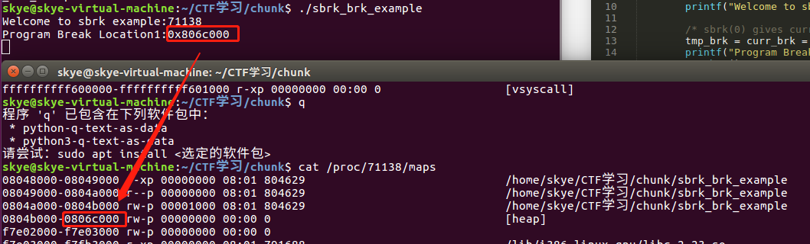

# 堆概述 

> 内容绝大部分来自ctf-wiki，文章用于自己学习记录

## 什么是堆 

在程序运行过程中，**堆可以提供动态分配的内存**，允许程序申请大小未知的内存[^1]。堆其实就是程序虚拟地址空间的一块连续的线性区域，它由低地址向高地址方向增长。我们一般称管理堆的那部分程序为堆管理器。

[^1]:无法提前预知的内存空间，更多是根据用户输入需要而动态变化

堆管理器处于用户程序与内核中间，主要做以下工作

1. 响应用户的申请内存请求，向操作系统**申请内存**，然后将其返回给用户程序。同时，为了保持内存管理的高效性，**内核一般都会预先分配很大的一块连续的内存，然后让堆管理器通过某种算法管理这块内存。只有当出现了堆空间不足的情况，堆管理器才会再次与操作系统进行交互**。
2. **管理用户所释放的内存**。一般来说，用户释放的内存并不是直接返还给操作系统的，而是由堆管理器进行管理。这些释放的内存可以来响应用户新申请的内存的请求。

Linux 中早期的堆分配与回收由 Doug Lea 实现，但它在并行处理多个线程时，会共享进程的堆内存空间。因此，为了安全性，一个线程使用堆时，会进行加锁。然而，与此同时，加锁会导致其它线程无法使用堆，降低了内存分配和回收的高效性。同时，如果在多线程使用时，没能正确控制，也可能影响内存分配和回收的正确性。Wolfram Gloger 在 Doug Lea 的基础上进行改进使其可以支持多线程，这个堆分配器就是 ptmalloc 。在 glibc-2.3.x. 之后，glibc 中集成了 ptmalloc2。

目前 Linux 标准发行版中使用的堆分配器是 glibc 中的堆分配器：ptmalloc2。ptmalloc2 主要是通过 malloc/free 函数来分配和释放内存块。

需要注意的是，在内存分配与使用的过程中，Linux 有这样的一个基本内存管理思想，**只有当真正访问一个地址的时候，系统才会建立虚拟页面与物理页面的映射关系**。 所以虽然操作系统已经给程序分配了很大的一块内存，但是这块内存其实只是虚拟内存。只有当用户使用到相应的内存时，系统才会真正分配物理页面给用户使用。

## 堆的基本操作 

这里我们主要介绍

- 基本的堆操作，包括堆的分配，回收，堆分配背后的系统调用
- 介绍堆目前的多线程支持。

### malloc

在 glibc 的 [malloc.c](https://github.com/iromise/glibc/blob/master/malloc/malloc.c#L448) 中，malloc 的说明如下

```
/*
  malloc(size_t n)
  Returns a pointer to a newly allocated chunk of at least n bytes, or null
  if no space is available. Additionally, on failure, errno is
  set to ENOMEM on ANSI C systems.
  If n is zero, malloc returns a minumum-sized chunk. (The minimum
  size is 16 bytes on most 32bit systems, and 24 or 32 bytes on 64bit
  systems.)  On most systems, size_t is an unsigned type, so calls
  with negative arguments are interpreted as requests for huge amounts
  of space, which will often fail. The maximum supported value of n
  differs across systems, but is in all cases less than the maximum
  representable value of a size_t.
*/
```

可以看出，malloc 函数返回对应大小字节的内存块的**指针**[^2]。此外，该函数还对一些异常情况进行了处理

[^2]:实际上还需进行对齐等操作，返回内存块不一定是对应大小的

- 当 n=0 时，返回当前系统允许的堆的最小内存块。
- 当 n 为负数时，由于在大多数系统上，**size_t 是`无符号数`（这一点非常重要）**，所以程序就会申请很大的内存空间，但通常来说都会失败，因为系统没有那么多的内存可以分配。

### free

在 glibc 的 [malloc.c](https://github.com/iromise/glibc/blob/master/malloc/malloc.c#L465) 中，free 的说明如下

```cassandra
/*
      free(void* p)
      Releases the chunk of memory pointed to by p, that had been previously
      allocated using malloc or a related routine such as realloc.
      It has no effect if p is null. It can have arbitrary (i.e., bad!)
      effects if p has already been freed.
      Unless disabled (using mallopt), freeing very large spaces will
      when possible, automatically trigger operations that give
      back unused memory to the system, thus reducing program footprint.
    */
```

可以看出，free 函数会释放由 p 所指向的内存块。这个内存块有可能是通过 malloc 函数得到的，也有可能是通过相关的函数 realloc 得到的。

此外，该函数也同样对异常情况进行了处理

- **当 p 为空指针时，函数不执行任何操作。**
- 当 p 已经被释放之后，再次释放会出现乱七八糟的效果，这其实就是 `double free`。
- 除了被禁用 (mallopt) 的情况下，当释放很大的内存空间时，程序会将这些内存空间还给系统，以便于减小程序所使用的内存空间。[^3]

[^3]:还需要根据内存块的物理位置判断是否还给系统

### 内存分配背后的系统调用 

在前面提到的函数中，无论是 malloc 函数还是 free 函数，我们动态申请和释放内存时，都经常会使用，但是它们并不是真正与系统交互的函数。这些函数背后的系统调用主要是 [(s)brk](http://man7.org/linux/man-pages/man2/sbrk.2.html) 函数以及 [mmap, munmap](http://man7.org/linux/man-pages/man2/mmap.2.html) 函数。[^4]

[^4]:也就是相当于 malloc 是一个整合包，打包好实现申请堆块需要用到的所有函数。类似的函数还有 system 等

如下图所示，我们主要考虑对堆进行申请内存块的操作。


#### (s)brk

对于堆的操作，操作系统提供了 brk 函数，glibc 库提供了 sbrk 函数，我们可以通过增加 [brk](https://en.wikipedia.org/wiki/Sbrk) 的大小来向操作系统申请内存。

初始时，堆的起始地址 [start_brk](http://elixir.free-electrons.com/linux/v3.8/source/include/linux/mm_types.h#L365) 以及堆的当前末尾 [brk](http://elixir.free-electrons.com/linux/v3.8/source/include/linux/mm_types.h#L365) 指向同一地址。根据是否开启 ASLR，两者的具体位置会有所不同

- 不开启 ASLR 保护时，start_brk 以及 brk 会指向 data/bss 段的结尾。
- 开启 ASLR 保护时，start_brk 以及 brk 也会指向同一位置，只是这个位置是在 data/bss 段结尾后的随机偏移处。

具体效果如下图（这个图片与网上流传的基本一致，这里是因为要画一张大图，所以自己单独画了下）所示


**例子**

```c
/* sbrk and brk example */
#include <stdio.h>
#include <unistd.h>
#include <sys/types.h>

int main()
{
        void *curr_brk, *tmp_brk = NULL;

        printf("Welcome to sbrk example:%d\n", getpid());

        /* sbrk(0) gives current program break location */
        tmp_brk = curr_brk = sbrk(0);
        printf("Program Break Location1:%p\n", curr_brk);
        getchar();

        /* brk(addr) increments/decrements program break location */
        brk(curr_brk+4096);

        curr_brk = sbrk(0);
        printf("Program break Location2:%p\n", curr_brk);
        getchar();

        brk(tmp_brk);

        curr_brk = sbrk(0);
        printf("Program Break Location3:%p\n", curr_brk);
        getchar();

        return 0;
}
//gcc sbrk_brk_example.c -m32 -o ./sbrk_brk_example
```

需要注意的是，在每一次执行完操作后，都执行了 getchar() 函数，这是为了我们方便我们查看程序真正的映射。

**在第一次调用 brk 之前**

从下面的输出可以看出，并没有出现堆。因此

- start_brk = brk = end_data = 0x806c000



**第一次增加 brk 后**

从下面的输出可以看出，已经出现了堆段

- start_brk = end_data = 0x806c000
- brk = 0x806d000


其中，关于堆的那一行

- 0x806c000是相应堆的起始地址
- rw-p 表明堆具有可读可写权限，并且属于隐私数据。
- 00000000 表明文件偏移，由于这部分内容并不是从文件中映射得到的，所以为 0。
- 00:00 是主从 (Major/mirror) 的设备号，这部分内容也不是从文件中映射得到的，所以也都为 0。
- 0 表示着 Inode 号。由于这部分内容并不是从文件中映射得到的，所以为 0。

然后通过 ``brk(tmp_brk);`` 将指针归位回到 0x806c000 ，新出现的 heap 消失。具体和第一步图一样，不贴图了。

#### mmap

malloc 会使用 [mmap](http://lxr.free-electrons.com/source/mm/mmap.c?v=3.8#L1285) 来创建独立的匿名映射段。匿名映射的目的主要是可以申请以 0 填充的内存，并且这块内存仅被调用进程所使用。

**例子**

```c
/* Private anonymous mapping example using mmap syscall */
#include <stdio.h>
#include <sys/mman.h>
#include <sys/types.h>
#include <sys/stat.h>
#include <fcntl.h>
#include <unistd.h>
#include <stdlib.h>

void static inline errExit(const char* msg)
{
        printf("%s failed. Exiting the process\n", msg);
        exit(-1);
}

int main()
{
        int ret = -1;
        printf("Welcome to private anonymous mapping example::PID:%d\n", getpid());
        printf("Before mmap\n");
        getchar();
        char* addr = NULL;
        addr = mmap(NULL, (size_t)132*1024, PROT_READ|PROT_WRITE, MAP_PRIVATE | MAP_ANONYMOUS, -1, 0);
        if (addr == MAP_FAILED)
                errExit("mmap");
        printf("After mmap\n");
        getchar();

        /* Unmap mapped region. */
        ret = munmap(addr, (size_t)132*1024);
        if(ret == -1)
                errExit("munmap");
        printf("After munmap\n");
        getchar();
        return 0;
}
```

**在执行 mmap 之前**

我们可以从下面的输出看到，目前只有. so 文件的 mmap 段。

```shell
sploitfun@sploitfun-VirtualBox:~/ptmalloc.ppt/syscalls$ cat /proc/6067/maps
08048000-08049000 r-xp 00000000 08:01 539691     /home/sploitfun/ptmalloc.ppt/syscalls/mmap
08049000-0804a000 r--p 00000000 08:01 539691     /home/sploitfun/ptmalloc.ppt/syscalls/mmap
0804a000-0804b000 rw-p 00001000 08:01 539691     /home/sploitfun/ptmalloc.ppt/syscalls/mmap
b7e21000-b7e22000 rw-p 00000000 00:00 0
...
sploitfun@sploitfun-VirtualBox:~/ptmalloc.ppt/syscalls$
```

**mmap 后**

从下面的输出可以看出，我们申请的内存与已经存在的内存段结合在了一起构成了 b7e00000 到 b7e21000 的 mmap 段。

```shell
sploitfun@sploitfun-VirtualBox:~/ptmalloc.ppt/syscalls$ cat /proc/6067/maps
08048000-08049000 r-xp 00000000 08:01 539691     /home/sploitfun/ptmalloc.ppt/syscalls/mmap
08049000-0804a000 r--p 00000000 08:01 539691     /home/sploitfun/ptmalloc.ppt/syscalls/mmap
0804a000-0804b000 rw-p 00001000 08:01 539691     /home/sploitfun/ptmalloc.ppt/syscalls/mmap
b7e00000-b7e22000 rw-p 00000000 00:00 0
...
sploitfun@sploitfun-VirtualBox:~/ptmalloc.ppt/syscalls$
```

**munmap**

从下面的输出，我们可以看到我们原来申请的内存段已经没有了，内存段又恢复了原来的样子了。

```
sploitfun@sploitfun-VirtualBox:~/ptmalloc.ppt/syscalls$ cat /proc/6067/maps
08048000-08049000 r-xp 00000000 08:01 539691     /home/sploitfun/ptmalloc.ppt/syscalls/mmap
08049000-0804a000 r--p 00000000 08:01 539691     /home/sploitfun/ptmalloc.ppt/syscalls/mmap
0804a000-0804b000 rw-p 00001000 08:01 539691     /home/sploitfun/ptmalloc.ppt/syscalls/mmap
b7e21000-b7e22000 rw-p 00000000 00:00 0
...
sploitfun@sploitfun-VirtualBox:~/ptmalloc.ppt/syscalls$
```

### 多线程支持 

在原来的 dlmalloc 实现中，当两个线程同时要申请内存时，只有一个线程可以进入临界区申请内存，而另外一个线程则必须等待直到临界区中不再有线程。这是因为所有的线程共享一个堆。在 glibc 的 ptmalloc 实现中，比较好的一点就是支持了多线程的快速访问。在新的实现中，所有的线程共享多个堆。

这里给出一个例子。

```
/* Per thread arena example. */
#include <stdio.h>
#include <stdlib.h>
#include <pthread.h>
#include <unistd.h>
#include <sys/types.h>

void* threadFunc(void* arg) {
        printf("Before malloc in thread 1\n");
        getchar();
        char* addr = (char*) malloc(1000);
        printf("After malloc and before free in thread 1\n");
        getchar();
        free(addr);
        printf("After free in thread 1\n");
        getchar();
}

int main() {
        pthread_t t1;
        void* s;
        int ret;
        char* addr;

        printf("Welcome to per thread arena example::%d\n",getpid());
        printf("Before malloc in main thread\n");
        getchar();
        addr = (char*) malloc(1000);
        printf("After malloc and before free in main thread\n");
        getchar();
        free(addr);
        printf("After free in main thread\n");
        getchar();
        ret = pthread_create(&t1, NULL, threadFunc, NULL);
        if(ret)
        {
                printf("Thread creation error\n");
                return -1;
        }
        ret = pthread_join(t1, &s);
        if(ret)
        {
                printf("Thread join error\n");
                return -1;
        }
        return 0;
}
```

**第一次申请之前**， 没有任何任何堆段。

```
sploitfun@sploitfun-VirtualBox:~/ptmalloc.ppt/mthread$ ./mthread
Welcome to per thread arena example::6501
Before malloc in main thread
...
sploitfun@sploitfun-VirtualBox:~/ptmalloc.ppt/mthread$ cat /proc/6501/maps
08048000-08049000 r-xp 00000000 08:01 539625     /home/sploitfun/ptmalloc.ppt/mthread/mthread
08049000-0804a000 r--p 00000000 08:01 539625     /home/sploitfun/ptmalloc.ppt/mthread/mthread
0804a000-0804b000 rw-p 00001000 08:01 539625     /home/sploitfun/ptmalloc.ppt/mthread/mthread
b7e05000-b7e07000 rw-p 00000000 00:00 0
...
sploitfun@sploitfun-VirtualBox:~/ptmalloc.ppt/mthread$
```

**第一次申请后**， 从下面的输出可以看出，堆段被建立了，并且它就紧邻着数据段，这说明 malloc 的背后是用 brk 函数来实现的。同时，需要注意的是，我们虽然只是申请了 1000 个字节，但是我们却得到了 0x0806c000-0x0804b000=0x21000 个字节的堆。**这说明虽然程序可能只是向操作系统申请很小的内存，但是为了方便，操作系统会把很大的内存分配给程序。这样的话，就避免了多次内核态与用户态的切换，提高了程序的效率。**我们称这一块连续的内存区域为 arena。此外，我们称由主线程申请的内存为 main_arena。后续的申请的内存会一直从这个 arena 中获取，直到空间不足。当 arena 空间不足时，它可以通过增加 brk 的方式来增加堆的空间。类似地，arena 也可以通过减小 brk 来缩小自己的空间。

```
sploitfun@sploitfun-VirtualBox:~/ptmalloc.ppt/mthread$ ./mthread
Welcome to per thread arena example::6501
Before malloc in main thread
After malloc and before free in main thread
...
sploitfun@sploitfun-VirtualBox:~/lsploits/hof/ptmalloc.ppt/mthread$ cat /proc/6501/maps
08048000-08049000 r-xp 00000000 08:01 539625     /home/sploitfun/ptmalloc.ppt/mthread/mthread
08049000-0804a000 r--p 00000000 08:01 539625     /home/sploitfun/ptmalloc.ppt/mthread/mthread
0804a000-0804b000 rw-p 00001000 08:01 539625     /home/sploitfun/ptmalloc.ppt/mthread/mthread
0804b000-0806c000 rw-p 00000000 00:00 0          [heap]
b7e05000-b7e07000 rw-p 00000000 00:00 0
...
sploitfun@sploitfun-VirtualBox:~/ptmalloc.ppt/mthread$
```

**在主线程释放内存后**，我们从下面的输出可以看出，其对应的 arena 并没有进行回收，而是交由 glibc 来进行管理。当后面程序再次申请内存时，在 glibc 中管理的内存充足的情况下，glibc 就会根据堆分配的算法来给程序分配相应的内存。

```
sploitfun@sploitfun-VirtualBox:~/ptmalloc.ppt/mthread$ ./mthread
Welcome to per thread arena example::6501
Before malloc in main thread
After malloc and before free in main thread
After free in main thread
...
sploitfun@sploitfun-VirtualBox:~/lsploits/hof/ptmalloc.ppt/mthread$ cat /proc/6501/maps
08048000-08049000 r-xp 00000000 08:01 539625     /home/sploitfun/ptmalloc.ppt/mthread/mthread
08049000-0804a000 r--p 00000000 08:01 539625     /home/sploitfun/ptmalloc.ppt/mthread/mthread
0804a000-0804b000 rw-p 00001000 08:01 539625     /home/sploitfun/ptmalloc.ppt/mthread/mthread
0804b000-0806c000 rw-p 00000000 00:00 0          [heap]
b7e05000-b7e07000 rw-p 00000000 00:00 0
...
sploitfun@sploitfun-VirtualBox:~/ptmalloc.ppt/mthread$
```

**在第一个线程 malloc 之前**，我们可以看到并没有出现与线程 1 相关的堆，但是出现了与线程 1 相关的栈。

```
sploitfun@sploitfun-VirtualBox:~/ptmalloc.ppt/mthread$ ./mthread
Welcome to per thread arena example::6501
Before malloc in main thread
After malloc and before free in main thread
After free in main thread
Before malloc in thread 1
...
sploitfun@sploitfun-VirtualBox:~/ptmalloc.ppt/mthread$ cat /proc/6501/maps
08048000-08049000 r-xp 00000000 08:01 539625     /home/sploitfun/ptmalloc.ppt/mthread/mthread
08049000-0804a000 r--p 00000000 08:01 539625     /home/sploitfun/ptmalloc.ppt/mthread/mthread
0804a000-0804b000 rw-p 00001000 08:01 539625     /home/sploitfun/ptmalloc.ppt/mthread/mthread
0804b000-0806c000 rw-p 00000000 00:00 0          [heap]
b7604000-b7605000 ---p 00000000 00:00 0
b7605000-b7e07000 rw-p 00000000 00:00 0          [stack:6594]
...
sploitfun@sploitfun-VirtualBox:~/ptmalloc.ppt/mthread$
```

**第一个线程 malloc 后**， 我们可以从下面输出看出线程 1 的堆段被建立了。而且它所在的位置为内存映射段区域，同样大小也是 132KB(b7500000-b7521000)。因此这表明该线程申请的堆时，背后对应的函数为 mmap 函数。同时，我们可以看出实际真的分配给程序的内存为 1M(b7500000-b7600000)。而且，只有 132KB 的部分具有可读可写权限，这一块连续的区域成为 thread arena。

注意：

> 当用户请求的内存大于 128KB 时，并且没有任何 arena 有足够的空间时，那么系统就会执行 mmap 函数来分配相应的内存空间。这与这个请求来自于主线程还是从线程无关。

```
sploitfun@sploitfun-VirtualBox:~/ptmalloc.ppt/mthread$ ./mthread
Welcome to per thread arena example::6501
Before malloc in main thread
After malloc and before free in main thread
After free in main thread
Before malloc in thread 1
After malloc and before free in thread 1
...
sploitfun@sploitfun-VirtualBox:~/ptmalloc.ppt/mthread$ cat /proc/6501/maps
08048000-08049000 r-xp 00000000 08:01 539625     /home/sploitfun/ptmalloc.ppt/mthread/mthread
08049000-0804a000 r--p 00000000 08:01 539625     /home/sploitfun/ptmalloc.ppt/mthread/mthread
0804a000-0804b000 rw-p 00001000 08:01 539625     /home/sploitfun/ptmalloc.ppt/mthread/mthread
0804b000-0806c000 rw-p 00000000 00:00 0          [heap]
b7500000-b7521000 rw-p 00000000 00:00 0
b7521000-b7600000 ---p 00000000 00:00 0
b7604000-b7605000 ---p 00000000 00:00 0
b7605000-b7e07000 rw-p 00000000 00:00 0          [stack:6594]
...
sploitfun@sploitfun-VirtualBox:~/ptmalloc.ppt/mthread$
```

**在第一个线程释放内存后**， 我们可以从下面的输出看到，这样释放内存同样不会把内存重新给系统。

```
sploitfun@sploitfun-VirtualBox:~/ptmalloc.ppt/mthread$ ./mthread
Welcome to per thread arena example::6501
Before malloc in main thread
After malloc and before free in main thread
After free in main thread
Before malloc in thread 1
After malloc and before free in thread 1
After free in thread 1
...
sploitfun@sploitfun-VirtualBox:~/ptmalloc.ppt/mthread$ cat /proc/6501/maps
08048000-08049000 r-xp 00000000 08:01 539625     /home/sploitfun/ptmalloc.ppt/mthread/mthread
08049000-0804a000 r--p 00000000 08:01 539625     /home/sploitfun/ptmalloc.ppt/mthread/mthread
0804a000-0804b000 rw-p 00001000 08:01 539625     /home/sploitfun/ptmalloc.ppt/mthread/mthread
0804b000-0806c000 rw-p 00000000 00:00 0          [heap]
b7500000-b7521000 rw-p 00000000 00:00 0
b7521000-b7600000 ---p 00000000 00:00 0
b7604000-b7605000 ---p 00000000 00:00 0
b7605000-b7e07000 rw-p 00000000 00:00 0          [stack:6594]
...
sploitfun@sploitfun-VirtualBox:~/ptmalloc.ppt/mthread$
```

# 堆相关数据结构 

> 内容绝大部分来自ctf-wiki，文章用于自己学习记录

堆的操作就这么复杂，那么在 glibc 内部必然也有精心设计的数据结构来管理它。与堆相应的数据结构主要分为

- 宏观结构，包含堆的宏观信息，可以通过这些数据结构索引堆的基本信息。
- 微观结构，用于具体处理堆的分配与回收中的内存块。

## 宏观结构

### 32位内存布局


从高地址到低地址为：不可访问的内核空间，栈空间（由高地址向低地址生长），内存布局区，堆空间（由低地址向高地址生长），BSS，数据段，文本段。本报告讨论进程的栈空间和堆空间的具体结构。

### 64位内存布局

用户空间的布局和32位差别很小。


### 堆管理介绍

#### 3 种数据结构

在 `glibc` 的 `malloc` 中针对堆管理，主要涉及到以下 3 种数据结构：

* heap_info（即Heap Header）对应管理 heap
* malloc_state（即Arena Header） 对应管理 area
* malloc_chunk（即Chunk Header） 对应管理 chunk

> 这里堆管理会出现在多线程，一般pwn题不会涉及多线程操作，也就是都是在 main_area 上操作，因此可选择性阅读 heap_info、malloc_state。

##### heap_info

heap_info: 即Heap Header，因为一个**thread arena**（注意：不包含**main thread**）可以包含多个heaps，所以为了便于管理，就给每个 heap 分配一个 heap  header。那么在什么情况下一个thread arena会包含多个 heaps 呢?在当前 heap 不够用的时候，malloc 会通过系统调用 mmap 申请新的堆空间，新的堆空间会被添加到当前thread arena中，便于管理。

```c
typedef struct _heap_info
{
  mstate ar_ptr; /* Arena for this heap. */
  struct _heap_info *prev; /* Previous heap. */
  size_t size;   /* Current size in bytes. */
  size_t mprotect_size; /* Size in bytes that has been mprotected
                           PROT_READ|PROT_WRITE.  */
  /* Make sure the following data is properly aligned, particularly
     that sizeof (heap_info) + 2 * SIZE_SZ is a multiple of
     MALLOC_ALIGNMENT. */
  char pad[-6 * SIZE_SZ & MALLOC_ALIGN_MASK];
} heap_info;
```

###### Arena 数量限制

主线程和子线程有自己独立的 *arena*，那么是不是无论有多少个线程，每个线程都有自己独立的 *arena* 呢？答案是否定的。事实上，*arena*的个数是跟系统中处理器核心个数相关的，如下表所示：

| systems |       number of arena       |
| :-----: | :-------------------------: |
| 32bits  | 2 x number of cpu cores + 1 |
| 64bits  | 8 x number of cpu cores + 1 |

###### Arena 管理

假设有如下情景：一台只含有一个处理器核心的机器安装有 32 位操作系统，其上运行了一个多线程应用程序，共含有 4 个线程——主线程和三个子线程。显然线程个数大于系统能维护的最大 *arena* 个数（2 x 核心数 + 1= 3），那么此时 `glibc` 的 `malloc` 就需要确保这 4 个线程能够正确地共享这 3 个 *arena*，那么它是如何实现的呢？

当主线程首次调用 `malloc` 的时候会直接为它分配一个 *main arena*，而不需要任何附加条件。

当子线程 1 和子线程 2 首次调用 `malloc` 的时候，`glibc` 实现的 `malloc` 会分别为每个子线程创建一个新的 *thread arena*。此时，各个线程与 *arena* 是一一对应的。但是，当用户线程 3 调用 `malloc` 的时候就出现问题了。因为此时 `glibc` 的 `malloc` 能维护的 *arena* 个数已经达到上限，无法再为子线程 3 分配新的 *arena* 了，那么就需要重复使用已经分配好的 3 个 *arena* 中的一个（*main arena*, *arena1* 或者 *arena2*）。那么该选择哪个 *arena* 进行重复利用呢？`glibc` 的 `malloc` 遵循以下规则：

1. 首先循环遍历所有可用的 *arena*，在遍历的过程中，它会尝试加锁该 *arena*。如果成功加锁（该 *arena* 当前对应的线程并未使用堆内存则表示可加锁），比如将 *main arena* 成功锁住，那么就将 *main arena* 返回给用户，即表示该 *arena* 被子线程 3 共享使用。
2. 如果没能找到可用的 *arena*，那么就将子线程 3 的 `malloc` 操作阻塞，直到有可用的 *arena* 为止。
3. 现在，如果子线程 3 再次调用 `malloc` 的话，`glibc` 的 `malloc` 就会先尝试使用最近访问的 *arena*（此时为 *main arena*）。如果此时 *main arena* 可用的话，就直接使用，否则就将子线程 3 阻塞，直到 *main arena* 再次可用为止。

这样子线程 3 与主线程就共享 *main arena* 了。至于其他更复杂的情况，以此类推。

##### malloc_state

malloc_state: 即Arena Header，用于表示 area 的信息，每个thread只含有一个Arena Header。Arena Header包含bins的信息、top chunk以及最后一个remainder chunk等(这些概念会在后文详细介绍):

```c
struct malloc_state
{
  /* Serialize access.  */
  mutex_t mutex;
  /* Flags (formerly in max_fast).  */
  int flags;
  /* Fastbins */
  mfastbinptr fastbinsY[NFASTBINS];
  /* Base of the topmost chunk -- not otherwise kept in a bin */
  mchunkptr top;
  /* The remainder from the most recent split of a small request */
  mchunkptr last_remainder;
  /* Normal bins packed as described above */
  mchunkptr bins[NBINS * 2 - 2];
  /* Bitmap of bins */
  unsigned int binmap[BINMAPSIZE];
  /* Linked list */
  struct malloc_state *next;
  /* Linked list for free arenas.  */
  struct malloc_state *next_free;
  /* Memory allocated from the system in this arena.  */
  INTERNAL_SIZE_T system_mem;
  INTERNAL_SIZE_T max_system_mem;
};
```

##### malloc_chunk

malloc_chunk: 即Chunk Header，一个heap被分为多个chunk，至于每个chunk的大小，这是根据用户的请求决定的，也就是说用户调用malloc(size_t size)传递的size参数“就是”chunk的大小(这里给“就是”加上引号，说明这种表示并不准确，但是为了方便理解就暂时这么描述了，详细说明见后文)。每个chunk都由一个结构体malloc_chunk表示：

```c
struct malloc_chunk {
  /* #define INTERNAL_SIZE_T size_t */
  INTERNAL_SIZE_T      prev_size;  /* Size of previous chunk (if free).  */
  INTERNAL_SIZE_T      size;       /* Size in bytes, including overhead. */
  struct malloc_chunk* fd;         /* double links -- used only if free. 这两个指针只在free chunk中存在*/
  struct malloc_chunk* bk;
  /* Only used for large blocks: pointer to next larger size.  */
  struct malloc_chunk* fd_nextsize; /* double links -- used only if free. */
  struct malloc_chunk* bk_nextsize;
};
```

关于上述的结构（malloc_chunk主线程也用到），针对子线程的，主线程和子线程有一些不同：

1. 主线程的堆不是分配在内存映射区，而是进程的虚拟内存堆区，因此不含有多个 *heap* 所以也就不含有 `heap_info` 结构体。当需要更多堆空间的时候，直接通过增长 `brk` 指针来获取更多的空间，直到它碰到内存映射区域（mapping）为止。
2. 不同于 *thread arena*，主线程的 *main arena* 的 *arena header* 并不在堆区中，而是一个全局变量，因此它属于 `libc.so` 的 data segment 区域。

#### heap segment与arena关系

首先，通过内存分布图理清malloc_state与heap_info之间的组织关系。

下图是只有一个heap segment的main arena和thread arena的内存分布图：


下图是一个thread arena中含有多个heap segments的情况：


从上图可以看出，thread arena只含有一个malloc_state(即arena header)，却有两个heap_info(即heap header)。由于两个heap segments是通过mmap分配的内存，两者在内存布局上并不相邻而是分属于不同的内存区间，所以为了便于管理，libc malloc将第二个heap_info结构体的prev成员指向了第一个heap_info结构体的起始位置（即ar_ptr成员），而第一个heap_info结构体的ar_ptr成员指向了malloc_state，这样就构成了一个单链表，方便后续管理。

## 微观结构

### chunk 介绍

#### 概述

在 glibc malloc 中将整个堆内存空间分成了连续的、大小不一的 chunk ，即对于堆内存管理而言 chunk 就是最小操作单位。*chunk* 总共分为 4 大类：

- *allocated chunk*
- *free chunk*
- *top chunk*
- *last remainder chunk*

从本质上来说，所有类型的 *chunk* 都是内存中一块连续的区域，只是通过该区域中特定位置的某些标识符加以区分。为了简便，也可以将这 4 大类 *chunk* 简化为 2 类：*allocated chunk* 以及 *free chunk*，前者表示已经分配给用户使用的 *chunk*，后者表示未使用的 *chunk*。

任何堆内存管理器都是以 *chunk* 为单位进行堆内存管理的，而这就需要一些数据结构来标志各个块的边界，以及区分已分配块和空闲块。大多数堆内存管理器都将这些边界信息作为 *chunk* 的一部分嵌入到 *chunk* 内部。

**无论一个 chunk 的大小如何，处于分配状态还是释放状态，它们都使用一个统一的结构（malloc_chunk）。虽然它们使用了同一个数据结构，但是根据是否被释放，它们的表现形式会有所不同。**

#### malloc_chunk (allocated chunk)

malloc_chunk 的结构如下:

```c
/*
  This struct declaration is misleading (but accurate and necessary).
  It declares a "view" into memory allowing access to necessary
  fields at known offsets from a given base. See explanation below.
*/
struct malloc_chunk {

  INTERNAL_SIZE_T      prev_size;  /* Size of previous chunk (if free).  */
  INTERNAL_SIZE_T      size;       /* Size in bytes, including overhead. */

  struct malloc_chunk* fd;         /* double links -- used only if free. */
  struct malloc_chunk* bk;

  /* Only used for large blocks: pointer to next larger size.  */
  struct malloc_chunk* fd_nextsize; /* double links -- used only if free. */
  struct malloc_chunk* bk_nextsize;
};
```

一般来说，size_t 在 64 位中是 64 位无符号整数，32 位中是 32 位无符号整数。

每个字段的具体的解释如下

- **prev_size**

  如果该 chunk 的**物理相邻的前一地址 chunk（两个指针的地址差值为前一 chunk 大小）**是空闲的话，那该字段记录的是前一个 chunk 的大小 (包括 chunk 头)。否则，该字段可以用来存储物理相邻的前一个 chunk 的数据。**这里的前一 chunk 指的是较低地址的 chunk** 。

- **size**

  该 chunk 的大小，大小必须是 2 * SIZE_SZ 的整数倍。如果申请的内存大小不是 2 * SIZE_SZ 的整数倍，会被转换满足大小的最小的 2 * SIZE_SZ 的倍数。32 位系统中，SIZE_SZ 是 4；64 位系统中，SIZE_SZ 是 8。 该字段的低三个比特位对 chunk 的大小没有影响，它们从高到低分别表示

  - NON_MAIN_ARENA，记录当前 chunk 是否不属于主线程，1 表示不属于，0 表示属于。
  - IS_MAPPED，记录当前 chunk 是否是由 mmap 分配的。
  - PREV_INUSE，记录前一个 chunk 块是否被分配。一般来说，堆中第一个被分配的内存块的 size 字段的 P 位都会被设置为 1，以便于防止访问前面的非法内存。当一个 chunk 的 size 的 P 位为 0 时，我们能通过 prev_size 字段来获取上一个 chunk 的大小以及地址。这也方便进行空闲 chunk 之间的合并。

- **fd，bk**

  chunk 处于分配状态时，从 fd 字段开始是用户的数据。chunk 空闲时，会被添加到对应的空闲管理链表中，其字段的含义如下

  - fd 指向下一个（非物理相邻）空闲的 chunk
  - bk 指向上一个（非物理相邻）空闲的 chunk
  - 通过 fd 和 bk 可以将空闲的 chunk 块加入到空闲的 chunk 块链表进行统一管理

- **fd_nextsize， bk_nextsize**

  也是只有 chunk 空闲的时候才使用，不过其用于较大的 chunk（large chunk）。

  - fd_nextsize 指向前一个与当前 chunk 大小不同的第一个空闲块，不包含 bin 的头指针。
  - bk_nextsize 指向后一个与当前 chunk 大小不同的第一个空闲块，不包含 bin 的头指针。
  - 一般空闲的 large chunk 在 fd 的遍历顺序中，按照由大到小的顺序排列。**这样做可以避免在寻找合适 chunk 时挨个遍历。**

一个已经分配的 chunk 的样子如下。**我们称前两个字段称为 chunk header，后面的部分称为 user data。每次 malloc 申请得到的内存指针，其实指向 user data 的起始处。**

当一个 chunk 处于使用状态时，它的下一个 chunk 的 prev_size 域无效，所以下一个 chunk 的该部分也可以被当前 chunk 使用。**这就是 chunk 中的空间复用。**

已经被分配使用的 *chunk* 结构如下两个图：（图一图二 size 位 A 与 N 相同含义只是表示不同）

```shell
chunk-> +-+-+-+-+-+-+-+-+-+-+-+-+-+-+-+-+-+-+-+-+-+-+-+-+-+-+-+-+-+-+-+-+
        |             Size of previous chunk, if unallocated (P clear)  |
        +-+-+-+-+-+-+-+-+-+-+-+-+-+-+-+-+-+-+-+-+-+-+-+-+-+-+-+-+-+-+-+-+
        |             Size of chunk, in bytes                     |A|M|P|
  mem-> +-+-+-+-+-+-+-+-+-+-+-+-+-+-+-+-+-+-+-+-+-+-+-+-+-+-+-+-+-+-+-+-+
        |             User data starts here...                          .
        .                                                               .
        .             (malloc_usable_size() bytes)                      .
next    .                                                               |
chunk-> +-+-+-+-+-+-+-+-+-+-+-+-+-+-+-+-+-+-+-+-+-+-+-+-+-+-+-+-+-+-+-+-+
        |             (size of chunk, but used for application data)    |
        +-+-+-+-+-+-+-+-+-+-+-+-+-+-+-+-+-+-+-+-+-+-+-+-+-+-+-+-+-+-+-+-+
        |             Size of next chunk, in bytes                |A|0|1|
        +-+-+-+-+-+-+-+-+-+-+-+-+-+-+-+-+-+-+-+-+-+-+-+-+-+-+-+-+-+-+-+-+
```


#### free_chunk

被释放的 chunk 被记录在链表中（可能是循环双向链表，也可能是单向链表）。具体结构如下：

```shell
chunk-> +-+-+-+-+-+-+-+-+-+-+-+-+-+-+-+-+-+-+-+-+-+-+-+-+-+-+-+-+-+-+-+-+
        |             Size of previous chunk, if unallocated (P clear)  |
        +-+-+-+-+-+-+-+-+-+-+-+-+-+-+-+-+-+-+-+-+-+-+-+-+-+-+-+-+-+-+-+-+
`head:' |             Size of chunk, in bytes                     |A|0|P|
  mem-> +-+-+-+-+-+-+-+-+-+-+-+-+-+-+-+-+-+-+-+-+-+-+-+-+-+-+-+-+-+-+-+-+
        |             Forward pointer to next chunk in list             |
        +-+-+-+-+-+-+-+-+-+-+-+-+-+-+-+-+-+-+-+-+-+-+-+-+-+-+-+-+-+-+-+-+
        |             Back pointer to previous chunk in list            |
        +-+-+-+-+-+-+-+-+-+-+-+-+-+-+-+-+-+-+-+-+-+-+-+-+-+-+-+-+-+-+-+-+
        |             Unused space (may be 0 bytes long)                .
        .                                                               .
 next   .                                                               |
chunk-> +-+-+-+-+-+-+-+-+-+-+-+-+-+-+-+-+-+-+-+-+-+-+-+-+-+-+-+-+-+-+-+-+
`foot:' |             Size of chunk, in bytes                           |
        +-+-+-+-+-+-+-+-+-+-+-+-+-+-+-+-+-+-+-+-+-+-+-+-+-+-+-+-+-+-+-+-+
        |             Size of next chunk, in bytes                |A|0|0|
        +-+-+-+-+-+-+-+-+-+-+-+-+-+-+-+-+-+-+-+-+-+-+-+-+-+-+-+-+-+-+-+-+
```

可以发现，如果一个 chunk 处于 free 状态，那么会有两个位置记录其相应的大小

1. 本身的 size 字段会记录。（图中最后一行 size 位）
2. 它后面的 chunk 会记录。（图中倒数第二行 nextchunk 的 prevsize 位） 

**一般情况下**（fastbin中存在特例），物理相邻的两个空闲 chunk 会被合并为一个 chunk 。堆管理器会通过 prev_size 字段以及 size 字段合并两个物理相邻的空闲 chunk 块。

**！！！一些关于堆的约束，后面详细考虑！！！**

```c
/*
    The three exceptions to all this are:
     1. The special chunk `top' doesn't bother using the
    trailing size field since there is no next contiguous chunk
    that would have to index off it. After initialization, `top'
    is forced to always exist.  If it would become less than
    MINSIZE bytes long, it is replenished.
     2. Chunks allocated via mmap, which have the second-lowest-order
    bit M (IS_MMAPPED) set in their size fields.  Because they are
    allocated one-by-one, each must contain its own trailing size
    field.  If the M bit is set, the other bits are ignored
    (because mmapped chunks are neither in an arena, nor adjacent
    to a freed chunk).  The M bit is also used for chunks which
    originally came from a dumped heap via malloc_set_state in
    hooks.c.
     3. Chunks in fastbins are treated as allocated chunks from the
    point of view of the chunk allocator.  They are consolidated
    with their neighbors only in bulk, in malloc_consolidate.
*/
```

#### top chunk

glibc 中对于 top chunk 的描述如下

```c
/*
   Top

    The top-most available chunk (i.e., the one bordering the end of
    available memory) is treated specially. It is never included in
    any bin, is used only if no other chunk is available, and is
    released back to the system if it is very large (see
    M_TRIM_THRESHOLD).  Because top initially
    points to its own bin with initial zero size, thus forcing
    extension on the first malloc request, we avoid having any special
    code in malloc to check whether it even exists yet. But we still
    need to do so when getting memory from system, so we make
    initial_top treat the bin as a legal but unusable chunk during the
    interval between initialization and the first call to
    sysmalloc. (This is somewhat delicate, since it relies on
    the 2 preceding words to be zero during this interval as well.)
 */

/* Conveniently, the unsorted bin can be used as dummy top on first call */
#define initial_top(M) (unsorted_chunks(M))
```

程序第一次进行 malloc 的时候，heap 会被分为两块，一块给用户，剩下的那块就是 top chunk。其实，所谓的 top chunk 就是处于当前堆的物理地址最高的 chunk。**top chunk 不属于任何一个 bin**，它的作用在于当所有的 bin 都无法满足用户请求的大小时，如果 *top chunk* 大小不小于用户请求的大小，就将该 *top chunk* 分作两部分：用户请求的 *chunk* 和 剩余的部分（成为新的 *top chunk*）。否则，就对 heap 进行扩展后再进行分配。在 *main arena* 中通过 `sbrk` 扩展 *heap*，而在*thread arena* 中通过 `mmap` 分配新的 *heap*。

需要注意的是，top chunk 的 prev_inuse 比特位始终为 1，否则其前面的 chunk 就会被合并到 top chunk 中。

**初始情况下，我们可以将 unsorted chunk 作为 top chunk。**

#### last remainder

在用户使用 malloc 请求分配内存时，ptmalloc2 找到的 chunk （bin中的chunk）可能并不和申请的内存大小一致，这时候就将分割之后的剩余部分称之为 last remainder chunk ，unsort bin 也会存这一块。top chunk 分割剩下的部分不会作为 last remainder。

#### chunk 相关宏 

这里主要介绍 chunk 的大小、对齐检查以及一些转换的宏。

**chunk 与 mem 指针头部的转换**

mem 指向用户得到的内存的起始位置。

```c
/* conversion from malloc headers to user pointers, and back */
#define chunk2mem(p) ((void *) ((char *) (p) + 2 * SIZE_SZ))
#define mem2chunk(mem) ((mchunkptr)((char *) (mem) -2 * SIZE_SZ))
```

**最小的 chunk 大小**

```c
/* The smallest possible chunk */
#define MIN_CHUNK_SIZE (offsetof(struct malloc_chunk, fd_nextsize))
```

这里，offsetof 函数计算出 fd_nextsize 在 malloc_chunk 中的偏移，说明最小的 chunk 至少要包含 bk 指针。

**最小申请的堆内存大小**

用户最小申请的内存大小必须是 2 * SIZE_SZ 的最小整数倍。

**注：就目前而看 MIN_CHUNK_SIZE 和 MINSIZE 大小是一致的，个人认为之所以要添加两个宏是为了方便以后修改 malloc_chunk 时方便一些。**

```c
/* The smallest size we can malloc is an aligned minimal chunk */
//MALLOC_ALIGN_MASK = 2 * SIZE_SZ -1
#define MINSIZE                                                                \
    (unsigned long) (((MIN_CHUNK_SIZE + MALLOC_ALIGN_MASK) &                   \
                      ~MALLOC_ALIGN_MASK))
```

**检查分配给用户的内存是否对齐**

2 * SIZE_SZ 大小对齐。

```c
/* Check if m has acceptable alignment */
// MALLOC_ALIGN_MASK = 2 * SIZE_SZ -1
#define aligned_OK(m) (((unsigned long) (m) & MALLOC_ALIGN_MASK) == 0)

#define misaligned_chunk(p)                                                    \
    ((uintptr_t)(MALLOC_ALIGNMENT == 2 * SIZE_SZ ? (p) : chunk2mem(p)) &       \
     MALLOC_ALIGN_MASK)
```

**请求字节数判断**

```c
/*
   Check if a request is so large that it would wrap around zero when
   padded and aligned. To simplify some other code, the bound is made
   low enough so that adding MINSIZE will also not wrap around zero.
 */

#define REQUEST_OUT_OF_RANGE(req)                                              \
    ((unsigned long) (req) >= (unsigned long) (INTERNAL_SIZE_T)(-2 * MINSIZE))
```

**将用户请求内存大小转为实际分配内存大小**

```c
/* pad request bytes into a usable size -- internal version */
//MALLOC_ALIGN_MASK = 2 * SIZE_SZ -1
#define request2size(req)                                                      \
    (((req) + SIZE_SZ + MALLOC_ALIGN_MASK < MINSIZE)                           \
         ? MINSIZE                                                             \
         : ((req) + SIZE_SZ + MALLOC_ALIGN_MASK) & ~MALLOC_ALIGN_MASK)

/*  Same, except also perform argument check */

#define checked_request2size(req, sz)                                          \
    if (REQUEST_OUT_OF_RANGE(req)) {                                           \
        __set_errno(ENOMEM);                                                   \
        return 0;                                                              \
    }                                                                          \
    (sz) = request2size(req);
```

当一个 chunk 处于已分配状态时，它的物理相邻的下一个 chunk 的 prev_size 字段必然是无效的，故而这个字段就可以被当前这个 chunk 使用。这就是 ptmalloc 中 chunk 间的复用。具体流程如下

1. 首先，利用 REQUEST_OUT_OF_RANGE 判断是否可以分配用户请求的字节大小的 chunk。
2. 其次，需要注意的是用户请求的字节是用来存储数据的，即 chunk header 后面的部分。与此同时，由于 chunk 间复用，所以可以使用下一个 chunk 的 prev_size 字段。因此，这里只需要再添加 SIZE_SZ 大小即可以完全存储内容。
3. 由于系统中所允许的申请的 chunk 最小是 MINSIZE，所以与其进行比较。如果不满足最低要求，那么就需要直接分配 MINSIZE 字节。
4. 如果大于的话，因为系统中申请的 chunk 需要 2 * SIZE_SZ 对齐，所以这里需要加上 MALLOC_ALIGN_MASK 以便于对齐。

**个人认为，这里在 request2size 的宏的第一行中没有必要加上 MALLOC_ALIGN_MASK。**

**需要注意的是，通过这样的计算公式得到的 size 最终一定是满足用户需要的。**

**标记位相关**

```c
/* size field is or'ed with PREV_INUSE when previous adjacent chunk in use */
#define PREV_INUSE 0x1

/* extract inuse bit of previous chunk */
#define prev_inuse(p) ((p)->mchunk_size & PREV_INUSE)

/* size field is or'ed with IS_MMAPPED if the chunk was obtained with mmap() */
#define IS_MMAPPED 0x2

/* check for mmap()'ed chunk */
#define chunk_is_mmapped(p) ((p)->mchunk_size & IS_MMAPPED)

/* size field is or'ed with NON_MAIN_ARENA if the chunk was obtained
   from a non-main arena.  This is only set immediately before handing
   the chunk to the user, if necessary.  */
#define NON_MAIN_ARENA 0x4

/* Check for chunk from main arena.  */
#define chunk_main_arena(p) (((p)->mchunk_size & NON_MAIN_ARENA) == 0)

/* Mark a chunk as not being on the main arena.  */
#define set_non_main_arena(p) ((p)->mchunk_size |= NON_MAIN_ARENA)

/*
   Bits to mask off when extracting size
   Note: IS_MMAPPED is intentionally not masked off from size field in
   macros for which mmapped chunks should never be seen. This should
   cause helpful core dumps to occur if it is tried by accident by
   people extending or adapting this malloc.
 */
#define SIZE_BITS (PREV_INUSE | IS_MMAPPED | NON_MAIN_ARENA)
```

**获取 chunk size**

```c
/* Get size, ignoring use bits */
#define chunksize(p) (chunksize_nomask(p) & ~(SIZE_BITS))

/* Like chunksize, but do not mask SIZE_BITS.  */
#define chunksize_nomask(p) ((p)->mchunk_size)
```

**获取下一个物理相邻的 chunk**

```c
/* Ptr to next physical malloc_chunk. */
#define next_chunk(p) ((mchunkptr)(((char *) (p)) + chunksize(p)))
```

**获取前一个 chunk 的信息**

```c
/* Size of the chunk below P.  Only valid if !prev_inuse (P).  */
#define prev_size(p) ((p)->mchunk_prev_size)

/* Set the size of the chunk below P.  Only valid if !prev_inuse (P).  */
#define set_prev_size(p, sz) ((p)->mchunk_prev_size = (sz))

/* Ptr to previous physical malloc_chunk.  Only valid if !prev_inuse (P).  */
#define prev_chunk(p) ((mchunkptr)(((char *) (p)) - prev_size(p)))
```

**当前 chunk 使用状态相关操作**

```c
/* extract p's inuse bit */
#define inuse(p)                                                               \
    ((((mchunkptr)(((char *) (p)) + chunksize(p)))->mchunk_size) & PREV_INUSE)

/* set/clear chunk as being inuse without otherwise disturbing */
#define set_inuse(p)                                                           \
    ((mchunkptr)(((char *) (p)) + chunksize(p)))->mchunk_size |= PREV_INUSE

#define clear_inuse(p)                                                         \
    ((mchunkptr)(((char *) (p)) + chunksize(p)))->mchunk_size &= ~(PREV_INUSE)
```

**设置 chunk 的 size 字段**

```c
/* Set size at head, without disturbing its use bit */
// SIZE_BITS = 7
#define set_head_size(p, s)                                                    \
    ((p)->mchunk_size = (((p)->mchunk_size & SIZE_BITS) | (s)))

/* Set size/use field */
#define set_head(p, s) ((p)->mchunk_size = (s))

/* Set size at footer (only when chunk is not in use) */
#define set_foot(p, s)                                                         \
    (((mchunkptr)((char *) (p) + (s)))->mchunk_prev_size = (s))
```

**获取指定偏移的 chunk**

```c
/* Treat space at ptr + offset as a chunk */
#define chunk_at_offset(p, s) ((mchunkptr)(((char *) (p)) + (s)))
```

**指定偏移处 chunk 使用状态相关操作**

```c
/* check/set/clear inuse bits in known places */
#define inuse_bit_at_offset(p, s)                                              \
    (((mchunkptr)(((char *) (p)) + (s)))->mchunk_size & PREV_INUSE)

#define set_inuse_bit_at_offset(p, s)                                          \
    (((mchunkptr)(((char *) (p)) + (s)))->mchunk_size |= PREV_INUSE)

#define clear_inuse_bit_at_offset(p, s)                                        \
    (((mchunkptr)(((char *) (p)) + (s)))->mchunk_size &= ~(PREV_INUSE))
```

### bin 介绍

#### 概述 

我们曾经说过，用户释放掉的 chunk 不会马上归还给系统，ptmalloc 会统一管理 heap 和 mmap 映射区域中的空闲的 chunk。当用户再一次请求分配内存时，ptmalloc 分配器会试图在空闲的 chunk 中挑选一块合适的给用户。这样可以避免频繁的系统调用，降低内存分配的开销。

在具体的实现中，ptmalloc 采用分箱式方法对空闲的 chunk 进行管理。首先，它会根据空闲的 chunk 的大小以及使用状态将 chunk 初步分为 4 类：fast bins，small bins，large bins，unsorted bin。每类中仍然有更细的划分，相似大小的 chunk 会用双（单）向链表链接起来。也就是说，在每类 bin 的内部仍然会有多个互不相关的链表来保存不同大小的 chunk 。

对于 small bins，large bins，unsorted bin 来说，ptmalloc 将它们维护在同一个数组中。这些 bin 对应的数据结构在 malloc_state 中，如下

```c
#define NBINS 128
/* Normal bins packed as described above */
mchunkptr bins[ NBINS * 2 - 2 ];
```

一个 bin 相当于一个 chunk 链表，我们把每个链表的头节点 chunk 作为 bins 数组，但是由于这个头节点作为 bin 表头，其 prev_size 与 size 字段是没有任何实际作用的，因此我们在存储头节点 chunk 的时候仅仅只需要存储头节点 chunk 的 fd 和 bk 即可，而其中的 prev_size 与 size 字段被重用为另一个 bin 的头节点的 fd 与 bk，这样可以节省空间，并提高可用性。因此**我们仅仅只需要 mchunkptr 类型的指针数组就足够存储这些头节点**，那 prev_size 与 size 字段到底是怎么重用的呢？这里我们以 32 位系统为例

| 含义     | bin1 的 fd/bin2 的 prev_size | bin1 的 bk/bin2 的 size | bin2 的 fd/bin3 的 prev_size | bin2 的 bk/bin3 的 size |
| :------- | :--------------------------- | :---------------------- | :--------------------------- | :---------------------- |
| bin 下标 | 0                            | 1                       | 2                            | 3                       |

可以看出除了第一个 bin（unsorted bin）外，后面的每个 bin 的表头 chunk 会重用前面的 bin 表头 chunk 的 fd 与 bk 字段，将其视为其自身的 prev_size 和 size 字段。这里也说明了一个问题，**bin 的下标和我们所说的第几个 bin 并不是一致的。同时，bin 表头的 chunk 头节点 的 prev_size 与 size 字段不能随便修改，因为这两个字段是其它 bin 表头 chunk 的 fd 和 bk 字段。**

数组中的 bin 依次介绍如下

1. （索引）第一个为 unsorted bin，字如其面，这里面的 chunk 没有进行排序，存储的 chunk 比较杂。
2. 索引从 2 到 63 的 bin 称为 small bin，同一个 small bin 链表中的 chunk 的大小相同。两个相邻索引的 small bin 链表中的 chunk 大小相差的字节数为 **2 个机器字长**，即 32 位相差 8 字节，64 位相差 16 字节。
3. small bins 后面的 bin 被称作 large bins。large bins 中的每一个 bin 都包含一定范围内的 chunk，其中的 chunk 按 fd 指针的顺序从大到小排列。相同大小的 chunk 同样按照最近使用顺序排列。

> 在 `glibc` 中用于记录 *bin* 的数据结构有两种，分别为：
>
> - `fastbinsY`: 这是一个数组，用于记录所有的 *fast bin*
> - `bin` 数组: 这也是一个数组，用于记录除 *fast bin* 之外的所有 *bin* 。事实上这个数组共有 126 个元素，分别是:
>   - `[1]` 为 *unsorted bin*
>   - `[2~63]` 为 *small bin*
>   - `[64~126]` 为 *large bin*
>
> 回顾 `malloc_chunk` 的数据结构，其中的 `fd` 和 `bk` 指针就是指向当前 *chunk* 所属的链表中 `forward chunk` 或者 `backward chunk`，**因此一般的 bin 是一个双向链表**（有例外）。

此外，上述这些 bin 的排布都会遵循一个原则：**任意两个物理相邻的空闲 chunk 不能在一起**。

需要注意的是，并不是所有的 chunk 被释放后就立即被放到 bin 中。ptmalloc 为了提高分配的速度，会把一些小的 chunk **先**放到 fast bins 的容器内。**而且，fastbin 容器中的 chunk 的使用标记总是被置位的，所以不满足上面的原则。**

bin 通用的宏如下

```c
typedef struct malloc_chunk *mbinptr;

/* addressing -- note that bin_at(0) does not exist */
#define bin_at(m, i)                                                           \
    (mbinptr)(((char *) &((m)->bins[ ((i) -1) * 2 ])) -                        \
              offsetof(struct malloc_chunk, fd))

/* analog of ++bin */
//获取下一个bin的地址
#define next_bin(b) ((mbinptr)((char *) (b) + (sizeof(mchunkptr) << 1)))

/* Reminders about list directionality within bins */
// 这两个宏可以用来遍历bin
// 获取 bin 的位于链表头的 chunk
#define first(b) ((b)->fd)
// 获取 bin 的位于链表尾的 chunk
#define last(b) ((b)->bk)
```

#### Fast Bin

大多数程序经常会申请以及释放一些比较小的内存块。如果将一些较小的 chunk 释放之后发现存在与之相邻的空闲的 chunk 并将它们进行合并，那么当下一次再次申请相应大小的 chunk 时，就需要对 chunk 进行分割，这样就大大降低了堆的利用效率。**因为我们把大部分时间花在了合并、分割以及中间检查的过程中。**因此，ptmalloc 中专门设计了 fast bin，对应的变量就是 malloc state 中的 fastbinsY

```c
/*
   Fastbins

    An array of lists holding recently freed small chunks.  Fastbins
    are not doubly linked.  It is faster to single-link them, and
    since chunks are never removed from the middles of these lists,
    double linking is not necessary. Also, unlike regular bins, they
    are not even processed in FIFO order (they use faster LIFO) since
    ordering doesn't much matter in the transient contexts in which
    fastbins are normally used.

    Chunks in fastbins keep their inuse bit set, so they cannot
    be consolidated with other free chunks. malloc_consolidate
    releases all chunks in fastbins and consolidates them with
    other free chunks.
 */
typedef struct malloc_chunk *mfastbinptr;

/*
    This is in malloc_state.
    /* Fastbins */
    mfastbinptr fastbinsY[ NFASTBINS ];
*/
```

为了更加高效地利用 fast bin，glibc 采用**单向链表**对其中的每个 bin 进行组织(只使用 `fd` 指针)，并且**每个 bin 采取 LIFO 策略（后进先出）**，最近释放的 chunk 会更早地被分配，所以会更加适合于局部性。也就是说，当用户需要的 chunk 的大小小于 fastbin 的最大大小时， ptmalloc 会首先判断 fastbin 中相应的 bin 中是否有对应大小的空闲块，如果有的话，就会直接从这个 bin 中获取 chunk。如果没有的话，ptmalloc 才会做接下来的一系列操作。

> *fast bin* 中无论是添加还是移除 *fast chunk*，都是对“链表尾”进行操作，而不会对某个中间的 *fast chunk* 进行操作。


默认情况下（**32 位系统为例**）， fastbin 中默认支持最大的 chunk 的数据空间大小为 64 字节。但是其可以支持的 chunk 的数据空间最大为 80 字节。除此之外， **fastbin 最多可以支持的 bin 的个数为 10 个**，从数据空间为 8 字节开始一直到 80 字节（注意这里说的是数据空间大小，也即除去 prev_size 和 size 字段部分的大小）定义如下：

```c
#define NFASTBINS (fastbin_index(request2size(MAX_FAST_SIZE)) + 1)

#ifndef DEFAULT_MXFAST
#define DEFAULT_MXFAST (64 * SIZE_SZ / 4)
#endif

/* The maximum fastbin request size we support */
#define MAX_FAST_SIZE (80 * SIZE_SZ / 4)

/*
   Since the lowest 2 bits in max_fast don't matter in size comparisons,
   they are used as flags.
 */

/*
   FASTCHUNKS_BIT held in max_fast indicates that there are probably
   some fastbin chunks. It is set true on entering a chunk into any
   fastbin, and cleared only in malloc_consolidate.

   The truth value is inverted so that have_fastchunks will be true
   upon startup (since statics are zero-filled), simplifying
   initialization checks.
 */
//判断分配区是否有 fast bin chunk，1表示没有
#define FASTCHUNKS_BIT (1U)

#define have_fastchunks(M) (((M)->flags & FASTCHUNKS_BIT) == 0)
#define clear_fastchunks(M) catomic_or(&(M)->flags, FASTCHUNKS_BIT)
#define set_fastchunks(M) catomic_and(&(M)->flags, ~FASTCHUNKS_BIT)

/*
   NONCONTIGUOUS_BIT indicates that MORECORE does not return contiguous
   regions.  Otherwise, contiguity is exploited in merging together,
   when possible, results from consecutive MORECORE calls.

   The initial value comes from MORECORE_CONTIGUOUS, but is
   changed dynamically if mmap is ever used as an sbrk substitute.
 */
// MORECORE是否返回连续的内存区域。
// 主分配区中的MORECORE其实为sbr()，默认返回连续虚拟地址空间
// 非主分配区使用mmap()分配大块虚拟内存，然后进行切分来模拟主分配区的行为
// 而默认情况下mmap映射区域是不保证虚拟地址空间连续的，所以非主分配区默认分配非连续虚拟地址空间。
#define NONCONTIGUOUS_BIT (2U)

#define contiguous(M) (((M)->flags & NONCONTIGUOUS_BIT) == 0)
#define noncontiguous(M) (((M)->flags & NONCONTIGUOUS_BIT) != 0)
#define set_noncontiguous(M) ((M)->flags |= NONCONTIGUOUS_BIT)
#define set_contiguous(M) ((M)->flags &= ~NONCONTIGUOUS_BIT)

/* ARENA_CORRUPTION_BIT is set if a memory corruption was detected on the
   arena.  Such an arena is no longer used to allocate chunks.  Chunks
   allocated in that arena before detecting corruption are not freed.  */

#define ARENA_CORRUPTION_BIT (4U)

#define arena_is_corrupt(A) (((A)->flags & ARENA_CORRUPTION_BIT))
#define set_arena_corrupt(A) ((A)->flags |= ARENA_CORRUPTION_BIT)

/*
   Set value of max_fast.
   Use impossibly small value if 0.
   Precondition: there are no existing fastbin chunks.
   Setting the value clears fastchunk bit but preserves noncontiguous bit.
 */

#define set_max_fast(s)                                                        \
    global_max_fast =                                                          \
        (((s) == 0) ? SMALLBIN_WIDTH : ((s + SIZE_SZ) & ~MALLOC_ALIGN_MASK))
#define get_max_fast() global_max_fast
```

ptmalloc 默认情况下会调用 set_max_fast(s) 将全局变量 global_max_fast 设置为 DEFAULT_MXFAST，也就是设置 fast bins 中 chunk 的最大值。当 MAX_FAST_SIZE 被设置为 0 时，系统就不会支持 fastbin 。

> 那么 `malloc` 操作具体如何处理 *fast chunk* 呢？
>
> 当用户通过 `malloc` 请求的大小属于 *fast chunk* 的大小范围（注意：用户请求 size 加上 16 字节就是实际内存 *chunk size*）。在初始化的时候 *fast bin* 支持的最大内存大小以及所有 *fast bin* 链表都是空的，所以当最开始使用 `malloc` 申请内存的时候，即使申请的内存大小属于 *fast chunk* 的内存大小（即 16 到 80 字节），它也不会交由 *fast bin* 来处理，而是向下传递交由 *small bin* 来处理，如果 *small bin* 也为空的话就交给 *unsorted bin* 处理。那么 *fast bin* 是在哪？怎么进行初始化的呢？
>
> 当我们第一次调用 `malloc` 的时候，系统执行 `_int_malloc` 函数，该函数首先会发现当前 *fast bin* 为空，就转交给 *small bin* 处理，进而又发现 *small bin* 也为空，就调用 `malloc_consolidate` 函数对 `malloc_state` 结构体进行初始化，`malloc_consolidate` 函数主要完成以下几个功能：
>
> - 首先判断当前 `malloc_state` 结构体中的 *fast bin* 是否为空，如果为空就说明整个 `malloc_state` （*arena*）都没有完成初始化，需要对 `malloc_state` 进行初始化。
> - `malloc_state` 的初始化操作由函数 `malloc_init_state(av)` 完成，该函数先初始化除 *fast bin* 之外的所有的 *bin* (构建双链表，详情见后文`small bins`介绍)，再初始化 *fast bins*。
> - 当再次执行 `malloc` 函数的时候，此时 *fast bin* 相关数据不为空了，就开始使用 *fast bin*，这部分代码如下：

```c
static void *
_int_malloc (mstate av, size_t bytes)
{
  // …
  /*
     If the size qualifies as a fastbin, first check corresponding bin.
     This code is safe to execute even if av is not yet initialized, so we
     can try it without checking, which saves some time on this fast path.
   */

   //第一次执行malloc(fast chunk)时这里判断为false，因为此时get_max_fast ()为0

   if ((unsigned long) (nb) <= (unsigned long) (get_max_fast ()))
    {
      // use fast bin
      idx = fastbin_index (nb);     
      mfastbinptr *fb = &fastbin (av, idx);
      mchunkptr pp = *fb;
      do
        {
          victim = pp;
          if (victim == NULL)
            break;
        }

      // remove chunk from fast bin    
      while ((pp = catomic_compare_and_exchange_val_acq (fb, victim->fd, victim))!= victim);
      if (victim != 0)
        {
          if (__builtin_expect (fastbin_index (chunksize (victim)) != idx, 0))
            {
              errstr = "malloc(): memory corruption (fast)";
            errout:
              malloc_printerr (check_action, errstr, chunk2mem (victim));
              return NULL;
            }
          check_remalloced_chunk (av, victim, nb);
          void *p = chunk2mem (victim);
          alloc_perturb (p, bytes);
          return p;
        }
    }
```

> 得到第一个来自于 *fast bin* 的 *chunk* 之后，系统就将该 *chunk* 从对应的 *fast bin* 中移除，并将其地址返回给用户。

**fastbin 的索引**

```c
#define fastbin(ar_ptr, idx) ((ar_ptr)->fastbinsY[ idx ])

/* offset 2 to use otherwise unindexable first 2 bins */
// chunk size=2*size_sz*(2+idx)
// 这里要减2，否则的话，前两个bin没有办法索引到。
#define fastbin_index(sz)                                                      \
    ((((unsigned int) (sz)) >> (SIZE_SZ == 8 ? 4 : 3)) - 2)
```

**需要特别注意的是，fastbin 范围的 chunk 的 inuse 始终被置为 1。因此它们不会和其它被释放的 chunk 合并。**

但是当释放的 chunk 与该 chunk 相邻的空闲 chunk 合并后的大小大于 FASTBIN_CONSOLIDATION_THRESHOLD 时，内存碎片可能比较多了，我们就需要把 fast bins 中的 chunk 都进行合并，以减少内存碎片对系统的影响。

```c
/*
   FASTBIN_CONSOLIDATION_THRESHOLD is the size of a chunk in free()
   that triggers automatic consolidation of possibly-surrounding
   fastbin chunks. This is a heuristic, so the exact value should not
   matter too much. It is defined at half the default trim threshold as a
   compromise heuristic to only attempt consolidation if it is likely
   to lead to trimming. However, it is not dynamically tunable, since
   consolidation reduces fragmentation surrounding large chunks even
   if trimming is not used.
 */

#define FASTBIN_CONSOLIDATION_THRESHOLD (65536UL)
```

**malloc_consolidate 函数可以将 fastbin 中所有能和其它 chunk 合并的 chunk 合并在一起。具体地参见后续的详细函数的分析。**

```c
/*
    Chunks in fastbins keep their inuse bit set, so they cannot
    be consolidated with other free chunks. malloc_consolidate
    releases all chunks in fastbins and consolidates them with
    other free chunks.
 */
```

#### Small Bin

small bins 中每个 chunk 的大小与其所在的 bin 的 index 的关系为：chunk_size = 2 * SIZE_SZ *index，具体如下

| 下标 | SIZE_SZ=4（32 位） | SIZE_SZ=8（64 位） |
| :--: | :----------------: | :----------------: |
|  2   |         16         |         32         |
|  3   |         24         |         48         |
|  4   |         32         |         64         |
|  5   |         40         |         80         |
|  x   |      2\*4\*x       |      2\*8\*x       |
|  63  |        504         |        1008        |

small bins 中一共有 62 个**循环双向链表，每个链表中存储的 chunk 大小都一致**。比如对于 32 位系统来说，下标 2 对应的双向链表中存储的 chunk 大小为均为 16 字节。每个链表都有链表头结点，这样可以方便对于链表内部结点的管理。此外，**small bins 中每个 bin 对应的链表采用 FIFO 的规则**（先进先出），所以同一个链表中先被释放的 chunk 会先被分配出去。**物理地址相邻的 *free chunk* 需要进行合并操作，即合并成一个大的 *free chunk*** 。

> 当释放 *small chunk* 的时候，先检查该 *chunk* 相邻的 *chunk* 是否为 *free chunk*，如果是的话就进行合并操作：将这些 *chunk* 合并成新的 *chunk* ，然后将它们从 *small bin* 中移除，最后将新的 *chunk* 添加到 *unsorted bin* 中。

small bin 相关的宏如下

```c
#define NSMALLBINS 64
#define SMALLBIN_WIDTH MALLOC_ALIGNMENT
// 是否需要对small bin的下标进行纠正
#define SMALLBIN_CORRECTION (MALLOC_ALIGNMENT > 2 * SIZE_SZ)

#define MIN_LARGE_SIZE ((NSMALLBINS - SMALLBIN_CORRECTION) * SMALLBIN_WIDTH)
//判断chunk的大小是否在small bin范围内
#define in_smallbin_range(sz)                                                  \
    ((unsigned long) (sz) < (unsigned long) MIN_LARGE_SIZE)
// 根据chunk的大小得到small bin对应的索引。
#define smallbin_index(sz)                                                     \
    ((SMALLBIN_WIDTH == 16 ? (((unsigned) (sz)) >> 4)                          \
                           : (((unsigned) (sz)) >> 3)) +                       \
     SMALLBIN_CORRECTION)
```

**或许，大家会很疑惑，那 fastbin 与 small bin 中 chunk 的大小会有很大一部分重合啊，那 small bin 中对应大小的 bin 是不是就没有什么作用啊？** 其实不然，fast bin 中的 chunk 是有可能被放到 small bin 中去的，我们在后面分析具体的源代码时会有深刻的体会。

#### Large Bin

large bins 中一共包括 63 个 bin，**每个 bin 中的 chunk 的大小不一致，而是处于一定区间范围内**。此外，这 63 个 bin 被分成了 6 组，每组 bin 中的 chunk 大小之间的公差一致，具体如下：

| 组   | 数量 | 公差    |
| :--- | :--- | :------ |
| 1    | 32   | 64B     |
| 2    | 16   | 512B    |
| 3    | 8    | 4096B   |
| 4    | 4    | 32768B  |
| 5    | 2    | 262144B |
| 6    | 1    | 不限制  |

这里我们以 32 位平台的 large bin 为例，第一个 large bin 的起始 chunk 大小为 512 字节，位于第一组，所以该 bin 可以存储的 chunk 的大小范围为 [512,512+64)。

关于 large bin 的宏如下，这里我们以 32 位平台下，第一个 large bin 的起始 chunk 大小为例，为 512 字节，那么 512>>6 = 8，所以其下标为 56+8=64。

```c
#define largebin_index_32(sz)                                                  \
    (((((unsigned long) (sz)) >> 6) <= 38)                                     \
         ? 56 + (((unsigned long) (sz)) >> 6)                                  \
         : ((((unsigned long) (sz)) >> 9) <= 20)                               \
               ? 91 + (((unsigned long) (sz)) >> 9)                            \
               : ((((unsigned long) (sz)) >> 12) <= 10)                        \
                     ? 110 + (((unsigned long) (sz)) >> 12)                    \
                     : ((((unsigned long) (sz)) >> 15) <= 4)                   \
                           ? 119 + (((unsigned long) (sz)) >> 15)              \
                           : ((((unsigned long) (sz)) >> 18) <= 2)             \
                                 ? 124 + (((unsigned long) (sz)) >> 18)        \
                                 : 126)

#define largebin_index_32_big(sz)                                              \
    (((((unsigned long) (sz)) >> 6) <= 45)                                     \
         ? 49 + (((unsigned long) (sz)) >> 6)                                  \
         : ((((unsigned long) (sz)) >> 9) <= 20)                               \
               ? 91 + (((unsigned long) (sz)) >> 9)                            \
               : ((((unsigned long) (sz)) >> 12) <= 10)                        \
                     ? 110 + (((unsigned long) (sz)) >> 12)                    \
                     : ((((unsigned long) (sz)) >> 15) <= 4)                   \
                           ? 119 + (((unsigned long) (sz)) >> 15)              \
                           : ((((unsigned long) (sz)) >> 18) <= 2)             \
                                 ? 124 + (((unsigned long) (sz)) >> 18)        \
                                 : 126)

// XXX It remains to be seen whether it is good to keep the widths of
// XXX the buckets the same or whether it should be scaled by a factor
// XXX of two as well.
#define largebin_index_64(sz)                                                  \
    (((((unsigned long) (sz)) >> 6) <= 48)                                     \
         ? 48 + (((unsigned long) (sz)) >> 6)                                  \
         : ((((unsigned long) (sz)) >> 9) <= 20)                               \
               ? 91 + (((unsigned long) (sz)) >> 9)                            \
               : ((((unsigned long) (sz)) >> 12) <= 10)                        \
                     ? 110 + (((unsigned long) (sz)) >> 12)                    \
                     : ((((unsigned long) (sz)) >> 15) <= 4)                   \
                           ? 119 + (((unsigned long) (sz)) >> 15)              \
                           : ((((unsigned long) (sz)) >> 18) <= 2)             \
                                 ? 124 + (((unsigned long) (sz)) >> 18)        \
                                 : 126)

#define largebin_index(sz)                                                     \
    (SIZE_SZ == 8 ? largebin_index_64(sz) : MALLOC_ALIGNMENT == 16             \
                                                ? largebin_index_32_big(sz)    \
                                                : largebin_index_32(sz))
```

* *large chunk* 可以添加、删除在 *large bin* 的任何一个位置。

* 鉴于同一个 *large bin* 中每个 *chunk* 的大小不一定相同，因此为了加快内存分配和释放的速度，就将同一个 *large bin* 中的所有 *chunk* 按照 *chunk size* 进行从大到小的排列：最大的 *chunk* 放在链表的前端，最小的 *chunk* 放在尾端。

* *large bin* 的 `free` （合并）操作类似于 *small bin*。

* *large bin* malloc （部分）操作：

  如果尾端最小的 *chunk* 大于用户请求的大小的话，就将该 *chunk* 拆分为两个 *chunk*：前者返回给用户，大小等同于用户请求的大小；剩余的部分做为一个新的 *chunk* 添加到 *unsorted bin* 中。

#### Unsorted Bin

unsorted bin 可以视为空闲 chunk 回归其所属 bin 之前的缓冲区。

其在 glibc 中具体的说明如下

```c
/*
   Unsorted chunks

    All remainders from chunk splits, as well as all returned chunks,
    are first placed in the "unsorted" bin. They are then placed
    in regular bins after malloc gives them ONE chance to be used before
    binning. So, basically, the unsorted_chunks list acts as a queue,
    with chunks being placed on it in free (and malloc_consolidate),
    and taken off (to be either used or placed in bins) in malloc.

    The NON_MAIN_ARENA flag is never set for unsorted chunks, so it
    does not have to be taken into account in size comparisons.
 */
```

从下面的宏我们可以看出

```c
/* The otherwise unindexable 1-bin is used to hold unsorted chunks. */
#define unsorted_chunks(M) (bin_at(M, 1))
```

unsorted bin 处于我们之前所说的 bin 数组下标 1 处。故而 unsorted bin 只有一个链表。unsorted bin 中的空闲 chunk 处于乱序状态，主要有两个来源

- 当一个较大的 chunk 被分割成两半后，如果剩下的部分大于 MINSIZE，就会被放到 unsorted bin 中。
- 释放一个不属于 fast bin 的 chunk，并且该 chunk 不和 top chunk 紧邻时，该 chunk 会被首先放到 unsorted bin 中。关于 top chunk 的解释，请参考上面的介绍。

此外，Unsorted Bin 在使用的过程中，采用的遍历顺序是 FIFO 。

下面附上各类上述三类 *bin* 的逻辑：


#### common macro

这里介绍一些通用的宏

**根据 chunk 的大小统一地获得 chunk 所在的索引**

```c
#define bin_index(sz)                                                          \
    ((in_smallbin_range(sz)) ? smallbin_index(sz) : largebin_index(sz))
```

## 参考资料

- [Linux 堆内存管理深入分析](https://murphypei.github.io/blog/2019/01/linux-heap)

- [CTF-WIKI](https://ctf-wiki.github.io/ctf-wiki/pwn/linux)

- [Linux堆内存管理深入分析(上半部)](https://blog.csdn.net/AliMobileSecurity/article/details/51384912)

- [Linux堆内存管理深入分析(下半部)](https://blog.csdn.net/AliMobileSecurity/article/details/51481718)

- [Linux下堆栈结构分析](https://blog.lao-yuan.com/2018/05/29/Linux下堆栈结构分析.html)


# 基础操作 

> 绝大部分内容来自 CTF-WIKI ，内容引用用于学习记录

## unlink

unlink 用来将一个双向链表（只存储空闲的 chunk）中的一个元素取出来，可能在以下地方使用

- malloc

  - 从恰好大小合适的 large bin 中获取 chunk。

    - **这里需要注意的是 fastbin 与 small bin 就没有使用 unlink[^1]，这就是为什么漏洞会经常出现在它们这里的原因。**

      [^1]: smallbin malloc 没有 unlink free 时会有，详细看图对比 largebin 和 smallbin，图片太大，放图片链接：[head](https://cdn.jsdelivr.net/gh/skyedai910/Picbed/img/heap.png)

    - 依次**遍历处理** unsorted bin 时也没有使用 unlink 。

  - 从比请求的 chunk 所在的 bin 大的 bin 中取 chunk。

- free

  - 后向合并，合并物理相邻低地址空闲 chunk。
  - 前向合并，合并物理相邻高地址空闲 chunk（除了 top chunk）。

- malloc_consolidate

  - 后向合并，合并物理相邻低地址空闲 chunk。
  - 前向合并，合并物理相邻高地址空闲 chunk（除了 top chunk）。

- realloc

  - 前向扩展，合并物理相邻高地址空闲 chunk（除了 top chunk）。

由于 unlink 使用非常频繁，所以 unlink 被实现为了一个宏，如下

```c
/* Take a chunk off a bin list */
// unlink p
#define unlink(AV, P, BK, FD) {                                            \
    // 由于 P 已经在双向链表中，所以有两个地方记录其大小，所以检查一下其大小是否一致。
    if (__builtin_expect (chunksize(P) != prev_size (next_chunk(P)), 0))      \
      malloc_printerr ("corrupted size vs. prev_size");               \
    FD = P->fd;                                                                      \
    BK = P->bk;                                                                      \
    // 防止攻击者简单篡改空闲的 chunk 的 fd 与 bk 来实现任意写的效果。
    if (__builtin_expect (FD->bk != P || BK->fd != P, 0))                      \
      malloc_printerr (check_action, "corrupted double-linked list", P, AV);  \
    else {                                                                      \
        FD->bk = BK;                                                              \
        BK->fd = FD;                                                              \
        // 下面主要考虑 P 对应的 nextsize 双向链表的修改
        if (!in_smallbin_range (chunksize_nomask (P))                              \
            // 如果P->fd_nextsize为 NULL，表明 P 未插入到 nextsize 链表中。
            // 那么其实也就没有必要对 nextsize 字段进行修改了。
            // 这里没有去判断 bk_nextsize 字段，可能会出问题。
            && __builtin_expect (P->fd_nextsize != NULL, 0)) {                      \
            // 类似于小的 chunk 的检查思路
            if (__builtin_expect (P->fd_nextsize->bk_nextsize != P, 0)              \
                || __builtin_expect (P->bk_nextsize->fd_nextsize != P, 0))    \
              malloc_printerr (check_action,                                      \
                               "corrupted double-linked list (not small)",    \
                               P, AV);                                              \
            // 这里说明 P 已经在 nextsize 链表中了。
            // 如果 FD 没有在 nextsize 链表中
            if (FD->fd_nextsize == NULL) {                                      \
                // 如果 nextsize 串起来的双链表只有 P 本身，那就直接拿走 P
                // 令 FD 为 nextsize 串起来的
                if (P->fd_nextsize == P)                                      \
                  FD->fd_nextsize = FD->bk_nextsize = FD;                      \
                else {                                                              \
                // 否则我们需要将 FD 插入到 nextsize 形成的双链表中
                    FD->fd_nextsize = P->fd_nextsize;                              \
                    FD->bk_nextsize = P->bk_nextsize;                              \
                    P->fd_nextsize->bk_nextsize = FD;                              \
                    P->bk_nextsize->fd_nextsize = FD;                              \
                  }                                                              \
              } else {                                                              \
                // 如果在的话，直接拿走即可
                P->fd_nextsize->bk_nextsize = P->bk_nextsize;                      \
                P->bk_nextsize->fd_nextsize = P->fd_nextsize;                      \
              }                                                                      \
          }                                                                      \
      }                                                                              \
}
```

这里我们以 small bin 的 unlink 为例子介绍一下。对于 large bin 的 unlink，与其类似，只是多了一个 nextsize 的处理。


可以看出， **P 最后的 fd 和 bk 指针并没有发生变化**，但是当我们去遍历整个双向链表时，已经遍历不到对应的链表了。这一点没有变化还是很有用处的，因为我们有时候可以使用这个方法来泄漏地址

- libc 地址
  - P 位于双向链表头部，bk 泄漏
  - P 位于双向链表尾部，fd 泄漏
  - 双向链表只包含一个空闲 chunk 时，P 位于双向链表中，fd 和 bk 均可以泄漏
- 泄漏堆地址，双向链表包含多个空闲 chunk
  - P 位于双向链表头部，fd 泄漏
  - P 位于双向链表中，fd 和 bk 均可以泄漏
  - P 位于双向链表尾部，bk 泄漏

**注意**

- 这里的头部指的是 bin 的 fd 指向的 chunk，即双向链表中最新加入的 chunk。
- 这里的尾部指的是 bin 的 bk 指向的 chunk，即双向链表中最先加入的 chunk。

同时，无论是对于 fd，bk 还是 fd_nextsize ，bk_nextsize，程序都会检测 fd 和 bk 是否满足对应的要求。

```c
// fd bk
if (__builtin_expect (FD->bk != P || BK->fd != P, 0))                      \
  malloc_printerr (check_action, "corrupted double-linked list", P, AV);  \

  // next_size related
              if (__builtin_expect (P->fd_nextsize->bk_nextsize != P, 0)              \
                || __builtin_expect (P->bk_nextsize->fd_nextsize != P, 0))    \
              malloc_printerr (check_action,                                      \
                               "corrupted double-linked list (not small)",    \
                               P, AV);
```

看起来似乎很正常。我们以 fd 和 bk 为例，P 的 forward chunk 的 bk 很自然是 P ，同样 P 的 backward chunk 的 fd 也很自然是 P 。如果没有做相应的检查的话，我们可以修改 P 的 fd 与 bk，从而可以很容易地达到任意地址写的效果。关于更加详细的例子，可以参见利用部分的 unlink 。

**注意：堆的第一个 chunk 所记录的 prev_inuse 位默认为 1。**

## malloc_printerr

在 glibc malloc 时检测到错误的时候，会调用 `malloc_printerr` 函数。

```c
static void malloc_printerr(const char *str) {
  __libc_message(do_abort, "%s\n", str);
  __builtin_unreachable();
}
```

主要会调用 `__libc_message` 来执行`abort` 函数，如下

```c++
  if ((action & do_abort)) {
    if ((action & do_backtrace))
      BEFORE_ABORT(do_abort, written, fd);

    /* Kill the application.  */
    abort();
  }
```

在`abort` 函数里，在 glibc 还是 2.23 版本时，会 fflush stream。

```c
  /* Flush all streams.  We cannot close them now because the user
     might have registered a handler for SIGABRT.  */
  if (stage == 1)
    {
      ++stage;
      fflush (NULL);
    }
```

# 申请内存块 

> Allocate Heap Memory
>
> 绝大部分内容来自 CTF-WIKI ，内容引用用于学习记录

## __libc_malloc

一般我们会使用 malloc 函数来申请内存块，可是当仔细看 glibc 的源码实现时，其实并没有 malloc 函数。其实该函数真正调用的是 \_\_libc_malloc 函数。为什么不直接写个 malloc 函数呢，因为有时候我们可能需要不同的名称。此外，\_\_libc_malloc 函数只是用来简单封装 \_int_malloc 函数。\_int\_malloc 才是申请内存块的核心。下面我们来仔细分析一下具体的实现。

该函数会**首先检查是否有内存分配函数的钩子函数（__malloc_hook）**，这个主要用于用户自定义的堆分配函数，方便用户快速修改堆分配函数并进行测试。这里需要注意的是，**用户申请的字节一旦进入申请内存函数中就变成了无符号整数**。

```c
// wapper for int_malloc
void *__libc_malloc(size_t bytes) {//size_t 为当前程序位数最长的无符号int型
    mstate ar_ptr;
    void * victim;
    // 检查是否有内存分配钩子，如果有，调用钩子并返回.
    void *(*hook)(size_t, const void *) = atomic_forced_read(__malloc_hook);
    if (__builtin_expect(hook != NULL, 0))//钩子不为空
        return (*hook)(bytes, RETURN_ADDRESS(0));//调用钩子并返回
```

接着会寻找一个 arena 来试图分配内存。

```
    arena_get(ar_ptr, bytes);
```

然后调用 _int_malloc 函数去申请对应的内存。

```
    victim = _int_malloc(ar_ptr, bytes);
```

如果分配失败的话，ptmalloc 会尝试再去寻找一个可用的 arena，并分配内存。

```
    /* Retry with another arena only if we were able to find a usable arena
       before.  */
    if (!victim && ar_ptr != NULL) {
        LIBC_PROBE(memory_malloc_retry, 1, bytes);
        ar_ptr = arena_get_retry(ar_ptr, bytes);
        victim = _int_malloc(ar_ptr, bytes);
    }
```

如果申请到了 arena，那么在退出之前还得解锁。

```
    if (ar_ptr != NULL) __libc_lock_unlock(ar_ptr->mutex);
```

判断目前的状态是否满足以下条件

- 要么没有申请到内存
- 要么是 mmap 的内存
- **要么申请到的内存必须在其所分配的 arena 中**

```
    assert(!victim || chunk_is_mmapped(mem2chunk(victim)) ||
           ar_ptr == arena_for_chunk(mem2chunk(victim)));
```

最后返回内存。

```
    return victim;
}
```

## _int_malloc

_int_malloc 是内存分配的核心函数，其核心思路有如下

1. 它根据用户申请的**内存块大小**以及**相应大小 chunk 通常使用的频度**（fastbin chunk, small chunk, large chunk），依次实现了不同的分配方法。
2. 它由小到大依次检查不同的 bin 中是否有相应的空闲块可以满足用户请求的内存。
3. 当所有的空闲 chunk 都无法满足时，它会考虑 top chunk。
4. 当 top chunk 也无法满足时，堆分配器才会进行内存块申请。

在进入该函数后，函数立马定义了一系列自己需要的变量，并将用户申请的内存大小转换为内部的 chunk 大小。

```
static void *_int_malloc(mstate av, size_t bytes) {
    INTERNAL_SIZE_T nb;  /* normalized request size */
    unsigned int    idx; /* associated bin index */
    mbinptr         bin; /* associated bin */

    mchunkptr       victim;       /* inspected/selected chunk */
    INTERNAL_SIZE_T size;         /* its size */
    int             victim_index; /* its bin index */

    mchunkptr     remainder;      /* remainder from a split */
    unsigned long remainder_size; /* its size */

    unsigned int block; /* bit map traverser */
    unsigned int bit;   /* bit map traverser */
    unsigned int map;   /* current word of binmap */

    mchunkptr fwd; /* misc temp for linking */
    mchunkptr bck; /* misc temp for linking */

    const char *errstr = NULL;

    /*
       Convert request size to internal form by adding SIZE_SZ bytes
       overhead plus possibly more to obtain necessary alignment and/or
       to obtain a size of at least MINSIZE, the smallest allocatable
       size. Also, checked_request2size traps (returning 0) request sizes
       that are so large that they wrap around zero when padded and
       aligned.
     */

    checked_request2size(bytes, nb);
```

### arena

```c
    /* There are no usable arenas.  Fall back to sysmalloc to get a chunk from
       mmap.  */
    if (__glibc_unlikely(av == NULL)) {
        void *p = sysmalloc(nb, av);
        if (p != NULL) alloc_perturb(p, bytes);
        return p;
    }
```

### fast bin

如果申请的 chunk 的大小位于 fastbin 范围内，**需要注意的是这里比较的是无符号整数**。**此外，是从 fastbin 的头结点开始取 chunk**。

```c
    /*
       If the size qualifies as a fastbin, first check corresponding bin.
       This code is safe to execute even if av is not yet initialized, so we
       can try it without checking, which saves some time on this fast path.
     */

    if ((unsigned long) (nb) <= (unsigned long) (get_max_fast())) {//申请大小小于等于fastbin上限
        // 得到对应的fastbin的下标
        idx             = fastbin_index(nb);
        // 得到对应的fastbin的头指针
        mfastbinptr *fb = &fastbin(av, idx);//单链表
        mchunkptr    pp = *fb;
        // 利用fd遍历对应的bin内是否有空闲的chunk块，
        do {
            victim = pp;
            if (victim == NULL) break;
        } while ((pp = catomic_compare_and_exchange_val_acq(fb, victim->fd,
                                                            victim)) != victim);
        // 存在可以利用的chunk
        if (victim != 0) {
            // 检查取到的 chunk 大小是否与相应的 fastbin 索引一致。
            // 根据取得的 victim ，利用 chunksize 计算其大小。
            // 利用fastbin_index 计算 chunk 的索引。
            if (__builtin_expect(fastbin_index(chunksize(victim)) != idx, 0)) {
                errstr = "malloc(): memory corruption (fast)";
            errout:
                malloc_printerr(check_action, errstr, chunk2mem(victim), av);
                return NULL;
            }
            // 细致的检查。。只有在 DEBUG 的时候有用
            check_remalloced_chunk(av, victim, nb);
            // 将获取的到chunk转换为mem模式
            void *p = chunk2mem(victim);
            // 如果设置了perturb_type, 则将获取到的chunk初始化为 perturb_type ^ 0xff
            alloc_perturb(p, bytes);
            return p;
        }
    }
```

#### 小总结

* malloc 参数是无符号长整型
* fastbin 是从头结点（最新进入）开始取 chunk ，符合“先进后出”

##### fast bin malloc 检查机制

**不启动 DEBUG 时，只检查即将分配 chunk 对应的 idx 是否与申请时的 idx 一致**，步骤如下：

1. ``chunksize(victim)`` ：提取 victim size
2. ``fastbin_index()`` ：查找 victim size 对应的 idx
3. ``!= idx``：检查是否相等，如果不相等则调用 malloc_printerr 打印错误信息

### small bin

如果获取的内存块的范围处于 small bin 的范围，那么执行如下流程

```c
    /*
       If a small request, check regular bin.  Since these "smallbins"
       hold one size each, no searching within bins is necessary.
       (For a large request, we need to wait until unsorted chunks are
       processed to find best fit. But for small ones, fits are exact
       anyway, so we can check now, which is faster.)
     */

    if (in_smallbin_range(nb)) {
        // 获取 small bin 的索引
        idx = smallbin_index(nb);
        // 获取对应 small bin 中的 chunk 指针
        bin = bin_at(av, idx);
        // 先执行 victim = last(bin)，获取 small bin 的最后一个 chunk
        // 如果 victim = bin ，那说明该 bin 为空。
        // 如果不相等，那么会有两种情况
        if ((victim = last(bin)) != bin) {
            // 第一种情况，small bin 还没有初始化。
            if (victim == 0) /* initialization check */
                // 执行初始化，将 fast bins 中的 chunk 进行合并
                malloc_consolidate(av);
            // 第二种情况，small bin 中存在空闲的 chunk
            else {
                // 获取 small bin 中倒数第二个 chunk 。
                bck = victim->bk;
                // 检查 bck->fd 是不是 victim，防止伪造
                if (__glibc_unlikely(bck->fd != victim)) {
                    errstr = "malloc(): smallbin double linked list corrupted";
                    goto errout;
                }
                // 设置 victim 对应的 inuse 位
                set_inuse_bit_at_offset(victim, nb);
                // 修改 small bin 链表，将 small bin 的最后一个 chunk 取出来
                bin->bk = bck;
                bck->fd = bin;
                // 如果不是 main_arena，设置对应的标志
                if (av != &main_arena) set_non_main_arena(victim);
                // 细致的检查，非调试状态没有作用
                check_malloced_chunk(av, victim, nb);
                // 将申请到的 chunk 转化为对应的 mem 状态
                void *p = chunk2mem(victim);
                // 如果设置了 perturb_type , 则将获取到的chunk初始化为 perturb_type ^ 0xff
                alloc_perturb(p, bytes);
                return p;
            }
        }
    }
```

#### 小总结

* malloc 参数是无符号长整型
* smallbin 是从最后结点（最先进入）开始取 chunk ，符合“先进先出”

##### small bin malloc 检查机制

步骤如下：

1. ``bck = victim->bk;``  |  ``(bck->fd != victim)`` ：检查即将分配的的 victim 的上一个 chunk 的 fd 指针是否指向 victim 防止伪造
2. ``set_inuse_bit_at_offset(victim, nb);`` ：修改 victim 的 size inuse 位
3. ``bin->bk = bck;``  |  ``bck->fd = bin;`` ：修改链表将 victime 取出来（small bin 最后一个）

### large bin

当 fast bin、small bin 中的 chunk 都不能满足用户请求 chunk 大小时，就会考虑是不是 large bin。但是，其实在 large bin 中并没有直接去扫描对应 bin 中的 chunk，而是**先利用 malloc_consolidate（参见 malloc_state 相关函数） 函数处理 fast bin 中的 chunk，将有可能能够合并的 chunk 先进行合并后放到 unsorted bin 中，不能够合并的就直接放到 unsorted bin 中**，然后再在下面的大循环中进行相应的处理。**为什么不直接从相应的 bin 中取出 large chunk 呢？这是 ptmalloc 的机制，它会在分配 large chunk 之前对堆中碎片 chunk 进行合并，以便减少堆中的碎片。**

```c
/*
       If this is a large request, consolidate fastbins before continuing.
       While it might look excessive to kill all fastbins before
       even seeing if there is space available, this avoids
       fragmentation problems normally associated with fastbins.
       Also, in practice, programs tend to have runs of either small or
       large requests, but less often mixtures, so consolidation is not
       invoked all that often in most programs. And the programs that
       it is called frequently in otherwise tend to fragment.
     */

else {
    // 获取large bin的下标。
    idx = largebin_index(nb);
    // 如果存在fastbin的话，会处理 fastbin
    if (have_fastchunks(av)) malloc_consolidate(av);
}
```

### 大循环 - 遍历 unsorted bin

> 2020.07.08 largebin 分配机制不太明白

**如果程序执行到了这里，那么说明 与 chunk 大小正好一致的 bin (fast bin， small bin) 中没有 chunk 可以直接满足需求 ，但是 large chunk 则是在这个大循环中处理**。

在接下来的这个循环中，主要做了以下的操作

- **按照 FIFO 的方式逐个将 unsorted bin 中的 chunk 取出来**
  - 如果是 small request，则考虑是不是恰好满足，是的话，直接返回。
  - 如果不是的话，放到对应的 bin 中。
- 尝试从 large bin 中分配用户所需的内存

该部分是一个大循环，这是为了尝试重新分配 small bin chunk，这是因为我们虽然会首先使用 large bin，top chunk 来尝试满足用户的请求，但是如果没有满足的话，由于我们在上面没有分配成功 small bin，我们并没有对 fast bin 中的 chunk 进行合并，所以这里会进行 fast bin chunk 的合并，进而使用一个大循环来尝试再次分配 small bin chunk。

```c
/*
       Process recently freed or remaindered chunks, taking one only if
       it is exact fit, or, if this a small request, the chunk is remainder from
       the most recent non-exact fit.  Place other traversed chunks in
       bins.  Note that this step is the only place in any routine where
       chunks are placed in bins.

       The outer loop here is needed because we might not realize until
       near the end of malloc that we should have consolidated, so must
       do so and retry. This happens at most once, and only when we would
       otherwise need to expand memory to service a "small" request.
     */

for (;;) {
    int iters = 0;
```

#### unsorted bin 遍历 

先考虑 unsorted bin，再考虑 last remainder ，但是对于 small bin chunk 的请求会有所例外。

**注意 unsorted bin 的遍历顺序为 bk。**

```c
// 如果 unsorted bin 不为空
// First In First Out
while ((victim = unsorted_chunks(av)->bk) != unsorted_chunks(av)) {
    // victim 为 unsorted bin 的最后一个 chunk
    // bck 为 unsorted bin 的倒数第二个 chunk
    bck = victim->bk;
    // 判断得到的 chunk 是否满足要求，不能过小，也不能过大
    // 一般 system_mem 的大小为132K
    if (__builtin_expect(chunksize_nomask(victim) <= 2 * SIZE_SZ, 0) ||
        __builtin_expect(chunksize_nomask(victim) > av->system_mem, 0))
        malloc_printerr(check_action, "malloc(): memory corruption",
                        chunk2mem(victim), av);
    // 得到victim对应的chunk大小。
    size = chunksize(victim);
```

##### SMALL REQUEST

如果用户的请求为 small bin chunk ，那么我们首先考虑 last remainder，如果 last remainder 是 unsorted bin 中的唯一一块的话， 并且 last remainder 的大小分割后还可以作为一个 chunk ，**为什么没有等号**？

```c
/*
               If a small request, try to use last remainder if it is the
               only chunk in unsorted bin.  This helps promote locality for
               runs of consecutive small requests. This is the only
               exception to best-fit, and applies only when there is
               no exact fit for a small chunk.
               */	
//是否是smallbin范围；bck是否是链首；remainder是（分配完）剩余部分
if (in_smallbin_range(nb) && bck == unsorted_chunks(av) &&
    victim == av->last_remainder &&
    (unsigned long) (size) > (unsigned long) (nb + MINSIZE)) {
    /* split and reattach remainder */
    // 获取新的 remainder 的大小
    remainder_size          = size - nb;
    // 获取新的 remainder 的位置
    remainder               = chunk_at_offset(victim, nb);
    // 更新 unsorted bin 的情况
    // av是被取出chunk的下一个chunk（fd）
    unsorted_chunks(av)->bk = unsorted_chunks(av)->fd = remainder;
    // 更新 av 中记录的 last_remainder
    av->last_remainder                                = remainder;
    // 更新last remainder的指针
    remainder->bk = remainder->fd = unsorted_chunks(av);
    if (!in_smallbin_range(remainder_size)) {
        remainder->fd_nextsize = NULL;
        remainder->bk_nextsize = NULL;
    }
    // 设置victim的头部，inuse
    set_head(victim, nb | PREV_INUSE |
             (av != &main_arena ? NON_MAIN_ARENA : 0));
    // 设置 remainder 的头部
    set_head(remainder, remainder_size | PREV_INUSE);
    // 设置记录 remainder 大小的 prev_size 字段，因为此时 remainder 处于空闲状态。
    set_foot(remainder, remainder_size);
    // 细致的检查，非调试状态下没有作用
    check_malloced_chunk(av, victim, nb);
    // 将 victim 从 chunk 模式转化为mem模式
    void *p = chunk2mem(victim);
    // 如果设置了perturb_type, 则将获取到的chunk初始化为 perturb_type ^ 0xff
    alloc_perturb(p, bytes);
    return p;
}
```

##### 初始取出 

```c
/* remove from unsorted list */
//修改 unsortedchunk 链表
unsorted_chunks(av)->bk = bck;
bck->fd                 = unsorted_chunks(av);
```

##### 取出 chunk 大小刚好合适 （EXACT FIT）

如果从 unsorted bin 中取出来的 chunk 大小正好合适，就直接使用。这里应该已经把合并后恰好合适的 chunk 给分配出去了。

```c
/* Take now instead of binning if exact fit */
if (size == nb) {//大小正好合适
    set_inuse_bit_at_offset(victim, size);
    // 如果不是 main_arena，设置对应的标志
    if (av != &main_arena) set_non_main_arena(victim);
    // 细致的检查，非调试状态下没有作用
    check_malloced_chunk(av, victim, nb);
    // 将 victim 从 chunk 模式转化为mem模式
    void *p = chunk2mem(victim);
    // 如果设置了perturb_type, 则将获取到的chunk初始化为 perturb_type ^ 0xff
    alloc_perturb(p, bytes);
    //直接返回 chunk 指针
    return p;
}
```

##### 将取出来 chunk 放入到 smallbin （PLACE CHUNK IN SMALL BIN）

把取出来的 chunk 放到对应的 small bin 中。

```c
            /* place chunk in bin */
			//判断 size 是否在smallbin
            if (in_smallbin_range(size)) {
                // 获取 small bin 的索引
                victim_index = smallbin_index(size);
                // 调整 small bin 的链表
                bck          = bin_at(av, victim_index);
                fwd          = bck->fd;
```

##### PLACE CHUNK IN LARGE BIN

把取出来的 chunk 放到对应的 large bin 中。

> 这里应该是获取正确插入位置的指针 bck、fwd。最后插入形式为：bck<-->victim<-->fwd。
>
> 链表构建在：[最终取出](# 最终取出)

```c
            } else {
                // large bin 范围
                victim_index = largebin_index(size);
                bck          = bin_at(av, victim_index); // 当前 large bin 的头部
                fwd          = bck->fd;

                /* maintain large bins in sorted order */
                /* 从这里我们可以总结出，largebin 以 fd_nextsize 递减排序。
                   同样大小的 chunk，后来的只会插入到之前同样大小的 chunk 后，
                   而不会修改之前相同大小的fd/bk_nextsize，这也很容易理解，
                   可以减低开销。此外，bin 头不参与 nextsize 链接。*/
                // 如果 large bin 链表不空
                if (fwd != bck) {
                    /* Or with inuse bit to speed comparisons */
                    // 加速比较，应该不仅仅有这个考虑，因为链表里的 chunk 都会设置该位。
                    size |= PREV_INUSE;
                    /* if smaller than smallest, bypass loop below */
                    // bck->bk 存储着相应 large bin 中最小的chunk。
                    // 如果遍历的 chunk 比当前最小的还要小，那就只需要插入到链表尾部。
                    // 判断 bck->bk 是不是在 main arena。
                    assert(chunk_main_arena(bck->bk));
                    if ((unsigned long) (size) <
                        (unsigned long) chunksize_nomask(bck->bk)) {
                        // 令 fwd 指向 large bin 头
                        fwd = bck;
                        // 令 bck 指向 largin bin 尾部 chunk
                        bck = bck->bk;
                        // victim 的 fd_nextsize 指向 largin bin 的第一个 chunk
                        victim->fd_nextsize = fwd->fd;
                        // victim 的 bk_nextsize 指向原来链表的第一个 chunk 指向的 bk_nextsize
                        victim->bk_nextsize = fwd->fd->bk_nextsize;
                        // 原来链表的第一个 chunk 的 bk_nextsize 指向 victim
                        // 原来指向链表第一个 chunk 的 fd_nextsize 指向 victim
                        fwd->fd->bk_nextsize =
                            victim->bk_nextsize->fd_nextsize = victim;
                    } else {
                        // 当前要插入的 victim 的大小大于最小的 chunk
                        // 判断 fwd 是否在 main arena
                        assert(chunk_main_arena(fwd));
                        // 从链表头部开始找到不比 victim 大的 chunk
                        while ((unsigned long) size < chunksize_nomask(fwd)) {
                            fwd = fwd->fd_nextsize;
                            assert(chunk_main_arena(fwd));
                        }
                        // 如果找到了一个和 victim 一样大的 chunk，
                        // 那就直接将 chunk 插入到该chunk的后面，并不修改 nextsize 指针。
                        if ((unsigned long) size ==
                            (unsigned long) chunksize_nomask(fwd))
                            /* Always insert in the second position.  */
                            fwd = fwd->fd;
                        else {
                            // 如果找到的chunk和当前victim大小不一样
                            // 那么就需要构造 nextsize 双向链表了
                            victim->fd_nextsize              = fwd;
                            victim->bk_nextsize              = fwd->bk_nextsize;
                            fwd->bk_nextsize                 = victim;
                            victim->bk_nextsize->fd_nextsize = victim;
                        }
                        bck = fwd->bk;
                    }
                } else
                    // 如果空的话，直接简单使得 fd_nextsize 与 bk_nextsize 构成一个双向链表即可。
                    victim->fd_nextsize = victim->bk_nextsize = victim;
            }
```

##### 最终取出 

```c
            // 放到对应的 bin 中，构成 bck<-->victim<-->fwd。
            mark_bin(av, victim_index);
            victim->bk = bck;
            victim->fd = fwd;
            fwd->bk    = victim;
            bck->fd    = victim;
```

##### WHILE 迭代次数 

while 最多迭代 10000 次后退出。

```c
            // #define MAX_ITERS 10000
            if (++iters >= MAX_ITERS) break;
        }
```

#### large chunk

**注： 或许会很奇怪，为什么这里没有先去看 small chunk 是否满足新需求了呢？这是因为 small bin 在循环之前已经判断过了，这里如果有的话，就是合并后的才出现 chunk。但是在大循环外，large chunk 只是单纯地找到其索引，所以觉得在这里直接先判断是合理的，而且也为了下面可以再去找较大的 chunk。**

如果请求的 chunk 在 large chunk 范围内，就在对应的 bin 中从小到大进行扫描，找到第一个合适的。

```c
        /*
           If a large request, scan through the chunks of current bin in
           sorted order to find smallest that fits.  Use the skip list for this.
         */
		//判断是否smallbin
        if (!in_smallbin_range(nb)) {
            bin = bin_at(av, idx);
            /* skip scan if empty or largest chunk is too small */
            // 如果对应的 bin 为空或者其中的chunk最大的也很小，那就跳过
            // first(bin)=bin->fd 表示当前链表中最大的chunk
            if ((victim = first(bin)) != bin &&
                (unsigned long) chunksize_nomask(victim) >=
                    (unsigned long) (nb)) {
                // 反向遍历链表，直到找到第一个不小于所需chunk大小的chunk
                victim = victim->bk_nextsize;
                while (((unsigned long) (size = chunksize(victim)) <
                        (unsigned long) (nb)))
                    victim = victim->bk_nextsize;

                /* Avoid removing the first entry for a size so that the skip
                   list does not have to be rerouted.  */
                // 如果最终取到的chunk不是该bin中的最后一个chunk，并且该chunk与其前面的chunk
                // 的大小相同，那么我们就取其前面的chunk，这样可以避免调整bk_nextsize,fd_nextsize
                //  链表。因为大小相同的chunk只有一个会被串在nextsize链上。
                if (victim != last(bin) &&
                    chunksize_nomask(victim) == chunksize_nomask(victim->fd))
                    victim = victim->fd;
                // 计算分配后剩余的大小
                remainder_size = size - nb;
                // 进行unlink（宏操作）
                unlink(av, victim, bck, fwd);

                /* Exhaust */
                // 剩下的大小不足以当做一个块
                // 很好奇接下来会怎么办？
                if (remainder_size < MINSIZE) {
                    set_inuse_bit_at_offset(victim, size);
                    if (av != &main_arena) set_non_main_arena(victim);
                }
                /* Split */
                //  剩下的大小还可以作为一个chunk，进行分割。
                else {
                    // 获取剩下那部分chunk的指针，称为remainder
                    remainder = chunk_at_offset(victim, nb);
                    /* We cannot assume the unsorted list is empty and therefore
                       have to perform a complete insert here.  */
                    // 插入unsorted bin中
                    bck = unsorted_chunks(av);
                    fwd = bck->fd;
                    // 判断 unsorted bin 是否被破坏。
                    if (__glibc_unlikely(fwd->bk != bck)) {
                        errstr = "malloc(): corrupted unsorted chunks";
                        goto errout;
                    }
                    remainder->bk = bck;
                    remainder->fd = fwd;
                    bck->fd       = remainder;
                    fwd->bk       = remainder;
                    // 如果不处于small bin范围内，就设置对应的字段
                    if (!in_smallbin_range(remainder_size)) {
                        remainder->fd_nextsize = NULL;
                        remainder->bk_nextsize = NULL;
                    }
                    // 设置分配的chunk的标记
                    set_head(victim,
                             nb | PREV_INUSE |
                                 (av != &main_arena ? NON_MAIN_ARENA : 0));

                    // 设置remainder的上一个chunk，即分配出去的chunk的使用状态
                    // 其余的不用管，直接从上面继承下来了
                    set_head(remainder, remainder_size | PREV_INUSE);
                    // 设置remainder的大小
                    set_foot(remainder, remainder_size);
                }
                // 检查
                check_malloced_chunk(av, victim, nb);
                // 转换为mem状态
                void *p = chunk2mem(victim);
                // 如果设置了perturb_type, 则将获取到的chunk初始化为 perturb_type ^ 0xff
                alloc_perturb(p, bytes);
                return p;
            }
        }
```

#### 寻找较大 chunk

**如果走到了这里，那说明对于用户所需的 chunk，不能直接从其对应的合适的 bin 中获取 chunk**[^1]，所以我们需要来查找比当前 bin 更大的 fast bin ， small bin 或者 large bin。

[^1]: 这里意思是去对应 bin 取，没有办法取到。比如需要一个 0x100 的chunk ，去到大小为 0x100 的bin 中取，而该 bin 中没有空闲 chunk 。

```c
        /*
           Search for a chunk by scanning bins, starting with next largest
           bin. This search is strictly by best-fit; i.e., the smallest
           (with ties going to approximately the least recently used) chunk
           that fits is selected.

           The bitmap avoids needing to check that most blocks are nonempty.
           The particular case of skipping all bins during warm-up phases
           when no chunks have been returned yet is faster than it might look.
         */

        ++idx;
        // 获取对应的bin
        bin   = bin_at(av, idx);
        // 获取当前索引在binmap中的block索引
        // #define idx2block(i) ((i) >> BINMAPSHIFT)  ,BINMAPSHIFT=5
        // Binmap按block管理，每个block为一个int，共32个bit，可以表示32个bin中是否有空闲chunk存在
        // 所以这里是右移5
        block = idx2block(idx);
        // 获取当前块大小对应的映射，这里可以得知相应的bin中是否有空闲块
        map   = av->binmap[ block ];
        // #define idx2bit(i) ((1U << ((i) & ((1U << BINMAPSHIFT) - 1))))
        // 将idx对应的比特位设置为1，其它位为0
        bit   = idx2bit(idx);
        for (;;) {
```

##### 找到一个合适的 MAP

```c
            /* Skip rest of block if there are no more set bits in this block.
             */
            // 如果bit>map，则表示该 map 中没有比当前所需要chunk大的空闲块
            // 如果bit为0，那么说明，上面idx2bit带入的参数为0。
            if (bit > map || bit == 0) {
                do {
                    // 寻找下一个block，直到其对应的map不为0。
                    // 如果已经不存在的话，那就只能使用top chunk了
                    if (++block >= BINMAPSIZE) /* out of bins */
                        goto use_top;
                } while ((map = av->binmap[ block ]) == 0);
                // 获取其对应的bin，因为该map中的chunk大小都比所需的chunk大，而且
                // map本身不为0，所以必然存在满足需求的chunk。
                bin = bin_at(av, (block << BINMAPSHIFT));
                bit = 1;
            }
```

##### 找到合适的 BIN

```c
            /* Advance to bin with set bit. There must be one. */
            // 从当前map的最小的bin一直找，直到找到合适的bin。
            // 这里是一定存在的
            while ((bit & map) == 0) {
                bin = next_bin(bin);
                bit <<= 1;
                assert(bit != 0);
            }
```

##### 简单检查 CHUNK

```c
            /* Inspect the bin. It is likely to be non-empty */
            // 获取对应的bin
            victim = last(bin);

            /*  If a false alarm (empty bin), clear the bit. */
            // 如果victim=bin，那么我们就将map对应的位清0，然后获取下一个bin
            // 这种情况发生的概率应该很小。
            if (victim == bin) {
                av->binmap[ block ] = map &= ~bit; /* Write through */
                bin                 = next_bin(bin);
                bit <<= 1;
            }
```

##### 真正取出 CHUNK

```c
            else {
                // 获取对应victim的大小
                size = chunksize(victim);

                /*  We know the first chunk in this bin is big enough to use. */
                assert((unsigned long) (size) >= (unsigned long) (nb));
                // 计算分割后剩余的大小
                remainder_size = size - nb;

                /* unlink */
                unlink(av, victim, bck, fwd);

                /* Exhaust */
                // 如果分割后不够一个chunk怎么办？
                if (remainder_size < MINSIZE) {
                    set_inuse_bit_at_offset(victim, size);
                    if (av != &main_arena) set_non_main_arena(victim);
                }

                /* Split */
                // 如果够，尽管分割
                else {
                    // 计算剩余的chunk的偏移
                    remainder = chunk_at_offset(victim, nb);

                    /* We cannot assume the unsorted list is empty and therefore
                       have to perform a complete insert here.  */
                    // 将剩余的chunk插入到unsorted bin中
                    bck = unsorted_chunks(av);
                    fwd = bck->fd;
                    if (__glibc_unlikely(fwd->bk != bck)) {
                        errstr = "malloc(): corrupted unsorted chunks 2";
                        goto errout;
                    }
                    remainder->bk = bck;
                    remainder->fd = fwd;
                    bck->fd       = remainder;
                    fwd->bk       = remainder;

                    /* advertise as last remainder */
                    // 如果在small bin范围内，就将其标记为remainder
                    if (in_smallbin_range(nb)) av->last_remainder = remainder;
                    if (!in_smallbin_range(remainder_size)) {
                        remainder->fd_nextsize = NULL;
                        remainder->bk_nextsize = NULL;
                    }
                    // 设置victim的使用状态
                    set_head(victim,
                             nb | PREV_INUSE |
                                 (av != &main_arena ? NON_MAIN_ARENA : 0));
                    // 设置remainder的使用状态，这里是为什么呢？
                    set_head(remainder, remainder_size | PREV_INUSE);
                    // 设置remainder的大小
                    set_foot(remainder, remainder_size);
                }
                // 检查
                check_malloced_chunk(av, victim, nb);
                // chunk状态转换到mem状态
                void *p = chunk2mem(victim);
                // 如果设置了perturb_type, 则将获取到的chunk初始化为 perturb_type ^ 0xff
                alloc_perturb(p, bytes);
                return p;
            }
```

### 使用 top chunk

**如果所有的 bin 中的 chunk 都没有办法直接满足要求（即不合并），或者说都没有空闲的 chunk。**那么我们就只能使用 top chunk 了。

```c
    use_top:
        /*
           If large enough, split off the chunk bordering the end of memory
           (held in av->top). Note that this is in accord with the best-fit
           search rule.  In effect, av->top is treated as larger (and thus
           less well fitting) than any other available chunk since it can
           be extended to be as large as necessary (up to system
           limitations).

           We require that av->top always exists (i.e., has size >=
           MINSIZE) after initialization, so if it would otherwise be
           exhausted by current request, it is replenished. (The main
           reason for ensuring it exists is that we may need MINSIZE space
           to put in fenceposts in sysmalloc.)
         */
        // 获取当前的top chunk，并计算其对应的大小
        victim = av->top;
        size   = chunksize(victim);
        // 如果分割之后，top chunk 大小仍然满足 chunk 的最小大小，那么就可以直接进行分割。
        if ((unsigned long) (size) >= (unsigned long) (nb + MINSIZE)) {
            remainder_size = size - nb;
            remainder      = chunk_at_offset(victim, nb);
            av->top        = remainder;
            // 这里设置 PREV_INUSE 是因为 top chunk 前面的 chunk 如果不是 fastbin，就必然会和
            // top chunk 合并，所以这里设置了 PREV_INUSE。
            set_head(victim, nb | PREV_INUSE |
                                 (av != &main_arena ? NON_MAIN_ARENA : 0));
            set_head(remainder, remainder_size | PREV_INUSE);

            check_malloced_chunk(av, victim, nb);
            void *p = chunk2mem(victim);
            alloc_perturb(p, bytes);
            return p;
        }
        // 否则，判断是否有 fast chunk
        /* When we are using atomic ops to free fast chunks we can get
           here for all block sizes.  */
        else if (have_fastchunks(av)) {
            // 先执行一次fast bin的合并
            malloc_consolidate(av);
            /* restore original bin index */
            // 判断需要的chunk是在small bin范围内还是large bin范围内
            // 并计算对应的索引
            // 等待下次再看看是否可以
            if (in_smallbin_range(nb))
                idx = smallbin_index(nb);
            else
                idx = largebin_index(nb);
        }
```

### 堆内存不够 

如果堆内存不够，我们就需要使用 `sysmalloc` 来申请内存了。

```c
        /*
           Otherwise, relay to handle system-dependent cases
         */
        // 否则的话，我们就只能从系统中再次申请一点内存了。
        else {
            void *p = sysmalloc(nb, av);
            if (p != NULL) alloc_perturb(p, bytes);
            return p;
        }
```

## _libc_calloc

calloc 也是 libc 中的一种申请内存块的函数。在 `libc`中的封装为 `_libc_calloc`，具体介绍如下

```c
/*
  calloc(size_t n_elements, size_t element_size);
  Returns a pointer to n_elements * element_size bytes, with all locations
  set to zero.
*/
void*  __libc_calloc(size_t, size_t);
```

> 2020.07.08 下面大概浏览一下未仔细品味

## sysmalloc

正如该函数头的注释所言，该函数用于当前堆内存不足时，需要向系统申请更多的内存。

```c
/*
   sysmalloc handles malloc cases requiring more memory from the system.
   On entry, it is assumed that av->top does not have enough
   space to service request for nb bytes, thus requiring that av->top
   be extended or replaced.
 */
```

### 基本定义 

```c
static void *sysmalloc(INTERNAL_SIZE_T nb, mstate av) {
  mchunkptr old_top;        /* incoming value of av->top */
  INTERNAL_SIZE_T old_size; /* its size */
  char *old_end;            /* its end address */

  long size; /* arg to first MORECORE or mmap call */
  char *brk; /* return value from MORECORE */

  long correction; /* arg to 2nd MORECORE call */
  char *snd_brk;   /* 2nd return val */

  INTERNAL_SIZE_T front_misalign; /* unusable bytes at front of new space */
  INTERNAL_SIZE_T end_misalign;   /* partial page left at end of new space */
  char *aligned_brk;              /* aligned offset into brk */

  mchunkptr p;                  /* the allocated/returned chunk */
  mchunkptr remainder;          /* remainder frOm allocation */
  unsigned long remainder_size; /* its size */

  size_t pagesize = GLRO(dl_pagesize);
  bool tried_mmap = false;
```

我们可以主要关注一下 `pagesize`，其

```c
#ifndef EXEC_PAGESIZE
#define EXEC_PAGESIZE   4096
#endif
# define GLRO(name) _##name
size_t _dl_pagesize = EXEC_PAGESIZE;
```

所以，`pagesize=4096=0x1000`。

### 考虑 mmap

正如开头注释所言如果满足如下任何一种条件

1. 没有分配堆。
2. 申请的内存大于 `mp_.mmap_threshold`，并且 mmap 的数量小于最大值，就可以尝试使用 mmap。

默认情况下，临界值为

```c
static struct malloc_par mp_ = {
    .top_pad = DEFAULT_TOP_PAD,
    .n_mmaps_max = DEFAULT_MMAP_MAX,
    .mmap_threshold = DEFAULT_MMAP_THRESHOLD,
    .trim_threshold = DEFAULT_TRIM_THRESHOLD,
#define NARENAS_FROM_NCORES(n) ((n) * (sizeof(long) == 4 ? 2 : 8))
    .arena_test = NARENAS_FROM_NCORES(1)
#if USE_TCACHE
        ,
    .tcache_count = TCACHE_FILL_COUNT,
    .tcache_bins = TCACHE_MAX_BINS,
    .tcache_max_bytes = tidx2usize(TCACHE_MAX_BINS - 1),
    .tcache_unsorted_limit = 0 /* No limit.  */
#endif
};
```

`DEFAULT_MMAP_THRESHOLD` 为 128*1024 字节，即 128 K。

```c
#ifndef DEFAULT_MMAP_THRESHOLD
#define DEFAULT_MMAP_THRESHOLD DEFAULT_MMAP_THRESHOLD_MIN
#endif
/*
  MMAP_THRESHOLD_MAX and _MIN are the bounds on the dynamically
  adjusted MMAP_THRESHOLD.
*/

#ifndef DEFAULT_MMAP_THRESHOLD_MIN
#define DEFAULT_MMAP_THRESHOLD_MIN (128 * 1024)
#endif

#ifndef DEFAULT_MMAP_THRESHOLD_MAX
/* For 32-bit platforms we cannot increase the maximum mmap
   threshold much because it is also the minimum value for the
   maximum heap size and its alignment.  Going above 512k (i.e., 1M
   for new heaps) wastes too much address space.  */
#if __WORDSIZE == 32
#define DEFAULT_MMAP_THRESHOLD_MAX (512 * 1024)
#else
#define DEFAULT_MMAP_THRESHOLD_MAX (4 * 1024 * 1024 * sizeof(long))
#endif
#endif
```

下面为这部分代码，目前不是我们关心的重点，可以暂时跳过。

```c
  /*
     If have mmap, and the request size meets the mmap threshold, and
     the system supports mmap, and there are few enough currently
     allocated mmapped regions, try to directly map this request
     rather than expanding top.
   */

  if (av == NULL ||
      ((unsigned long)(nb) >= (unsigned long)(mp_.mmap_threshold) &&
       (mp_.n_mmaps < mp_.n_mmaps_max))) {
    char *mm; /* return value from mmap call*/

  try_mmap:
    /*
       Round up size to nearest page.  For mmapped chunks, the overhead
       is one SIZE_SZ unit larger than for normal chunks, because there
       is no following chunk whose prev_size field could be used.

       See the front_misalign handling below, for glibc there is no
       need for further alignments unless we have have high alignment.
     */
    if (MALLOC_ALIGNMENT == 2 * SIZE_SZ)
      size = ALIGN_UP(nb + SIZE_SZ, pagesize);
    else
      size = ALIGN_UP(nb + SIZE_SZ + MALLOC_ALIGN_MASK, pagesize);
    tried_mmap = true;

    /* Don't try if size wraps around 0 */
    if ((unsigned long)(size) > (unsigned long)(nb)) {
      mm = (char *)(MMAP(0, size, PROT_READ | PROT_WRITE, 0));

      if (mm != MAP_FAILED) {
        /*
           The offset to the start of the mmapped region is stored
           in the prev_size field of the chunk. This allows us to adjust
           returned start address to meet alignment requirements here
           and in memalign(), and still be able to compute proper
           address argument for later munmap in free() and realloc().
         */

        if (MALLOC_ALIGNMENT == 2 * SIZE_SZ) {
          /* For glibc, chunk2mem increases the address by 2*SIZE_SZ and
             MALLOC_ALIGN_MASK is 2*SIZE_SZ-1.  Each mmap'ed area is page
             aligned and therefore definitely MALLOC_ALIGN_MASK-aligned.  */
          assert(((INTERNAL_SIZE_T)chunk2mem(mm) & MALLOC_ALIGN_MASK) == 0);
          front_misalign = 0;
        } else
          front_misalign = (INTERNAL_SIZE_T)chunk2mem(mm) & MALLOC_ALIGN_MASK;
        if (front_misalign > 0) {
          correction = MALLOC_ALIGNMENT - front_misalign;
          p = (mchunkptr)(mm + correction);
          set_prev_size(p, correction);
          set_head(p, (size - correction) | IS_MMAPPED);
        } else {
          p = (mchunkptr)mm;
          set_prev_size(p, 0);
          set_head(p, size | IS_MMAPPED);
        }

        /* update statistics */

        int new = atomic_exchange_and_add(&mp_.n_mmaps, 1) + 1;
        atomic_max(&mp_.max_n_mmaps, new);

        unsigned long sum;
        sum = atomic_exchange_and_add(&mp_.mmapped_mem, size) + size;
        atomic_max(&mp_.max_mmapped_mem, sum);

        check_chunk(av, p);

        return chunk2mem(p);
      }
    }
  }
```

### mmap 失败或者未分配堆 

```
  /* There are no usable arenas and mmap also failed.  */
  if (av == NULL)
    return 0;
```

如果是这两种情况中的任何一种，其实就可以退出了。。

### 记录旧堆信息 

```c
  /* Record incoming configuration of top */

  old_top = av->top;
  old_size = chunksize(old_top);
  old_end = (char *)(chunk_at_offset(old_top, old_size));

  brk = snd_brk = (char *)(MORECORE_FAILURE);
```

### 检查旧堆信息 1

```c
  /*
     If not the first time through, we require old_size to be
     at least MINSIZE and to have prev_inuse set.
   */

  assert((old_top == initial_top(av) && old_size == 0) ||
         ((unsigned long)(old_size) >= MINSIZE && prev_inuse(old_top) &&
          ((unsigned long)old_end & (pagesize - 1)) == 0));
```

这个检查要求满足其中任何一个条件

1. `old_top == initial_top(av) && old_size == 0`，即如果是第一次的话，堆的大小需要是 0。
2. 新的堆，那么
   1. `(unsigned long)(old_size) >= MINSIZE && prev_inuse(old_top)`，堆的大小应该不小于 `MINSIZE`，并且前一个堆块应该处于使用中。
   2. `((unsigned long)old_end & (pagesize - 1)) == 0)`，堆的结束地址应该是页对齐的，由于页对齐的大小默认是 0x1000，所以低 12 个比特需要为 0。

### 检查旧堆信息 2

```c
  /* Precondition: not enough current space to satisfy nb request */
  assert((unsigned long)(old_size) < (unsigned long)(nb + MINSIZE));
```

根据 malloc 中的定义

```c
static void *_int_malloc(mstate av, size_t bytes) {
    INTERNAL_SIZE_T nb;  /* normalized request size */
```

`nb` 应该是已经加上 chunk 头部的字节，为什么还要加上 `MINSIZE`呢？这是因为 top chunk 的大小应该至少预留 MINSIZE 空间，以便于合并。

### 非 main_arena

这里暂时不是关心的重点，暂且不分析。

```c
  if (av != &main_arena) {
    heap_info *old_heap, *heap;
    size_t old_heap_size;

    /* First try to extend the current heap. */
    old_heap = heap_for_ptr(old_top);
    old_heap_size = old_heap->size;
    if ((long)(MINSIZE + nb - old_size) > 0 &&
        grow_heap(old_heap, MINSIZE + nb - old_size) == 0) {
      av->system_mem += old_heap->size - old_heap_size;
      set_head(old_top,
               (((char *)old_heap + old_heap->size) - (char *)old_top) |
                   PREV_INUSE);
    } else if ((heap = new_heap(nb + (MINSIZE + sizeof(*heap)), mp_.top_pad))) {
      /* Use a newly allocated heap.  */
      heap->ar_ptr = av;
      heap->prev = old_heap;
      av->system_mem += heap->size;
      /* Set up the new top.  */
      top(av) = chunk_at_offset(heap, sizeof(*heap));
      set_head(top(av), (heap->size - sizeof(*heap)) | PREV_INUSE);

      /* Setup fencepost and free the old top chunk with a multiple of
         MALLOC_ALIGNMENT in size. */
      /* The fencepost takes at least MINSIZE bytes, because it might
         become the top chunk again later.  Note that a footer is set
         up, too, although the chunk is marked in use. */
      old_size = (old_size - MINSIZE) & ~MALLOC_ALIGN_MASK;
      set_head(chunk_at_offset(old_top, old_size + 2 * SIZE_SZ),
               0 | PREV_INUSE);
      if (old_size >= MINSIZE) {
        set_head(chunk_at_offset(old_top, old_size),
                 (2 * SIZE_SZ) | PREV_INUSE);
        set_foot(chunk_at_offset(old_top, old_size), (2 * SIZE_SZ));
        set_head(old_top, old_size | PREV_INUSE | NON_MAIN_ARENA);
        _int_free(av, old_top, 1);
      } else {
        set_head(old_top, (old_size + 2 * SIZE_SZ) | PREV_INUSE);
        set_foot(old_top, (old_size + 2 * SIZE_SZ));
      }
    } else if (!tried_mmap)
      /* We can at least try to use to mmap memory.  */
      goto try_mmap;
  }
```

### Main_arena 处理 

#### 计算内存 

计算可以满足请求的内存大小。

```c
else { /* av == main_arena */

    /* Request enough space for nb + pad + overhead */
    size = nb + mp_.top_pad + MINSIZE;
```

默认情况下 `top_pad`定义为

```c
#ifndef DEFAULT_TOP_PAD
# define DEFAULT_TOP_PAD 131072
#endif
```

即 131072 字节，0x20000 字节。

#### 是否连续 

如果我们希望堆的空间连续的话，那么其实可以复用之前的内存。

```c
    /*
       If contiguous, we can subtract out existing space that we hope to
       combine with new space. We add it back later only if
       we don't actually get contiguous space.
     */

    if (contiguous(av))
      size -= old_size;
```

#### 对齐页大小 

```c
    /*
       Round to a multiple of page size.
       If MORECORE is not contiguous, this ensures that we only call it
       with whole-page arguments.  And if MORECORE is contiguous and
       this is not first time through, this preserves page-alignment of
       previous calls. Otherwise, we correct to page-align below.
     */

    size = ALIGN_UP(size, pagesize);
```

#### 申请内存 

```c
    /*
       Don't try to call MORECORE if argument is so big as to appear
       negative. Note that since mmap takes size_t arg, it may succeed
       below even if we cannot call MORECORE.
     */

    if (size > 0) {
      brk = (char *)(MORECORE(size));
      LIBC_PROBE(memory_sbrk_more, 2, brk, size);
    }
```

##### 可能成功 

```c
    if (brk != (char *)(MORECORE_FAILURE)) {
      /* Call the `morecore' hook if necessary.  */
      void (*hook)(void) = atomic_forced_read(__after_morecore_hook);
      if (__builtin_expect(hook != NULL, 0))
        (*hook)();
    }
```

这里竟然调用了一个 hook，有点意思。

##### 失败 

失败，考虑 mmap。

```c
else {
      /*
         If have mmap, try using it as a backup when MORECORE fails or
         cannot be used. This is worth doing on systems that have "holes" in
         address space, so sbrk cannot extend to give contiguous space, but
         space is available elsewhere.  Note that we ignore mmap max count
         and threshold limits, since the space will not be used as a
         segregated mmap region.
       */

      /* Cannot merge with old top, so add its size back in */
      if (contiguous(av))
        size = ALIGN_UP(size + old_size, pagesize);

      /* If we are relying on mmap as backup, then use larger units */
      if ((unsigned long)(size) < (unsigned long)(MMAP_AS_MORECORE_SIZE))
        size = MMAP_AS_MORECORE_SIZE;

      /* Don't try if size wraps around 0 */
      if ((unsigned long)(size) > (unsigned long)(nb)) {
        char *mbrk = (char *)(MMAP(0, size, PROT_READ | PROT_WRITE, 0));

        if (mbrk != MAP_FAILED) {
          /* We do not need, and cannot use, another sbrk call to find end */
          brk = mbrk;
          snd_brk = brk + size;

          /*
             Record that we no longer have a contiguous sbrk region.
             After the first time mmap is used as backup, we do not
             ever rely on contiguous space since this could incorrectly
             bridge regions.
           */
          set_noncontiguous(av);
        }
      }
    }
```

#### 内存可能申请成功 

```c
    if (brk != (char *)(MORECORE_FAILURE)) {
      if (mp_.sbrk_base == 0)
        mp_.sbrk_base = brk;
      av->system_mem += size;
```

##### 情况 1

```c
      /*
         If MORECORE extends previous space, we can likewise extend top size.
       */

      if (brk == old_end && snd_brk == (char *)(MORECORE_FAILURE))
        set_head(old_top, (size + old_size) | PREV_INUSE);
```

##### 情况 2 - 意外内存耗尽 

```c
      else if (contiguous(av) && old_size && brk < old_end)
        /* Oops!  Someone else killed our space..  Can't touch anything.  */
        malloc_printerr("break adjusted to free malloc space");
```

##### 处理其他意外情况 

```c
      /*
         Otherwise, make adjustments:

       * If the first time through or noncontiguous, we need to call sbrk
          just to find out where the end of memory lies.

       * We need to ensure that all returned chunks from malloc will meet
          MALLOC_ALIGNMENT

       * If there was an intervening foreign sbrk, we need to adjust sbrk
          request size to account for fact that we will not be able to
          combine new space with existing space in old_top.

       * Almost all systems internally allocate whole pages at a time, in
          which case we might as well use the whole last page of request.
          So we allocate enough more memory to hit a page boundary now,
          which in turn causes future contiguous calls to page-align.
       */

      else {
        front_misalign = 0;
        end_misalign = 0;
        correction = 0;
        aligned_brk = brk;
```

###### 处理连续内存 

```c
        /* handle contiguous cases */
        if (contiguous(av)) {
          /* Count foreign sbrk as system_mem.  */
          if (old_size)
            av->system_mem += brk - old_end;

          /* Guarantee alignment of first new chunk made from this space */

          front_misalign = (INTERNAL_SIZE_T)chunk2mem(brk) & MALLOC_ALIGN_MASK;
          if (front_misalign > 0) {
            /*
               Skip over some bytes to arrive at an aligned position.
               We don't need to specially mark these wasted front bytes.
               They will never be accessed anyway because
               prev_inuse of av->top (and any chunk created from its start)
               is always true after initialization.
             */

            correction = MALLOC_ALIGNMENT - front_misalign;
            aligned_brk += correction;
          }

          /*
             If this isn't adjacent to existing space, then we will not
             be able to merge with old_top space, so must add to 2nd request.
           */

          correction += old_size;

          /* Extend the end address to hit a page boundary */
          end_misalign = (INTERNAL_SIZE_T)(brk + size + correction);
          correction += (ALIGN_UP(end_misalign, pagesize)) - end_misalign;

          assert(correction >= 0);
          snd_brk = (char *)(MORECORE(correction));

          /*
             If can't allocate correction, try to at least find out current
             brk.  It might be enough to proceed without failing.

             Note that if second sbrk did NOT fail, we assume that space
             is contiguous with first sbrk. This is a safe assumption unless
             program is multithreaded but doesn't use locks and a foreign sbrk
             occurred between our first and second calls.
           */

          if (snd_brk == (char *)(MORECORE_FAILURE)) {
            correction = 0;
            snd_brk = (char *)(MORECORE(0));
          } else {
            /* Call the `morecore' hook if necessary.  */
            void (*hook)(void) = atomic_forced_read(__after_morecore_hook);
            if (__builtin_expect(hook != NULL, 0))
              (*hook)();
          }
        }
```

###### 处理不连续内存 

```c
        /* handle non-contiguous cases */
        else {
          if (MALLOC_ALIGNMENT == 2 * SIZE_SZ)
            /* MORECORE/mmap must correctly align */
            assert(((unsigned long)chunk2mem(brk) & MALLOC_ALIGN_MASK) == 0);
          else {
            front_misalign =
                (INTERNAL_SIZE_T)chunk2mem(brk) & MALLOC_ALIGN_MASK;
            if (front_misalign > 0) {
              /*
                 Skip over some bytes to arrive at an aligned position.
                 We don't need to specially mark these wasted front bytes.
                 They will never be accessed anyway because
                 prev_inuse of av->top (and any chunk created from its start)
                 is always true after initialization.
               */

              aligned_brk += MALLOC_ALIGNMENT - front_misalign;
            }
          }

          /* Find out current end of memory */
          if (snd_brk == (char *)(MORECORE_FAILURE)) {
            snd_brk = (char *)(MORECORE(0));
          }
        }
```

###### 调整 

```c
        /* Adjust top based on results of second sbrk */
        if (snd_brk != (char *)(MORECORE_FAILURE)) {
          av->top = (mchunkptr)aligned_brk;
          set_head(av->top, (snd_brk - aligned_brk + correction) | PREV_INUSE);
          av->system_mem += correction;

          /*
             If not the first time through, we either have a
             gap due to foreign sbrk or a non-contiguous region.  Insert a
             double fencepost at old_top to prevent consolidation with space
             we don't own. These fenceposts are artificial chunks that are
             marked as inuse and are in any case too small to use.  We need
             two to make sizes and alignments work out.
           */

          if (old_size != 0) {
            /*
               Shrink old_top to insert fenceposts, keeping size a
               multiple of MALLOC_ALIGNMENT. We know there is at least
               enough space in old_top to do this.
             */
            old_size = (old_size - 4 * SIZE_SZ) & ~MALLOC_ALIGN_MASK;
            set_head(old_top, old_size | PREV_INUSE);

            /*
               Note that the following assignments completely overwrite
               old_top when old_size was previously MINSIZE.  This is
               intentional. We need the fencepost, even if old_top otherwise
               gets lost.
             */
            set_head(chunk_at_offset(old_top, old_size),
                     (2 * SIZE_SZ) | PREV_INUSE);
            set_head(chunk_at_offset(old_top, old_size + 2 * SIZE_SZ),
                     (2 * SIZE_SZ) | PREV_INUSE);

            /* If possible, release the rest. */
            if (old_size >= MINSIZE) {
              _int_free(av, old_top, 1);
            }
          }
        }
      }
```

需要注意的是，在这里程序将旧的 top chunk 进行了释放，那么其会根据大小进入不同的 bin 或 tcache 中。

#### 更新最大内存 

```c
  if ((unsigned long)av->system_mem > (unsigned long)(av->max_system_mem))
    av->max_system_mem = av->system_mem;
  check_malloc_state(av);
```

#### 分配内存块 

##### 获取大小 

```c
  /* finally, do the allocation */
  p = av->top;
  size = chunksize(p);
```

##### 切分 TOP

```c
  /* check that one of the above allocation paths succeeded */
  if ((unsigned long)(size) >= (unsigned long)(nb + MINSIZE)) {
    remainder_size = size - nb;
    remainder = chunk_at_offset(p, nb);
    av->top = remainder;
    set_head(p, nb | PREV_INUSE | (av != &main_arena ? NON_MAIN_ARENA : 0));
    set_head(remainder, remainder_size | PREV_INUSE);
    check_malloced_chunk(av, p, nb);
    return chunk2mem(p);
  }
```

#### 捕捉所有错误 

```c
  /* catch all failure paths */
  __set_errno(ENOMEM);
  return 0;
```


# 释放内存块 

> Free Heap Memory
>
> 绝大部分内容来自 CTF-WIKI ，内容引用用于学习记录

## __libc_free

类似于 malloc，free 函数也有一层封装，命名格式与 malloc 基本类似。代码如下

```c
void __libc_free(void *mem) {
    mstate    ar_ptr;
    mchunkptr p; /* chunk corresponding to mem */
    // 判断是否有钩子函数 __free_hook
    void (*hook)(void *, const void *) = atomic_forced_read(__free_hook);
    if (__builtin_expect(hook != NULL, 0)) {
        //执行hook函数然后返回
        (*hook)(mem, RETURN_ADDRESS(0));
        return;
    }
    // free NULL没有作用
    if (mem == 0) /* free(0) has no effect */
        return;
    // 将mem转换为chunk状态
    p = mem2chunk(mem);
    // 如果该块内存是mmap得到的
    if (chunk_is_mmapped(p)) /* release mmapped memory. */
    {
        /* See if the dynamic brk/mmap threshold needs adjusting.
       Dumped fake mmapped chunks do not affect the threshold.  */
        if (!mp_.no_dyn_threshold && chunksize_nomask(p) > mp_.mmap_threshold &&
            chunksize_nomask(p) <= DEFAULT_MMAP_THRESHOLD_MAX &&
            !DUMPED_MAIN_ARENA_CHUNK(p)) {
            mp_.mmap_threshold = chunksize(p);
            mp_.trim_threshold = 2 * mp_.mmap_threshold;
            LIBC_PROBE(memory_mallopt_free_dyn_thresholds, 2,
                       mp_.mmap_threshold, mp_.trim_threshold);
        }
        munmap_chunk(p);
        return;
    }
    // 根据chunk获得分配区的指针
    ar_ptr = arena_for_chunk(p);
    // 执行释放
    _int_free(ar_ptr, p, 0);
}
```

## _int_free

函数初始时刻定义了一系列的变量，并且得到了用户想要释放的 chunk 的大小

```c
static void _int_free(mstate av, mchunkptr p, int have_lock) {
    INTERNAL_SIZE_T size;      /* its size */
    mfastbinptr *   fb;        /* associated fastbin */
    mchunkptr       nextchunk; /* next contiguous chunk */
    INTERNAL_SIZE_T nextsize;  /* its size */
    int             nextinuse; /* true if nextchunk is used */
    INTERNAL_SIZE_T prevsize;  /* size of previous contiguous chunk */
    mchunkptr       bck;       /* misc temp for linking */
    mchunkptr       fwd;       /* misc temp for linking */

    const char *errstr = NULL;
    int         locked = 0;

    size = chunksize(p);
```

### 简单的检查 

```c
    /* Little security check which won't hurt performance: the
       allocator never wrapps around at the end of the address space.
       Therefore we can exclude some size values which might appear
       here by accident or by "design" from some intruder.  */
    // 指针不能指向非法的地址, 必须小于等于-size，为什么？？？
    // 指针必须得对齐，2*SIZE_SZ 这个对齐得仔细想想
    if (__builtin_expect((uintptr_t) p > (uintptr_t) -size, 0) ||
        __builtin_expect(misaligned_chunk(p), 0)) {
        errstr = "free(): invalid pointer";
    errout:
        if (!have_lock && locked) __libc_lock_unlock(av->mutex);
        malloc_printerr(check_action, errstr, chunk2mem(p), av);
        return;
    }
    /* We know that each chunk is at least MINSIZE bytes in size or a
       multiple of MALLOC_ALIGNMENT.  */
    // 大小没有最小的chunk大，或者说，大小不是MALLOC_ALIGNMENT的整数倍
    if (__glibc_unlikely(size < MINSIZE || !aligned_OK(size))) {
        errstr = "free(): invalid size";
        goto errout;
    }
    // 检查该chunk是否处于使用状态，非调试状态下没有作用
    check_inuse_chunk(av, p);
```

其中

```c
/* Check if m has acceptable alignment */

#define aligned_OK(m) (((unsigned long) (m) &MALLOC_ALIGN_MASK) == 0)

#define misaligned_chunk(p)                                                    \
    ((uintptr_t)(MALLOC_ALIGNMENT == 2 * SIZE_SZ ? (p) : chunk2mem(p)) &       \
     MALLOC_ALIGN_MASK)
```

### fast bin

如果上述检查都合格的话，判断当前的 bin 是不是在 fast bin 范围内，在的话就插入到 **fastbin 头部**，即成为对应 fastbin 链表的**第一个 free chunk**。

```c
    /*
      If eligible, place chunk on a fastbin so it can be found
      and used quickly in malloc.
    */

    if ((unsigned long) (size) <= (unsigned long) (get_max_fast())

#if TRIM_FASTBINS
        /*
      If TRIM_FASTBINS set, don't place chunks
      bordering top into fastbins
        */
       //默认 #define TRIM_FASTBINS 0，因此默认情况下下面的语句不会执行
       // 如果当前chunk是fast chunk，并且下一个chunk是top chunk，则不能插入
       // 因为下一个chunk是topchunk 直接与 topchunk 合并
        && (chunk_at_offset(p, size) != av->top)
#endif
            ) {
        // 下一个chunk的大小不能小于两倍的SIZE_SZ,并且
        // 下一个chunk的大小不能大于system_mem， 一般为132k
        // 如果出现这样的情况，就报错。
        if (__builtin_expect(
                chunksize_nomask(chunk_at_offset(p, size)) <= 2 * SIZE_SZ, 0) ||
            __builtin_expect(
                chunksize(chunk_at_offset(p, size)) >= av->system_mem, 0)) {
            /* We might not have a lock at this point and concurrent
               modifications
               of system_mem might have let to a false positive.  Redo the test
               after getting the lock.  */
            if (have_lock || ({
                    assert(locked == 0);
                    __libc_lock_lock(av->mutex);
                    locked = 1;
                    chunksize_nomask(chunk_at_offset(p, size)) <= 2 * SIZE_SZ ||
                        chunksize(chunk_at_offset(p, size)) >= av->system_mem;
                })) {
                errstr = "free(): invalid next size (fast)";
                goto errout;
            }
            if (!have_lock) {
                __libc_lock_unlock(av->mutex);
                locked = 0;
            }
        }
        // 将chunk的mem部分全部设置为perturb_byte
        free_perturb(chunk2mem(p), size - 2 * SIZE_SZ);
        // 设置fast chunk的标记位
        set_fastchunks(av);
        // 根据大小获取fast bin的索引
        unsigned int idx = fastbin_index(size);
        // 获取对应fastbin的头指针，被初始化后为NULL。
        fb               = &fastbin(av, idx);

        /* Atomically link P to its fastbin: P->FD = *FB; *FB = P;  */
        // 使用原子操作将P插入到链表中
        mchunkptr    old     = *fb, old2;
        unsigned int old_idx = ~0u;
        do {
            /* Check that the top of the bin is not the record we are going to
               add
               (i.e., double free).  */
            // so we can not double free one fastbin chunk
            // 防止对 fast bin double free
            // 防御方法是通过检查上一个chunk是否和新释放的chunk地址相同
            // 绕过方法就是在中间夹杂一个其他chunk，比如需要doublefree A，释放顺序为：
            // free A、free B、free A
            if (__builtin_expect(old == p, 0)) {
                errstr = "double free or corruption (fasttop)";
                goto errout;
            }
            /* Check that size of fastbin chunk at the top is the same as
               size of the chunk that we are adding.  We can dereference OLD
               only if we have the lock, otherwise it might have already been
               deallocated.  See use of OLD_IDX below for the actual check.  */
            if (have_lock && old != NULL)
                old_idx = fastbin_index(chunksize(old));
            p->fd = old2 = old;
        } while ((old = catomic_compare_and_exchange_val_rel(fb, p, old2)) !=
                 old2);
        // 确保fast bin的加入前与加入后相同
        if (have_lock && old != NULL && __builtin_expect(old_idx != idx, 0)) {
            errstr = "invalid fastbin entry (free)";
            goto errout;
        }
    }
```

### 合并非 mmap 的空闲 chunk

**只有不是 fast bin 的情况下才会触发 unlink**

首先我们先说一下为什么会合并 chunk，这是为了避免 heap 中有太多零零碎碎的内存块，合并之后可以用来应对更大的内存块请求。合并的主要顺序为

- 先考虑物理低地址空闲块
- 后考虑物理高地址空闲块

**合并后的 chunk 指向合并的 chunk 的低地址。**

在没有锁的情况下，先获得锁。

```c
    /*
      Consolidate other non-mmapped chunks as they arrive.
    */

    else if (!chunk_is_mmapped(p)) {
        if (!have_lock) {
            __libc_lock_lock(av->mutex);
            locked = 1;
        }
        nextchunk = chunk_at_offset(p, size);
```

#### 轻量级的检测 

```c
        /* Lightweight tests: check whether the block is already the
           top block.  */
        // 当前free的chunk不能是top chunk
        if (__glibc_unlikely(p == av->top)) {
            errstr = "double free or corruption (top)";
            goto errout;
        }
        // 当前free的chunk的下一个chunk不能超过arena的边界
        /* Or whether the next chunk is beyond the boundaries of the arena.  */
        if (__builtin_expect(contiguous(av) &&
                                 (char *) nextchunk >=
                                     ((char *) av->top + chunksize(av->top)),
                             0)) {
            errstr = "double free or corruption (out)";
            goto errout;
        }
        // 当前要free的chunk的使用标记没有被标记，double free
        /* Or whether the block is actually not marked used.  */
        if (__glibc_unlikely(!prev_inuse(nextchunk))) {
            errstr = "double free or corruption (!prev)";
            goto errout;
        }
        // 下一个chunk的大小
        nextsize = chunksize(nextchunk);
        // next chunk size valid check
        // 判断下一个chunk的大小是否不大于2*SIZE_SZ，或者
        // nextsize是否大于系统可提供的内存
        if (__builtin_expect(chunksize_nomask(nextchunk) <= 2 * SIZE_SZ, 0) ||
            __builtin_expect(nextsize >= av->system_mem, 0)) {
            errstr = "free(): invalid next size (normal)";
            goto errout;
        }
```

#### 释放填充 

```c
        //将指针的mem部分全部设置为perturb_byte
        free_perturb(chunk2mem(p), size - 2 * SIZE_SZ);
```

#### 后向合并 - 合并低地址 chunk

```c
        /* consolidate backward */
        if (!prev_inuse(p)) {
            prevsize = prev_size(p);
            size += prevsize;
            p = chunk_at_offset(p, -((long) prevsize));
            unlink(av, p, bck, fwd);
        }
```

#### 下一块不是 top chunk - 前向合并 - 合并高地址 chunk

需要注意的是，如果下一块不是 top chunk ，则合并高地址的 chunk ，并将合并后的 chunk 放入到 unsorted bin 中。

```c
        // 如果下一个chunk不是top chunk
        if (nextchunk != av->top) {
            /* get and clear inuse bit */
            // 获取下一个 chunk 的使用状态
            nextinuse = inuse_bit_at_offset(nextchunk, nextsize);
            // 如果不在使用，合并，否则清空当前chunk的使用状态。
            /* consolidate forward */
            if (!nextinuse) {
                unlink(av, nextchunk, bck, fwd);
                size += nextsize;
            } else
                clear_inuse_bit_at_offset(nextchunk, 0);

            /*
          Place the chunk in unsorted chunk list. Chunks are
          not placed into regular bins until after they have
          been given one chance to be used in malloc.
            */
            // 把 chunk 放在 unsorted chunk 链表的头部
            // unsorted bin 链头
            bck = unsorted_chunks(av);
            // unsorted bin 顺数第一个（最新放入）
            fwd = bck->fd;
            // 简单的检查
            if (__glibc_unlikely(fwd->bk != bck)) {
                errstr = "free(): corrupted unsorted chunks";
                goto errout;
            }
            p->fd = fwd;
            p->bk = bck;
            // 如果是 large chunk，那就设置nextsize指针字段为NULL。
            if (!in_smallbin_range(size)) {
                p->fd_nextsize = NULL;
                p->bk_nextsize = NULL;
            }
            bck->fd = p;
            fwd->bk = p;

            set_head(p, size | PREV_INUSE);
            set_foot(p, size);

            check_free_chunk(av, p);
        }
```

#### 下一块是 top chunk - 合并到 top chunk

```c
        /*
          If the chunk borders the current high end of memory,
          consolidate into top
        */
        // 如果要释放的chunk的下一个chunk是top chunk，那就合并到 top chunk
        else {
            size += nextsize;
            set_head(p, size | PREV_INUSE);
            av->top = p;
            check_chunk(av, p);
        }
```

#### 向系统返还内存 

```c
        /*
          If freeing a large space, consolidate possibly-surrounding
          chunks. Then, if the total unused topmost memory exceeds trim
          threshold, ask malloc_trim to reduce top.

          Unless max_fast is 0, we don't know if there are fastbins
          bordering top, so we cannot tell for sure whether threshold
          has been reached unless fastbins are consolidated.  But we
          don't want to consolidate on each free.  As a compromise,
          consolidation is performed if FASTBIN_CONSOLIDATION_THRESHOLD
          is reached.
        */
         // 如果合并后的 chunk 的大小大于FASTBIN_CONSOLIDATION_THRESHOLD
         // 一般合并到 top chunk 都会执行这部分代码。
         // 那就向系统返还内存
        if ((unsigned long) (size) >= FASTBIN_CONSOLIDATION_THRESHOLD) {
            // 如果有 fast chunk 就进行合并
            if (have_fastchunks(av)) malloc_consolidate(av);
            // 主分配区
            if (av == &main_arena) {
#ifndef MORECORE_CANNOT_TRIM
                // top chunk 大于当前的收缩阙值
                if ((unsigned long) (chunksize(av->top)) >=
                    (unsigned long) (mp_.trim_threshold))
                    systrim(mp_.top_pad, av);
#endif      // 非主分配区，则直接收缩heap
            } else {
                /* Always try heap_trim(), even if the top chunk is not
                   large, because the corresponding heap might go away.  */
                heap_info *heap = heap_for_ptr(top(av));

                assert(heap->ar_ptr == av);
                heap_trim(heap, mp_.top_pad);
            }
        }

        if (!have_lock) {
            assert(locked);
            __libc_lock_unlock(av->mutex);
        }
```

### 释放 mmap 的 chunk

```c
    } else {
        //  If the chunk was allocated via mmap, release via munmap().
        munmap_chunk(p);
    }
```

## systrim

## heap_trim

## munmap_chunk

