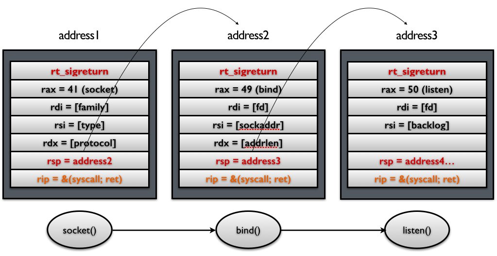

# SROP

## 简介

SROP 的全称是 **Sigreturn Oriented Programming** 。这里`sigreturn`是一个系统调用，它在 unix 系统发生 signal 的时候会被间接地调用。

## signal 机制

简单来说就类 unix 系统中的一种中断信号机制，类似于单片机的各类中断服务信号，该机制常见步骤如下：


当内核向某个进程发起（ deliver ）一个 signal ，该进程会被暂时挂起（ suspend ），进入内核（1），然后内核为该进程保存相应的上下文，**主要是将所有寄存器压入栈中，以及压入 signal 信息，以及指向 sigreturn 的系统调用地址**。跳转到之前注册好的 signal handler 中处理相应signal（2），当 signal handler 返回之后（3），内核为该进程恢复之前保存的上下文，最后恢复进程的执行（4）。

### Signal Frame 结构

在第二步中被压入栈中，存储进程上下文的数据被称为 Signal Frame ，存放在用户进程的地址空间（栈）。下图中的绿、黄、橙色组成 Signal Frame 。


> 中断后执行的 signal handler 使用的栈空间在上图的 sp 下方（低地址）

对于 signal Frame 来说，会因为架构的不同而有所区别，这里给出分别给出 x86 以及 x64 的 sigcontext ：

- x86

```  c
struct sigcontext
{
  unsigned short gs, __gsh;
  unsigned short fs, __fsh;
  unsigned short es, __esh;
  unsigned short ds, __dsh;
  unsigned long edi;
  unsigned long esi;
  unsigned long ebp;
  unsigned long esp;
  unsigned long ebx;
  unsigned long edx;
  unsigned long ecx;
  unsigned long eax;
  unsigned long trapno;
  unsigned long err;
  unsigned long eip;
  unsigned short cs, __csh;
  unsigned long eflags;
  unsigned long esp_at_signal;
  unsigned short ss, __ssh;
  struct _fpstate * fpstate;
  unsigned long oldmask;
  unsigned long cr2;
};
```

- x64（64 位有图，见后文）

```c
struct _fpstate
{
  /* FPU environment matching the 64-bit FXSAVE layout.  */
  __uint16_t        cwd;
  __uint16_t        swd;
  __uint16_t        ftw;
  __uint16_t        fop;
  __uint64_t        rip;
  __uint64_t        rdp;
  __uint32_t        mxcsr;
  __uint32_t        mxcr_mask;
  struct _fpxreg    _st[8];
  struct _xmmreg    _xmm[16];
  __uint32_t        padding[24];
};

struct sigcontext
{
  __uint64_t r8;
  __uint64_t r9;
  __uint64_t r10;
  __uint64_t r11;
  __uint64_t r12;
  __uint64_t r13;
  __uint64_t r14;
  __uint64_t r15;
  __uint64_t rdi;
  __uint64_t rsi;
  __uint64_t rbp;
  __uint64_t rbx;
  __uint64_t rdx;
  __uint64_t rax;
  __uint64_t rcx;
  __uint64_t rsp;
  __uint64_t rip;
  __uint64_t eflags;
  unsigned short cs;
  unsigned short gs;
  unsigned short fs;
  unsigned short __pad0;
  __uint64_t err;
  __uint64_t trapno;
  __uint64_t oldmask;
  __uint64_t cr2;
  __extension__ union
    {
      struct _fpstate * fpstate;
      __uint64_t __fpstate_word;
    };
  __uint64_t __reserved1 [8];
};
```

### rt_sigreturn 恢复线程步骤

假设是 64 位系统，在第一个步时将如下的 Signal Frame 压入了栈上，接着跳转执行注册好的signal handler ，当 signal handler 执行完之后，栈指针（stack pointer）就指向`rt_sigreturn`，所以，signal handler 函数的最后一条`ret`指令会使得执行流跳转到这段sigreturn代码，被动地进行`sigreturn`系统调用，恢复进程上下文。


### Signal Frame 缺陷

1. 这一部分 Signal Frame 是存储在用户进程的地址空间，用户进程具有读写权限。
2. 内核恢复进程时，没有对 Signal Frame 进行前后对比，即可能恢复的进程与保持不一样。

## 简单单次利用

控制用户进程的栈，那么它就可以伪造一个 Signal Frame，如下图所示，这里以 64 位为例子，给出 Signal Frame 更加详细的信息：


当系统执行完 sigreturn 系统调用之后，会执行一系列的 pop 指令以便于恢复相应寄存器的值，当执行到 rip 时，就会将程序执行流指向 syscall 地址，根据相应寄存器的值，此时，便会得到一个 shell 。

## system call chains

如果需要执行一系列的函数，我们只需要做两处修改即可：

- **控制栈指针。**
- **把原来 rip 指向的`syscall` gadget 换成`syscall; ret` gadget。**

如下图所示 ，这样当每次 syscall 返回的时候，栈指针都会指向下一个 Signal Frame。因此就可以执行一系列的 sigreturn 函数调用。



### 两个 gadget 在哪

在某些 libc 中会存在，具体看参考文章，ctf 会在程序中预留。

sigreturn 这个 gadget 话可以用系统调用号代替。在 64 位系统中，sigreturn 系统调用对应的系统调用号为 15，只需要 RAX=15，并且执行 syscall 即可实现调用 syscall 调用。而 RAX 寄存器的值又可以通过控制某个函数的返回值来间接控制，比如说 read 函数的返回值为读取的字节数。

## 利用工具

pwntools 中已经集成了对于 srop 的攻击，用 **SigreturnFrame** 生成 Signal Frame 。

## 例题

### 360 春秋杯 smallest-pwn

> system call chains 利用，多次调用 sigreturn 


### [V&N2020 公开赛]babybabypwn

> system call chains 简单利用，控制恢复进程上下文后跳转执行写入的利用链

## 参考文章

* [Sigreturn Oriented Programming (SROP) Attack攻击原理](https://www.freebuf.com/articles/network/87447.html)
* [ctfwiki advanced rop](https://ctf-wiki.github.io/ctf-wiki/pwn/linux/stackoverflow/advanced-rop-zh)